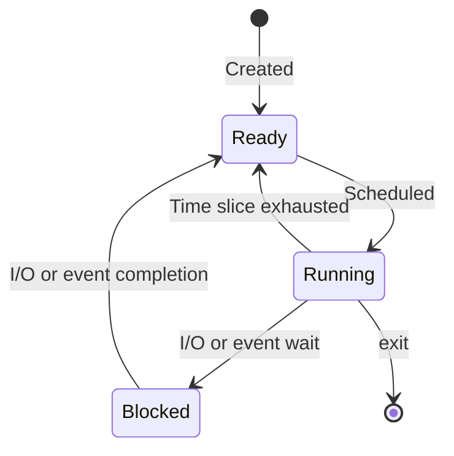

# Procesos: Abstracción y Virtualización de la CPU

## Objetivos de Aprendizaje

* **Diferenciar**: Un programa (código estático en disco) de un proceso (su ejecución dinámica en memoria).
* **Explicar**: Los tres pilares de un sistema operativo (abstracción, mecanismos, políticas) y cómo se aplican a la gestión de procesos.
* **Describir**: El ciclo de carga de un programa a proceso y la distribución de su espacio de memoria (código, datos, heap, stack).
* **Aplicar**: El modelo de tres estados (Ready/Running/Blocked) para trazar la ejecución de uno o más procesos, con y sin operaciones de I/O.
* **Identificar**: Las estructuras de datos (PCB, listas de procesos) que el sistema operativo usa para administrar procesos.

## Repaso: Ciclo de Instrucción (*Instruction Fetch*)

Como puente con arquitectura de computadores, se repasó el ciclo **Fetch → Decode → Execute** con un ejemplo en ensamblador MIPS (`la`, `lw`, `addi`, `sw` sobre una variable `var_x` almacenada en `.data`), mostrando cómo el *Program Counter* (PC) y el *Instruction Register* (IR) van avanzando por las direcciones de memoria mientras la CPU lee, decodifica y ejecuta cada instrucción.

## Contraste: Sistemas Con y Sin Sistema Operativo

* **Sin sistema operativo** (por ejemplo, un Arduino con un control remoto dedicado): un único "proceso" atado directamente al hardware.
* **Con sistema operativo** (un computador de escritorio): múltiples procesos (juego, navegador, teclado, mouse) compartiendo la misma CPU.

Esto abre la pregunta central del módulo: **¿cómo hace el sistema operativo para administrar la CPU y que todos los procesos parezcan ejecutarse a la vez?**

## Virtualización: Los Cuatro Pilares

La virtualización que ofrece un sistema operativo se apoya en cuatro ideas, cada una con una **ilusión** que se percibe y un **recurso** físico limitado detrás:

* **Virtualización de CPU**: da la ilusión de que cada proceso (A, B, C, …) tiene su propia CPU, cuando en realidad comparten un único recurso físico.
* **Virtualización de Memoria**: da la ilusión de que cada proceso tiene su propio espacio de memoria, sobre el recurso físico compartido de la RAM.
* **Concurrencia y paralelismo**: la diferencia entre un único hilo de ejecución y múltiples hilos de ejecución.
* **Persistencia**: el almacenamiento a largo plazo (disco, SD, SSD, USB) organizado en un sistema de archivos jerárquico.

## Programa vs. Proceso

* **Programa**: la imagen de un ejecutable (binario) que está guardada, de forma **estática**, en el **disco duro**.
* **Proceso**: un programa **en ejecución**, de forma **dinámica**, en la **memoria RAM** — usa CPU y memoria.

El mapa de memoria de un proceso en ejecución se organiza en regiones: **Code** (apuntada por el *Program Counter*, PC), **Data**, **Heap** y **Stack** (apuntada por el *Stack Pointer*, SP); en disco, el programa solo contiene las secciones **Code** y **Data**.

## El Proceso como Abstracción

$$\text{Proceso} = \text{CPU} + \text{Memory} + \text{I/O Info}$$

* **CPU**: registros (PC, SP, …).
* **Memory** (*Address Space*): Code, Data, Heap, Stack.
* **I/O**: información de dispositivos y archivos asociados al proceso.

## De un Programa a un Proceso: Compilación y Carga

Un programa en C (`app.c`) se compila con `gcc app.c -o app.exe`, generando un binario (`app.exe`) con sus secciones de código y datos, que se guarda en el disco. Al ejecutarlo, su espacio de direcciones en memoria se organiza (de *low* a *high memory*) en: `text` (código), `initialized data`, `uninitialized data`, `heap` (crece hacia arriba, usado por ejemplo con `malloc`) y `stack` (crece hacia abajo, contiene `argc`/`argv` y las variables locales).

**Carga (*loading*)**: de un programa a un proceso, el sistema operativo sigue estos pasos:

1. Copia el **código del programa** a memoria (de forma diferida/*lazy*).
2. Asigna memoria en la **pila (stack)** en tiempo de ejecución.
3. Crea el espacio de memoria **heap**.
4. Realiza tareas de **inicialización de I/O**.
5. Inicia el programa ejecutando su punto de entrada, `main()`.

## Virtualización de la CPU: Time Sharing y Cambio de Contexto

Retomando la pregunta central — ¿cómo, con una sola CPU, se pueden correr varias tareas a la vez (Firefox, Word, Spotify) — la respuesta es la técnica de **time sharing**: la CPU se asigna a cada proceso por turnos, alternando mediante **cambios de contexto (*context switch*)** lo suficientemente rápidos como para dar la ilusión de simultaneidad.

## Elementos de los Sistemas Operativos

Tres conceptos son los pilares que permiten que el software interactúe con el hardware sin caos:

* **Abstracción** (lo que "ve" el usuario/programador): interfaz simplificada que oculta la complejidad física del hardware — por ejemplo, `process`, `thread`, `file`, `socket`, `memory page`.
* **Mecanismos** (el "cómo" se hace): las funciones de bajo nivel que implementan una operación — por ejemplo, `create`, `schedule`, `open`, `write`, `locate`.
* **Políticas** (el "quién" y "cuándo"): el conjunto de reglas o algoritmos que deciden cómo se usan los mecanismos — por ejemplo, *Last Recently Used* (LRU), *Earliest Deadline First* (EDF).

| | Abstracción | Mecanismos | Políticas |
| --- | --- | --- | --- |
| **Process management** | Proceso | `create`, `destroy`, `wait`, `status`, … | FIFO, RR, … |

## La API de Procesos

La **API** es la formalización de la abstracción: el conjunto de funciones y protocolos (punto de entrada) para interactuar con el kernel, y la única vía legal para pasar de modo usuario a modo privilegiado (por ejemplo, POSIX).

| Función | Descripción |
| --- | --- |
| Crear (`create`) | Crea un nuevo proceso para ejecutar un programa. |
| Eliminar (`destroy`) | Forzar la detención de un programa en ejecución. |
| Esperar (`wait`) | Espera que un proceso termine su ejecución. |
| Operaciones de control | Ej. Suspender un proceso. |
| Estado (`status`) | Información de estado del proceso. |

A nivel de la API, un proceso transita por los estados **new → ready ⇄ running → terminated**, pudiendo pasar por **waiting** cuando espera I/O o un evento.

## Modelo de Tres Estados (Ready / Running / Blocked)

Para razonar sobre cómo el sistema operativo comparte la CPU, se usa un modelo simplificado de tres estados:



* **Ready**: el proceso está listo para ejecutarse, pero el SO ha decidido no ejecutarlo en este momento.
* **Running**: el proceso se está ejecutando en el procesador.
* **Blocked**: el proceso está desarrollando alguna operación (por ejemplo, I/O a disco) y no puede continuar hasta que esta termine.

### Ejemplo 1: Trazado de Estados (Solo CPU)

Dos procesos (Process₀, Process₁), cada uno con instrucciones únicamente de CPU. Process₀ se ejecuta primero (t=1 a 4) mientras Process₁ permanece en *Ready*; al terminar Process₀, Process₁ pasa a *Running* (t=5 a 8) y termina.

| Time | Process₀ | Process₁ | Nota |
| --- | --- | --- | --- |
| 1–4 | Running | Ready | |
| 4 | Running | Ready | Process₀ termina |
| 5–8 | – | Running | |
| 8 | – | Running | Process₁ termina |

### Ejemplo 2: Trazado de Estados (CPU e I/O)

Con los mismos dos procesos, Process₀ ahora inicia una operación de I/O en t=3, quedando **Blocked**; mientras espera, Process₁ pasa a *Running*. Cuando la I/O de Process₀ termina, este vuelve a *Ready* y luego retoma la CPU.

| Time | Process₀ | Process₁ | Nota |
| --- | --- | --- | --- |
| 1–3 | Running | Ready | Process₀ inicia I/O |
| 4–6 | Blocked | Running | Process₀ bloqueado; Process₁ corre |
| 7 | Ready | Running | I/O de Process₀ termina |
| 8 | Ready | Running | Process₁ termina |
| 9–10 | Running | – | Process₀ retoma y termina |

## Estructuras de Datos del Sistema Operativo

Para rastrear los procesos en memoria (el SO ocupa una región junto a los `process 1..4`), se usan estructuras de datos clásicas: **listas enlazadas simples**, **listas doblemente enlazadas**, **listas circulares** y **árboles binarios de búsqueda** — cada una con sus propias ventajas según la operación que el SO necesite realizar más frecuentemente (recorrido, inserción, búsqueda).

### Lista de Procesos: Colas Ready y Wait

Los procesos **listos**, **bloqueados** y **en ejecución** se organizan en colas implementadas como listas enlazadas de **PCB**, cada una con un `queue header` (`head`/`tail`):

* **Ready queue**: procesos listos para ejecutarse (por ejemplo, PCB₇ → PCB₂).
* **Wait queue**: procesos bloqueados esperando I/O u otro evento (por ejemplo, PCB₃ → PCB₁₄ → PCB₆).

## Process Control Block (PCB)

El **PCB** es la estructura (en C) que almacena toda la información de un proceso:

* **Estado de ejecución** (running, ready, …) y **número de proceso**.
* **Program counter**: localización de la próxima instrucción a ejecutar.
* **Registros de la CPU**.
* **Información de scheduling** (prioridades, …).
* **Información de manejo de memoria** (memoria asignada).
* **Información de contabilidad** (*accounting*: CPU usada, tiempo desde el inicio, límites de tiempo).
* **Información de estado de I/O** (dispositivos y archivos abiertos).

En Linux, cada proceso se representa con un `struct task_struct`, enlazado en una lista circular junto a un puntero `current` al proceso que se ejecuta en ese momento. En **xv6** (sistema operativo educativo usado como referencia), esto se implementa con dos estructuras:

```c
// registros que xv6 guarda/restaura para detener y reiniciar un proceso
struct context {
  int eip;
  int esp;
  int ebx;
  int ecx;
  int edx;
  int esi;
  int edi;
  int ebp;
};

// los distintos estados en los que puede estar un proceso
enum proc_state { UNUSED, EMBRYO, SLEEPING,
                   RUNNABLE, RUNNING, ZOMBIE };

// la información que xv6 rastrea de cada proceso
struct proc {
  char *mem;               // Start of process memory
  uint sz;                 // Size of process memory
  char *kstack;            // Bottom of kernel stack for this process
  enum proc_state state;   // Process state
  int pid;                 // Process ID
  struct proc *parent;     // Parent process
  void *chan;               // If !zero, sleeping on chan
  int killed;               // If !zero, has been killed
  struct file *ofile[NOFILE]; // Open files
  struct inode *cwd;        // Current directory
  struct context context;   // Switch here to run process
  struct trapframe *tf;     // Trap frame for the current interrupt
};
```

## El Modelo de Estados en Linux

Linux extiende el modelo de tres estados con transiciones adicionales, representadas en la siguiente convención de letras: **R** (ejecutando/seleccionado por el *scheduler*), **S** (espera de una señal o evento I/O), **D** (espera un evento de E/S, no interrumpible), **T** (detenido, esperando la señal apropiada), **Z** (*zombie*: terminó y queda a la espera de que el padre acceda a su estado/estadísticas), **X** (muerto: no hay ningún proceso a la espera, los datos del proceso pueden liberarse). La transición de **S** a **X** directamente no existe en sistemas Linux.

## Resumen y Conclusión

Esta sesión sienta las bases del Módulo 2 (Procesos) respondiendo a sus preguntas fundacionales:

| Pregunta | Respuesta |
| --- | --- |
| ¿Qué es un proceso? | Un programa en ejecución: CPU + Memoria + información de I/O. |
| ¿Qué es la API de procesos? | El conjunto de llamadas (`create`, `destroy`, `wait`, `status`, …) que formalizan la abstracción del proceso. |
| ¿Cuáles son los estados de un proceso? | Ready, Running y Blocked (con New y Terminated como puntos de entrada/salida). |
| ¿Qué es un PCB y cómo se relaciona con la lista de procesos? | La estructura de datos que guarda el estado completo de un proceso; la lista de procesos (y las colas *ready*/*wait*) son listas enlazadas de PCBs. |

Con la abstracción del proceso ya definida, la siguiente clase profundiza en cómo el sistema operativo implementa la **ejecución directa limitada** para virtualizar la CPU de forma eficiente y segura.

---

> [!IMPORTANT]
> **Nota de Transparencia:** Este documento fue generado y adaptado mediante el uso de **IA Generativa**, a partir del manuscrito anotado de la clase y el resumen de la sesión de Zoom del 11/08/2026. El contenido ha sido supervisado, validado y refinado por intervención humana para garantizar su precisión técnica y coherencia pedagógica. No obstante, pueden haber errores.
