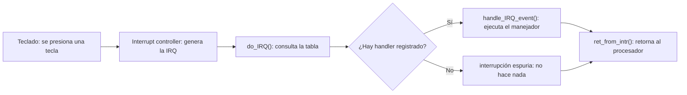
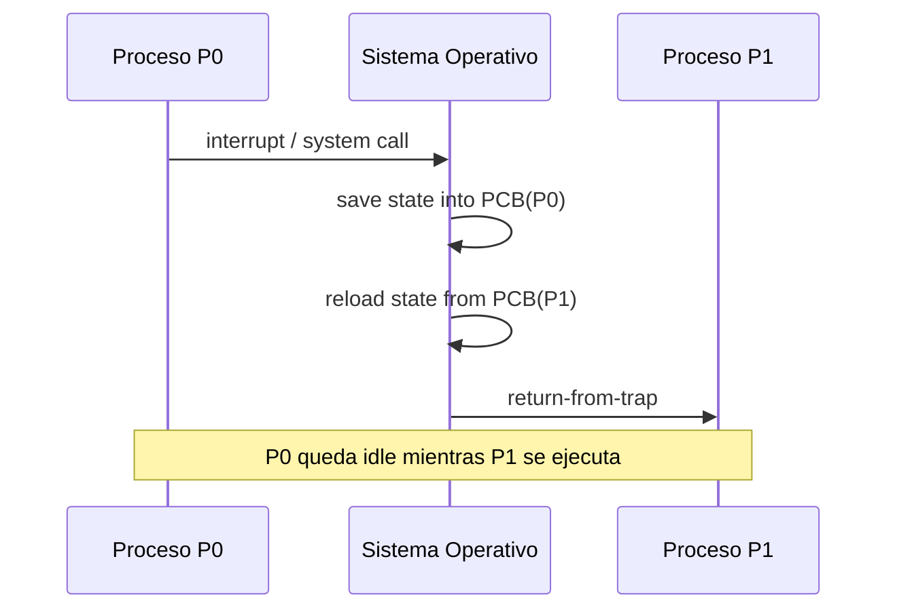

# Ejecución Directa Limitada (Limited Direct Execution)

## Objetivos de Aprendizaje

* **Explicar**: Cómo la ejecución directa limitada (EDL) permite que los procesos corran directamente en la CPU sin que el sistema operativo pierda el control.
* **Diferenciar**: El modo usuario y el modo kernel, y el papel del bit de modo en la protección del hardware.
* **Describir**: El protocolo de llamadas al sistema (*syscall*) mediante la instrucción `trap` y la tabla de traps.
* **Explicar**: Cómo las interrupciones de hardware (IRQ) permiten que el sistema operativo recupere el control de la CPU de forma asíncrona.
* **Comparar**: Los enfoques cooperativo y no cooperativo para la conmutación entre procesos, y el papel del cambio de contexto.

## Contexto: Virtualizando la CPU

La pregunta que abre el tema es: ¿cómo se logra la virtualización de la CPU de modo que cada proceso crea que tiene su propia CPU? La respuesta parte de la **multiprogramación**:

* **Multiprogramación básica** (sin separación de privilegios): varios procesos (P1, P2, P3) y el propio SO comparten turnos de CPU (*time sharing*), pero sin ninguna barrera de protección entre ellos.
* **Multiprogramación + barrera de protección**: se añade una separación entre **modo usuario** (donde corren P1, P2, P3) y **modo kernel** (donde corre el SO como intermediario/administrador). Esta barrera es precisamente lo que agrega la palabra "**Limited**" a la ejecución directa.

El **scheduler** es la parte del sistema operativo que decide qué proceso usa la CPU en cada momento.

## Ejecución Directa Limitada (EDL): Objetivos

La técnica de ejecución directa limitada persigue dos objetivos, en tensión entre sí:

* **Desempeño**: ¿cómo implementar la virtualización sin adicionar un sobrecosto (*overhead*) excesivo?
* **Control**: ¿cómo ejecutar procesos de manera eficiente sin perder el control de la CPU?

**Limited Direct Execution** combina ambos:

* **Direct Execution** (desempeño): las aplicaciones deben ejecutarse directamente en el procesador — el SO no debe intervenir ni verificar la validez de cada instrucción.
* **Limited** (protección): los procesos deben estar aislados entre sí, el kernel debe estar aislado de los procesos, y los dispositivos de hardware deben estar aislados de los procesos.

### Protocolo de Ejecución Directa

Al lanzar un programa, el sistema operativo y el proceso de usuario se alternan en una secuencia de pasos:

| Sistema Operativo (modo kernel) | Proceso de usuario (modo usuario) |
| --- | --- |
| 1. Crea una entrada en la lista de procesos | |
| 2. Asigna memoria al proceso | |
| 3. Carga el programa a memoria | |
| 4. Inicializa la pila (*stack*) con `argc`/`argv` | |
| 5. Reinicia registros de CPU | |
| 6. Ejecuta llamada a `main()` | |
| | 7. Ejecuta `main()` |
| | 8. Ejecuta `return` de `main()` |
| 9. Libera la memoria del proceso | |
| 10. Elimina la entrada de la lista de procesos | |

## Problemas de la Ejecución Directa

La ejecución directa (sin límites) plantea dos problemas:

1. **¿Qué sucede si un proceso desea realizar una operación restringida?** (por ejemplo, una solicitud de E/S al disco, obtener más recursos del sistema, o ejecutar una instrucción especial como `LIDT`).
2. **¿Cómo hace el sistema operativo para realizar el cambio de contexto** entre procesos?

> [!tip]
> **Analogía del autoservicio**: la ejecución directa sin límites es como un autoservicio de gaseosas al que cualquiera accede libremente, sin que nadie revise cada instrucción. La ejecución directa *limitada* agrega, en cambio, un empleado (el SO) que **debe tener la supervisión de un adulto** — controla y administra el acceso a los recursos, evitando que un proceso se apodere completamente del sistema (por ejemplo, con un bucle infinito `while(1);`).

## Modo Usuario y Modo Kernel

La solución al problema de las operaciones restringidas es una **transferencia de control protegida**, implementada con dos modos de ejecución:

* **Modo usuario**: las aplicaciones **no tienen** acceso total a los recursos de hardware — solo pueden hacer un número limitado de cosas (sin acceso privilegiado).
* **Modo kernel**: el sistema operativo **tiene** acceso total a los recursos de hardware (memoria, CPU, dispositivos) y puede ejecutar instrucciones privilegiadas.

> [!tip]
> *"Un gran poder conlleva una gran responsabilidad"*: el SO tiene acceso total al hardware, por eso es el único que decide qué puede hacer cada proceso.

A nivel de hardware, esta distinción se implementa mediante un **bit de privilegio** en un registro especial del procesador. En la arquitectura Intel® 64 / IA-32, este es el **CPL (Current Privilege Level)** del registro CS (*Code Segment Selector*): `00` corresponde a CPL = 0 (máximo privilegio, modo kernel) y `11` a CPL = 3 (mínimo privilegio, modo usuario) — documentado en el *Intel® 64 and IA-32 Architectures Software Developer's Manual*, Vol. 3A, secciones 3.4.2 y 5.5.

### ¿Qué dispara el cambio de modos?

Existen dos mecanismos, según quién inicia el cambio:

* **Llamada a sistema (*syscall*)**: cambio de software (**SW**) — lo pide activamente el programa.
* **Interrupción**: cambio de hardware (**HW**) — lo genera un dispositivo externo.

## Llamadas al Sistema (Syscalls)

Una **llamada al sistema** es el mecanismo mediante el cual un proceso en modo usuario solicita un servicio privilegiado al kernel:

* El programa **no ejecuta el trap directamente**: llama a una función de la biblioteca estándar (por ejemplo, `open()`), que internamente coloca el número de la syscall en un registro y ejecuta la instrucción `trap`.
* La instrucción **`trap`** cambia el bit de modo de la CPU (mode bit = 1 → 0) y transfiere el control al kernel.
* El SO usa ese número para buscar en la **syscall table** — así el proceso nunca indica una dirección arbitraria a la que saltar dentro del kernel, solo puede *pedir un servicio por número*. Esta indirección es en sí misma una medida de protección.
* Al terminar, el SO ejecuta la instrucción **`return-from-trap`**, que restablece el bit de modo (mode bit = 0 → 1) y devuelve el control al **mismo proceso** que hizo la llamada.

Las llamadas al sistema exponen funcionalidades clave del kernel a través de **APIs de alto nivel** (el programador casi nunca invoca el número de syscall directamente):

* **Win32** (Windows)
* **POSIX** (Linux, Mac OS, Unix)
* **API de Java** (JVM)

| Categoría | Windows (Win32) | Unix (POSIX) |
| --- | --- | --- |
| Control de procesos | `CreateProcess()`, `ExitProcess()`, `WaitForSingleObject()` | `fork()`, `exit()`, `wait()` |
| Gestión de archivos | `CreateFile()`, `ReadFile()`, `WriteFile()`, `CloseHandle()` | `open()`, `read()`, `write()`, `close()` |
| Gestión de dispositivos | `SetConsoleMode()`, `ReadConsole()`, `WriteConsole()` | `ioctl()`, `read()`, `write()` |
| Mantenimiento de info. | `GetCurrentProcessID()`, `SetTimer()`, `Sleep()` | `getpid()`, `alarm()`, `sleep()` |
| Comunicaciones | `CreatePipe()`, `CreateFileMapping()`, `MapViewOfFile()` | `pipe()`, `shm_open()`, `mmap()` |
| Protección | `SetFileSecurity()`, `InitializeSecurityDescriptor()` | `chmod()`, `umask()`, `chown()` |

Nótese que la fila **Process control** es la versión concreta de la API de procesos de la clase anterior (Crear/Eliminar/Esperar): `fork()`/`exit()`/`wait()` en Unix son la implementación real de esas operaciones abstractas.

> [!Note]
> Continuación de la sesión del 18/08/2026 — a partir de aquí se estudiaron las interrupciones de hardware (IRQ), el protocolo de arranque, el cambio de contexto y los enfoques cooperativo/no cooperativo.

## Interrupciones de Hardware (IRQ)

A diferencia de la syscall, en una interrupción el programa **no pide nada** — el evento lo dispara un dispositivo externo, en cualquier momento, sin que ningún proceso lo sepa (por eso es hardware, **asíncrona**).

**Ejemplo — el teclado**: al presionar una tecla, el controlador del teclado genera una señal eléctrica hacia el *interrupt controller*, que a su vez interrumpe al procesador — sin importar qué estaba haciendo la CPU en ese instante. La secuencia completa es:

Al igual que con la syscall table, el SO configura desde el **boot** una dirección de manejador para cada línea de interrupción (el equivalente, para hardware, de la trap table). Cada IRQ tiene un número asociado, y existen interrupciones con **mayor prioridad** que otras, lo que permite atender primero los eventos más críticos cuando ocurren varias interrupciones a la vez.

## Protocolo de Arranque (Boot Process)

Antes de que el SO pueda atender syscalls e interrupciones, el sistema debe arrancar:

1. **Power On** → BIOS/UEFI (carga desde memoria no volátil, ejecuta POST).
2. **Detect Devices** — se detectan los dispositivos disponibles.
3. **Choose a Boot Device**.
4. **GRUB (Boot Loader)** — lee `/etc/grub2.cfg`, ejecuta el kernel y carga las librerías soportadas.
5. **Execute systemd** (primer proceso en espacio de usuario).
6. **Run `.target` Files** (`default.target`, `multi-user.target`, `basic.target`, `getty.target`, `ssh.service`, …).
7. **Run Startup Scripts** (`/systemd-logind`, `/etc/profile`, `~/.bashrc`, …).
8. Los usuarios pueden iniciar sesión.

Durante el arranque, en **modo kernel**, el SO inicializa la **trap table** (direcciones de los manejadores de syscall e interrupciones — disco, red, timer, teclado, llamadas al sistema) y la **syscall table** (`open`, `read`, `getpid`, …); el hardware almacena esas direcciones para usarlas cuando corresponda.

## Cambio de Contexto entre Procesos

Cuando ocurre una interrupción, el **scheduler** debe decidir: continuar con el proceso actual o cambiar a uno diferente. Si decide cambiar, el SO ejecuta un **cambio de contexto (*context switch*)**.

Al cambiar de contexto:

1. Se **guarda** el estado del proceso en ejecución en su PCB — esto implica almacenar en el **kernel stack** los registros de propósito general, el *Program Counter* (PC) y el *kernel stack pointer*.
2. Se **restauran** los valores del proceso que se va a ejecutar, desde su kernel stack.
3. Se **cambia** al kernel stack del proceso que se va a ejecutar.

Ejemplo ilustrado en el manuscrito: si el Proceso P0 fue interrumpido en la instrucción 100 y el Proceso P1 en la instrucción 200, el SO guarda esos valores del *Program Counter* en sus respectivos PCB. Al retomar la ejecución de P0, se carga el valor 100 en el PC, permitiendo que continúe exactamente donde fue interrumpido.

## Enfoques Cooperativo y No Cooperativo

Existen dos formas en que el SO recupera el control de la CPU para conmutar entre procesos:

### Enfoque Cooperativo (no apropiativo)

Los procesos **liberan la CPU periódicamente**, mediante:

* Una **llamada al sistema** — por ejemplo, la instrucción `yield()`.
* Una **operación ilegal** que genera una **excepción** (división por cero, acceso ilegal a memoria, etc.), lo que también le devuelve el control al SO.

Cuando el proceso libera la CPU, es el sistema operativo quien decide cuál será el próximo proceso en usarla. El problema de este enfoque es que, si un proceso nunca hace una syscall ni comete un error, el SO **no puede intervenir** — un proceso podría "secuestrar" la CPU indefinidamente (por ejemplo, con un bucle infinito).

### Enfoque No Cooperativo (apropiativo)

El sistema operativo **toma el control** de la CPU mediante **interrupciones de un timer de hardware**, que se lanzan cada cierto tiempo (algunos milisegundos), sin depender de la voluntad del proceso en ejecución. Cuando se lanza una interrupción por timer:

1. El proceso en ejecución es **suspendido**.
2. Se **almacena el estado** del proceso.
3. Se ejecuta una **rutina de atención** a la interrupción.

Durante el arranque, el hardware almacena la dirección del **timer handler** (junto con el *syscall handler*) en la trap table, y el timer se inicia e interrumpe la CPU cada X milisegundos. Este enfoque garantiza que ningún proceso pueda monopolizar la CPU indefinidamente.

## Múltiples Interrupciones

¿Qué pasa si, durante una interrupción o una rutina de atención (*trap handler*), llega otra interrupción? El SO se encarga de estas situaciones de dos formas:

* **Deshabilita interrupciones** durante la atención a las interrupciones.
* Utiliza **esquemas de protección (bloqueo)** avanzados para proteger el acceso concurrente a estructuras de datos internas.

> [!Note]
> Esto es apenas una introducción al problema de la **concurrencia** (la capacidad del sistema operativo de manejar varias cosas a la vez), tema que se profundiza en un curso posterior.

## Resumen y Conclusión

La ejecución directa limitada resuelve, mediante dos mecanismos complementarios, el reto de virtualizar la CPU con buen desempeño y sin perder el control:

| Mecanismo | Disparado por | Propósito |
| --- | --- | --- |
| **Syscall** (`trap` / `return-from-trap`) | Software — lo pide el proceso | Permite que un proceso solicite un servicio privilegiado al kernel de forma controlada. |
| **Interrupción** (IRQ / timer) | Hardware — asíncrono | Le permite al SO recuperar el control de la CPU sin depender de la voluntad del proceso. |

Ambos mecanismos comparten el mismo patrón: se consulta una tabla inicializada al *boot* (trap table / tabla de interrupciones), se guarda el estado del proceso interrumpido, se atiende la solicitud en modo kernel, y se retorna el control mediante un cambio de contexto. La combinación del enfoque cooperativo (syscalls, `yield()`) y no cooperativo (timer) es lo que permite al sistema operativo compartir la CPU entre múltiples procesos sin que ninguno la monopolice.

---

> [!IMPORTANT]
> **Nota de Transparencia:** Este documento fue generado y adaptado mediante el uso de **IA Generativa**, a partir del manuscrito anotado de la clase y los resúmenes de las sesiones de Zoom del 13/08/2026 y 18/08/2026. El contenido ha sido supervisado, validado y refinado por intervención humana para garantizar su precisión técnica y coherencia pedagógica. No obstante, pueden haber errores.
