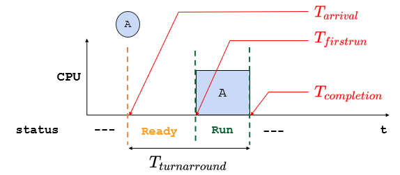
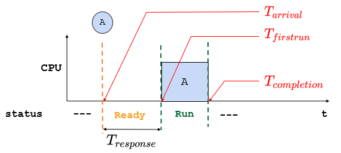
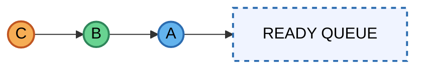
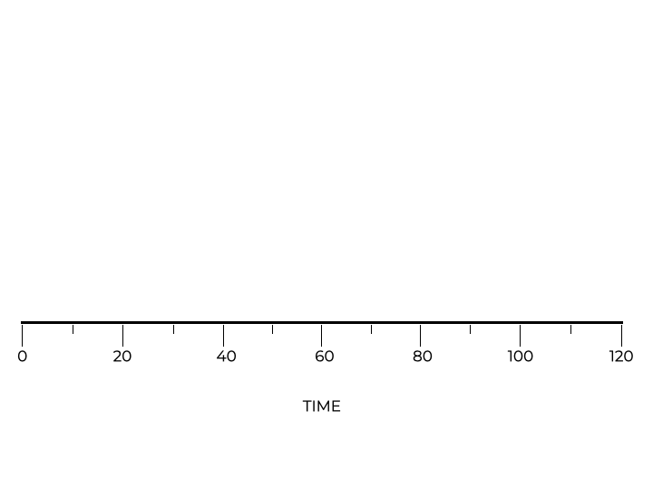
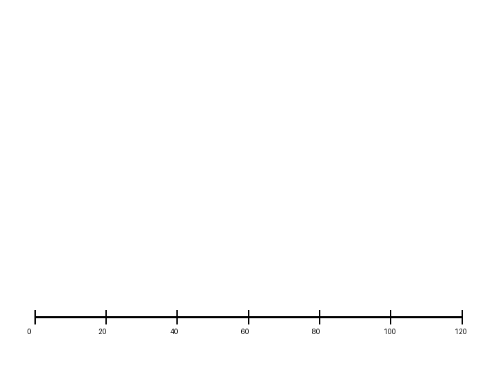
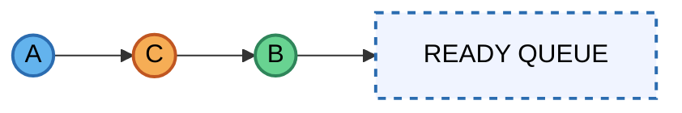
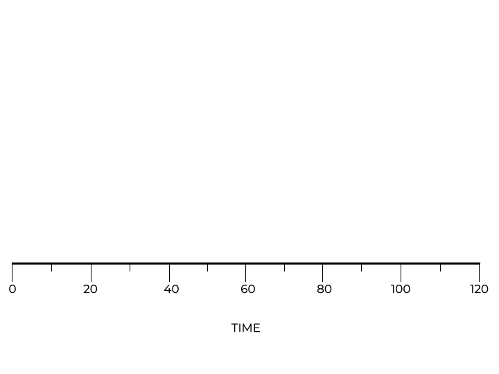
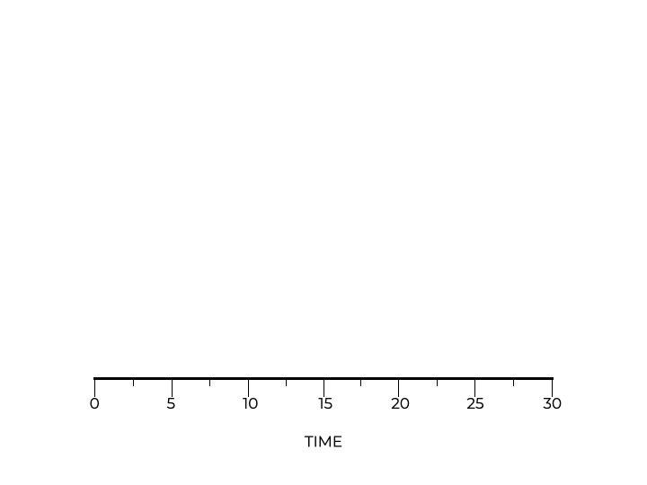
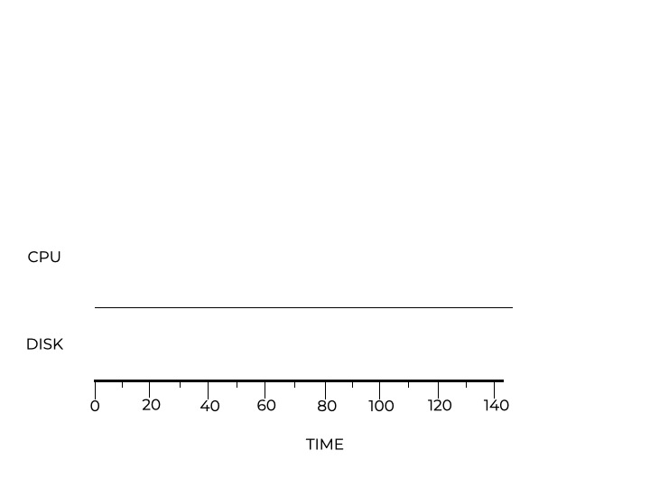

# Planificación de CPU (CPU Scheduling)

## Objetivos de Aprendizaje

* **Identificar y Describir**: Los propósitos y objetivos primordiales de las políticas de planificación dentro de un Sistema Operativo (SO).
* **Explicar**: Las suposiciones clave (*workload assumptions*) consideradas al diseñar e implementar dichas políticas.
* **Medir**: Evaluar el desempeño de distintos algoritmos de planificación mediante métricas esenciales de rendimiento.
* **Comparar y Contrastar**: Analizar las ventajas y desventajas de diversas políticas de planificación en distintos escenarios de carga.
* **Aplicar**: Trasladar el conocimiento teórico a situaciones prácticas, garantizando el uso eficiente de la CPU y la ejecución de procesos.

## Introducción a la Planificación de CPU

Una vez comprendidos los mecanismos de bajo nivel de los procesos, es momento de profundizar en el **planificador (scheduler)** del Sistema Operativo.

El **planificador** es la unidad lógica encargada de determinar qué procesos se ejecutan, en qué momento y durante cuánto tiempo. Exploraremos diversas **políticas o disciplinas de planificación** que rigen estas decisiones.

## Suposiciones de Carga de Trabajo (*Workload Assumptions*)

Para sentar las bases del estudio de la planificación de procesos en **Sistemas Operativos**, partimos de un escenario idealizado. Estas son las **5 suposiciones sobre la carga de trabajo (workload)** que nos permiten aislar el comportamiento de los algoritmos antes de enfrentarnos a la complejidad del mundo real:
1. **Duración Equitativa**: Se asume que todos los procesos (trabajos) tienen exactamente la misma duración o tiempo de ejecución.
2. **Llegada Simultánea**: Todos los procesos llegan al sistema al mismo tiempo (en el instante $T=0$).
3. **Ejecución hasta la Finalización**: Una vez que un proceso obtiene la CPU, se ejecuta de forma continua hasta terminar. Es decir, no hay interrupciones ni expulsión (*non-preemptive*).
4. **Uso Exclusivo de CPU**: Se asume que los procesos son puramente computacionales y no realizan ninguna operación de **Entrada/Salida (I/O)**.
5. **Conocimiento Perfecto**: El sistema operativo conoce de antemano y con precisión cuánto tiempo durará cada proceso antes de que este comience.

## Métricas y Algoritmos de Planificación

Para evaluar el rendimiento, nos enfocaremos en:

### Métricas Principales

* **Turnaround Time** (Tiempo de Retorno): Tiempo total desde que llega el proceso hasta que termina.

  

  $$T_{turnaround} = T_{completion} - T_{arrival}$$

  **Donde**:
  * $T_{completion}$: Instante de tiempo en que el proceso termina.
  * $T_{arrival}$: Instante de tiempo en que el proceso entró a la cola de listos (ready queue).

* **Response Time** (Tiempo de Respuesta): Tiempo desde que llega el proceso hasta que se atiende por primera vez.

  

  $$T_{response} = T_{firstrun} - T_{arrival}$$

  Donde:
  * $T_{firstrun}$: Instante de tiempo en que el proceso toma la CPU por primera vez (como se observa en el diagrama anterior).
  * $T_{arrival}$: Instante de tiempo en que el proceso entra a la cola de listos (ready queue).

### Comparativa de Métricas de Rendimiento

| Característica | Tiempo de Retorno (*Turnaround Time*) | Tiempo de Respuesta (*Response Time*) |
| :--- | :--- | :--- |
| **Definición** | Tiempo total desde que el proceso llega hasta que finaliza. | Tiempo desde que el proceso llega hasta que se atiende por primera vez. |
| **Fórmula** | $T_{turnaround} = T_{completion} - T_{arrival}$ | $T_{response} = T_{firstrun} - T_{arrival}$ |
| **Enfoque** | **Eficiencia y Productividad:** Maximizar la cantidad de trabajo terminado. | **Interactividad:** Minimizar la percepción de espera del usuario. |
| **Algoritmo Ideal** | **SJF / STCF** (prioriza trabajos cortos para que salgan rápido). | **Round Robin** (da ráfagas de tiempo a todos equitativamente). |

## Políticas de Planificación

### 1. FIFO: First-In, First-Out (FCFS)

La política **FIFO** (también conocida como *First-Come, First-Served*) es el enfoque más básico de la planificación. Bajo este esquema, el primer proceso en llegar es el primero en ser atendido, y se ejecuta de manera **no apropiativa (non-preemptive)**: una vez que el proceso obtiene la CPU, mantiene el control hasta que finaliza su ráfaga de cómputo.

#### A. Escenario Ideal (Suposiciones Iniciales)

> [!Note]
> **Checklist de suposiciones ideales**
> - [x] Suposición 1: Duración equitativa
> - [x] Suposición 2: Llegada simultánea
> - [x] Suposición 3: Ejecución hasta finalizar
> - [x] Suposición 4: Uso exclusivo de CPU
> - [x] Suposición 5: Conocimiento perfecto del runtime

**Escenario A: El Caso Ideal (Duraciones Equitativas)** 

Supongamos que tenemos tres procesos (A, B, C) que llegan prácticamente al mismo tiempo (($T = 0$)) y cada uno requiere **10 segundos de CPU**.

El orden de llegada al sistema es:

Bajo la política **FCFS**, los procesos se ejecutan estrictamente en el orden en que llegan a la cola de listos (*Ready Queue*).

| Proceso | Arrival Time | Run-time (CPU) |
| ------- | ------------ | -------------- |
| A       | 0            | 10             |
| B       | 0            | 10             |
| C       | 0            | 10             |

Dado que FCFS es un algoritmo no apropiativo:
- El proceso **A** comienza primero y ejecuta hasta terminar.
- Luego se ejecuta **B**.
- Finalmente se ejecuta **C**.

Ahora vamos a calcular Turnaround Time para cada proceso:

$$T_{turnaround} = T_{completion} - T_{arrival}$$

* **A**: $T_A = 10 - 0 = 10$
* **B**: $T_B = 20 - 0 = 20$
* **C**: $T_C = 30 - 0 = 30$

Luego, el Turnaround Time para todos los procesos es:

$$
T_{avg} = \frac{10 + 20 + 30}{3} = 20
$$

>[!tip] 
>En este escenario homogéneo, FCFS produce un resultado razonable y predecible.

**Escenario B: La supoción 1 deja de cumplirse (Los procesos no tienen la misma duración)** 

> [!Note]
> **Checklist de suposiciones ideales**
> - [ ] Suposición 1: Duración equitativa
> - [x] Suposición 2: Llegada simultánea
> - [x] Suposición 3: Ejecución hasta finalizar
> - [x] Suposición 4: Uso exclusivo de CPU
> - [x] Suposición 5: Conocimiento perfecto del runtime

Ahora supongamos que el proceso **A** se ejecuta durante **100 segundos**, mientras que **B** y **C** duran 10 segundos cada uno. El orden de llegada se mantiene:

| Proceso | Arrival Time | Run-time (CPU) |
| ------- | ------------ | -------------- |
| A       | 0            | 100            |
| B       | 0            | 10             |
| C       | 0            | 10             |

En este caso, aunque el orden de ejecución no cambia, la larga duración de **A** obliga a **B** y **C** a esperar un tiempo considerable antes de acceder a la CPU.

Para este caso los Turnaround Time para cada proceso quedan:

* **A**: $T_A = 100 - 0 = 100$
* **B**: $T_B = 110 - 0 = 110$
* **C**: $T_C = 120 - 0 = 120$

Y el Turnaround Time promedio es:

$$
T_{avg} = \frac{100 + 110 + 120}{3} = 110
$$

Observamos que el turnaround promedio aumenta drásticamente respecto al caso ideal (de **20 s** a **110 s**).

### Efecto Convoy

Este comportamiento se conoce como **Efecto Convoy**.

Ocurre cuando un proceso largo se ejecuta primero y retrasa a múltiples procesos cortos que llegan detrás de él.

Se caracteriza por:
- Los procesos cortos deben esperar innecesariamente.
- El turnaround promedio aumenta significativamente.
- El sistema puede percibirse como lento o poco responsivo.

> [!Important]  
> FCFS es justo en orden de llegada, pero **no optimiza el turnaround promedio cuando las duraciones son heterogéneas**.

Este análisis nos lleva a una pregunta natural:

> [!note]
> ¿Podríamos mejorar el desempeño si ejecutamos primero los procesos más cortos?

Esa pregunta motiva el estudio del siguiente algoritmo: **Shortest Job First (SJF)**.

### 2. SJF: Shortest Job First (El trabajo más corto primero)

Para solucionar el **Efecto Convoy** visto en FIFO, surge la política **SJF**. Su principio es simple: ante un conjunto de tareas pendientes, el planificador elegirá siempre aquella que tenga el tiempo de ejecución (*run-time*) más corto. Al igual que FIFO, en su versión clásica, SJF es un algoritmo **no apropiativo (non-preemptive)**.

#### A. Optimizando el Turnaround (Llegada Simultánea)

> [!Note]
> **Checklist de suposiciones**
> * [ ] **Suposición 1: Duración equitativa** (Relajada: los procesos ahora tienen duraciones distintas).
> * [x] Suposición 2: Llegada simultánea.
> * [x] Suposición 3: Ejecución hasta finalizar.
> * [x] Suposición 4: Uso exclusivo de CPU.
> * [x] Suposición 5: Conocimiento perfecto del runtime.
> 
> 

**Escenario A: Superando el Efecto Convoy**

Retomamos el caso donde el proceso **A** dura **100s**, mientras que **B** y **C** duran **10s**. Si todos llegan en $T=0$, SJF reordena la ejecución para priorizar a los más cortos.

| Proceso | Arrival Time | Run-time (CPU) |
| --- | --- | --- |
| A | 0 | 100 |
| B | 0 | 10 |
| C | 0 | 10 |

El orden de ejecución, despues de ordenar sera:

Calculamos el **Turnaround Time** para cada proceso:

* **B**: $T_B = 10 - 0 = 10$
* **C**: $T_C = 20 - 0 = 20$
* **A**: $T_A = 120 - 0 = 120$

El Turnaround promedio es:

$$T_{avg} = \frac{10 + 20 + 120}{3} = 50$$

> [!tip]
> Al mover los trabajos cortos al principio, el tiempo de espera de estos disminuye drásticamente, bajando el promedio de **110s (en FIFO)** a solo **50s**.

#### B. La Limitación de SJF (Llegada Diferida)

¿Qué sucede si relajamos la **Suposición 2** y los procesos no llegan al mismo tiempo?.

> [!Note]
> **Checklist de suposiciones**
> * [ ] Suposición 1: Duración equitativa.
> * [ ] **Suposición 2: Llegada simultánea** (Relajada: los procesos llegan en diferentes tiempos).
> * [x] Suposición 3: Ejecución hasta finalizar.
> * [x] Suposición 4: Uso exclusivo de CPU.
> * [x] Suposición 5: Conocimiento perfecto del runtime.

**Escenario B: El regreso del Efecto Convoy**

Supongamos que **A** (100s) llega en $T=0$, mientras que **B** y **C** (10s cada uno) llegan apenas en $T=10$. Como SJF es **no apropiativo**, una vez que A toma la CPU, no la soltará hasta terminar.

| Proceso | Arrival Time | Run-time (CPU) |
|----------|--------------|----------------|
| A        | 0            | 100            |
| B        | 10           | 10             |
| C        | 10           | 10             |

Cálculos de Turnaround:

* **A**: $T_A = 100 - 0 = 100$
* **B**: $T_B = 110 - 10 = 100$
* **C**: $T_C = 120 - 10 = 110$

En lo que respecta al Turnaround promedio tenemos:

$$T_{avg} = \frac{100 + 100 + 110}{3} = 103.33$$

#### Limitaciones de SJF

Aunque SJF es óptimo bajo suposiciones ideales, presenta problemas prácticos:
- Requiere conocer el tiempo de ejecución por adelantado.
- No funciona bien cuando los procesos llegan en momentos distintos.
- No es apropiativo (en su versión básica).

> [!Important]  
> SJF es óptimo bajo suposiciones ideales, pero pierde eficiencia cuando los tiempos de llegada son dinámicos.

Este problema nos lleva naturalmente a la siguiente mejora:

> [!note]
> ¿Qué pasaría si permitiéramos interrumpir un proceso largo cuando llega uno más corto?

### 3. STCF: Shortest Time-to-Completion First (Menor tiempo restante primero)

Para resolver el problema de la llegada diferida en SJF, es necesario relajar la suposición de que los procesos deben ejecutarse hasta su finalización sin interrupciones. Aquí introducimos el concepto de **preecepción (expulsión)**.

**STCF** (también conocido como **PSJF** o *Preemptive SJF*) añade la capacidad de que el planificador detenga un proceso en ejecución si llega uno nuevo con un tiempo de finalización más corto.

#### Optimizando el Turnaround con Preecepción

> [!Note]
> **Checklist de suposiciones**
> * [ ] Suposición 1: Duración equitativa.
> * [ ] Suposición 2: Llegada simultánea.
> * [ ] **Suposición 3: Ejecución hasta finalizar** (Relajada: El sistema ahora es **apropiativo**).
> * [x] Suposición 4: Uso exclusivo de CPU.
> * [x] Suposición 5: Conocimiento perfecto del runtime.

**Escenario: El rescate de los procesos cortos**

Utilizamos el mismo escenario que rompió el SJF:

* **A** (100s) llega en $T=0$.
* **B** y **C** (10s cada uno) llegan en $T=10$.

| Proceso | Arrival Time | Run-time (CPU) |
|----------|--------------|----------------|
| A        | 0            | 100            |
| B        | 10           | 10             |
| C        | 10           | 10             |

Con STCF, cuando **B** y **C** llegan en $T=10$, el planificador compara:

* Tiempo restante de **A**: 90s.
* Tiempo total de **B**: 10s.
* Tiempo total de **C**: 10s.

El planificador decide **expulsar** a **A** y ejecutar a **B**, luego a **C**, y finalmente retomar los 90s restantes de **A**.

**Cálculos de Turnaround Time:**

* **B**: Termina en $T=20$. Llegó en $T=10$.
  
  $$T_B = 20 - 10 = 10$$

* **C**: Termina en $T=30$. Llegó en $T=10$. 
  
  $$T_C = 30 - 10 = 20$$

* **A**: Termina en $T=120$. Llegó en $T=0$. 
  
  $$T_A = 120 - 0 = 120$$

El Turnaround promedio es:

$$T_{avg} = \frac{120 + 10 + 20}{3} = \frac{150}{3} = 50$$

> [!tip]
> **STCF es el algoritmo óptimo** para minimizar el tiempo de retorno promedio (Turnaround) cuando las tareas tienen tiempos de llegada distintos.

#### Observaciones importantes

STCF hereda la propiedad teórica importante de SJF:

> [!tip]
> Bajo las suposiciones ideales, STCF minimiza el turnaround promedio incluso cuando los procesos llegan en momentos distintos.

La diferencia fundamental es que STCF:
- Se adapta dinámicamente.
- Permite reaccionar ante nuevas llegadas.
- Reduce el impacto de procesos largos.

A pesar de su eficiencia teórica, STCF presenta desafíos reales:

- Requiere conocer el tiempo restante de ejecución.
- Puede generar muchas interrupciones (*context switches*).
- Puede afectar negativamente el tiempo de respuesta si hay demasiadas preempciones.

> [!Important]  
> STCF mejora significativamente el turnaround promedio, pero introduce mayor complejidad y sobrecosto por cambios de contexto.

### Una nueva métrica: Tiempo de Respuesta (*Response Time*)

Hasta ahora, hemos optimizado qué tan rápido termina un proceso, pero en sistemas interactivos (donde el usuario espera ver algo en pantalla), necesitamos medir qué tan rápido **empieza** a ejecutarse.

Como se habia mencionado previamente, el **Response Time** se define como el tiempo desde que el proceso llega hasta que se le asigna la CPU por **primera vez**:

$$T_{response} = T_{first\_run} - T_{arrival}$$

Retomemos nuevamente el escenario anterior:

Ahora, procedamos a calcular el **Response Time** para cada proceso:

* **A**: Empieza en $T=0$, llega en $T=0$. 
  
  $$R_A = 0$$

* **B**: Empieza en $T=10$, llega en $T=10$. 
  
  $$R_B = 0$$

* **C**: Empieza en $T=20$, llega en $T=10$. 
  
  $$R_C = 10$$

En lo que respecta al tiempo de respuesta promedio tenemos:

$$R_{avg} =  \frac{R_A + R_B + R_C}{3} = \frac{0 + 0 + 10}{3} = 3.33$$

Aunque el promedio es bajo, si los procesos fueran muy largos, el tiempo de respuesta en STCF (o SJF/FIFO) sería terrible para los últimos procesos en la cola. Esto nos lleva a la necesidad de una política que reparta la CPU de forma equitativa: **Round Robin**.

#### Conclusiones importantes

Optimizar únicamente el turnaround no garantiza buena experiencia en sistemas interactivos.

> [!note]
> En sistemas interactivos, minimizar el tiempo de respuesta puede ser más importante que minimizar el turnaround promedio.

Esto explica por qué algoritmos como **Round Robin** fueron diseñados:

- No priorizan solo la duración total.
- Buscan dar oportunidad rápida de ejecución a todos los procesos.

### 4. Round Robin (RR)

A diferencia de las políticas anteriores (SJF/STCF) que buscan minimizar el tiempo de retorno, **Round Robin (RR)** nace para optimizar el **Tiempo de Respuesta**. 

A diferencia de FCFS, SJF y STCF, Round Robin introduce una idea fundamental:

> [!tip]
> La CPU se asigna a cada proceso por un intervalo de tiempo fijo llamado *quantum*.

Si el proceso no termina durante ese intervalo, es interrumpido y enviado al final de la cola.

Este esquema implementa:

- Planificación **apropiativa (preemptive)**
- Rotación equitativa entre procesos
- Mejora en interactividad

#### El equilibrio: Respuesta vs. Retorno

> [!Note]
> **Checklist de suposiciones**
> * [ ] Suposición 1: Duración equitativa.
> * [ ] Suposición 2: Llegada simultánea.
> * [ ] **Suposición 3: Ejecución hasta finalizar** (Totalmente relajada: El sistema es ahora interactivo).
> * [x] Suposición 4: Uso exclusivo de CPU.
> * [x] Suposición 5: Conocimiento perfecto del runtime.

**Escenario: Priorizando la interactividad**

Imaginemos que los procesos **A**, **B** y **C** llegan al mismo tiempo ($T=0$) y cada uno dura **5s**. 

| Proceso | Arrival | Run-time |
|----------|----------|----------|
| A        | 0        | 5        |
| B        | 0        | 5        |
| C        | 0        | 5        |

En una política como SJF, el proceso **C** tendría que esperar a que **A** y **B** terminen completamente antes de empezar.

* **Calculo del Turnaround Time**:
  * **A**: $T_A = 5 - 0 = 5$
  * **B**: $T_B = 10 - 0 = 10$
  * **C**: $T_C = 15 - 0 = 15$
  
  $$T_{avg} = \frac{5 + 10 + 15}{3} = \mathbf{10s}$$

* **Calculo del Response Time**:
  * **A**: $R_A = 0 - 0 = 0$
  * **B**: $R_B = 5 - 0 = 5$
  * **C**: $R_C = 10 - 0 = 10$
  
  $$R_{avg} = \frac{0 + 5 + 10}{3} = \mathbf{5s}$$

En **RR** con un *quantum* de **1s**, el orden sería: **A, B, C, A, B, C...**

* **Calculo del Turnaround Time**:
  * **A**: $T_A = 13 - 0 = 13$
  * **B**: $T_B = 14 - 0 = 14$
  * **C**: $T_C = 15 - 0 = 15$
  
  $$T_{avg} = \frac{13 + 14 + 15}{3} = \mathbf{14s}$$

* **Calculo del Response Time**:
  * **A**: $R_A = 0 - 0 = 0$
  * **B**: $R_B = 1 - 0 = 1$
  * **C**: $R_C = 2 - 0 = 2$

  $$R_{avg} = \frac{0 + 1 + 2}{3} = \mathbf{1s}$$

**Comparación de Métricas:**

| Política | Tiempo de Respuesta (Promedio) | Tiempo de Retorno (Promedio) |
| --- | --- | --- |
| **SJF** | $(0 + 5 + 10) / 3 = \mathbf{5s}$ | $(5 + 10 + 15) / 3 = \mathbf{10s}$ |
| **RR** | $(0 + 1 + 2) / 3 = \mathbf{1s}$ | $(13 + 14 + 15) / 3 = \mathbf{14s}$ |

> [!tip]
> **El gran compromiso:** RR es excelente para el Tiempo de Respuesta (interactividad), pero es una de las peores políticas para el Tiempo de Retorno, ya que estira la finalización de todos los procesos casi hasta el final del cronograma.

#### El tamaño del Time Slice

El rendimiento de RR depende críticamente de la longitud del cuanto de tiempo:

* **Muy corto:** Mejor respuesta, pero el costo del **cambio de contexto (context switch)** degrada el rendimiento total (el sistema pasa más tiempo cambiando de proceso que ejecutándolos).
* **Muy largo:** Se amortiza el costo del cambio de contexto, pero el sistema pierde interactividad, comportándose eventualmente como un FIFO.

### 5. Incorporación de Operaciones de E/S (I/O)

Hasta ahora, hemos asumido que cada proceso realiza solo tareas de cómputo hasta su finalización. Sin embargo, en un sistema real, los procesos frecuentemente realizan operaciones de **Entrada/Salida (I/O)**, como leer un archivo del disco o esperar un paquete de red.

Para entender cómo afecta esto a la planificación, debemos relajar la cuarta suposición.

> [!Note]
> **Checklist de suposiciones**
> * [ ] Suposición 1: Duración equitativa.
> * [ ] Suposición 2: Llegada simultánea.
> * [ ] Suposición 3: Ejecución hasta finalizar.
> * [ ] **Suposición 4: Uso exclusivo de CPU** (Relajada: Los procesos ahora realizan I/O).
> * [x] Suposición 5: Conocimiento perfecto del runtime.
> 
> 

#### A. El problema del desperdicio (Sin solapamiento)

Imaginemos dos procesos, **A** y **B**, que necesitan 50ms de CPU cada uno. Sin embargo, **A** está diseñado para ejecutar 10ms de cómputo y luego realizar una petición de I/O que tarda otros 10ms.

Si el planificador no es consciente de la I/O y simplemente trata a **A** como un solo bloque (estilo SJF o STCF tradicional), la CPU se quedará **ociosa (idle)** mientras **A** espera a que termine su operación de disco, antes de permitir que **B** siquiera comience.

Este enfoque es altamente ineficiente porque no aprovecha el hardware: mientras un proceso espera al disco, otro podría estar usando la CPU.

#### B. El poder del solapamiento (Tratando I/O como sub-tareas)

Para optimizar el sistema, el planificador debe tratar cada **ráfaga de CPU** (CPU burst) de un proceso como un trabajo independiente.

Siguiendo el ejemplo anterior:

1. **A** inicia su primera ráfaga de 10ms.
2. En $T=10$, **A** inicia una I/O. El sistema marca a **A** como **"Bloqueado"**.
3. En lugar de esperar, el planificador aplica **STCF** y ve que **B** está listo.
4. **B** toma la CPU mientras la I/O de **A** ocurre en paralelo en el hardware de disco.
5. Al terminar la I/O, el sistema recibe una interrupción y mueve a **A** de nuevo a la cola de **"Listos"**.

> [!tip]
> **El Secreto del Solapamiento:** Al tratar las ráfagas de CPU como tareas cortas, políticas como STCF permiten que el sistema mantenga una alta utilización. Mientras un proceso está bloqueado esperando por el hardware de I/O, otro proceso puede mantener la CPU ocupada.

### 6. La suposición final: El conocimiento del futuro

Hemos llegado a la última frontera de la planificación. Todas nuestras políticas (SJF, STCF) han dependido de una premisa casi imposible de cumplir en la práctica:

> [!Note]
> **Checklist de suposiciones**
> * [ ] Suposición 1: Duración equitativa.
> * [ ] Suposición 2: Llegada simultánea.
> * [ ] Suposición 3: Ejecución hasta finalizar.
> * [ ] Suposición 4: Uso exclusivo de CPU.
> * [ ] **Suposición 5: Conocimiento perfecto del runtime** (¿Cómo sabemos cuánto durará un proceso antes de ejecutarlo?).
 
En un sistema operativo real, el planificador no tiene una "bola de cristal" para saber cuánto tiempo durará un proceso o su siguiente ráfaga de CPU. ¿Cómo podemos diseñar un algoritmo que sea tan eficiente como SJF/STCF sin conocer el futuro?

La respuesta es el **Multi-Level Feedback Queue (MLFQ)**, que utiliza el pasado para predecir el futuro.

Para cerrar este capítulo de la planificación de CPU, es fundamental sintetizar el camino recorrido. Hemos pasado de un modelo idealizado con suposiciones rígidas a un escenario mucho más cercano a la realidad de los sistemas operativos modernos.

Aquí tienes la sección de **Conclusión** para tu README:

---

## Resumen y Conclusión

A lo largo de este análisis, hemos visto que no existe una "política perfecta", sino soluciones óptimas para objetivos distintos. La evolución de las políticas de planificación es, en esencia, una historia de **trade-offs** (compensaciones) entre dos métricas principales:

1. **Turnaround Time (Tiempo de Retorno):** Maximizado por políticas como **SJF** y **STCF**, que priorizan terminar las tareas lo antes posible.
2. **Response Time (Tiempo de Respuesta):** Maximizado por **Round Robin**, que prioriza la interactividad y la equidad en el reparto de la CPU.

### El Mapa de las Políticas

| Política | Tipo | Optimiza | Debilidad Principal |
| --- | --- | --- | --- |
| **FIFO** | No apropiativo | Simplicidad | Efecto Convoy |
| **SJF** | No apropiativo | Turnaround (llegada simultánea) | Efecto Convoy (llegada diferida) |
| **STCF** | Apropiativo | Turnaround (óptimo) | Mal tiempo de respuesta |
| **RR** | Apropiativo | Tiempo de Respuesta | Mal tiempo de retorno |

### Hacia la planificación real: El problema del Oráculo

Hemos logrado relajar casi todas nuestras suposiciones iniciales:

* [x] **S1:** Los procesos ahora pueden durar distinto.
* [x] **S2:** Los procesos pueden llegar en cualquier momento.
* [x] **S3:** Los procesos pueden ser interrumpidos (preecepción).
* [x] **S4:** Los procesos realizan operaciones de E/S.

Sin embargo, nos queda una última suposición en pie: **El conocimiento perfecto del tiempo de ejecución (S5)**.

En la práctica, el sistema operativo no sabe cuánto tiempo va a durar un proceso que el usuario acaba de abrir. Por lo tanto, no puede aplicar SJF o STCF de manera pura. La solución que adoptan los sistemas modernos (como Linux, macOS o Windows) es el **MLFQ (Multi-Level Feedback Queue)**.

**MLFQ** observa el comportamiento de los procesos:
* Si un proceso usa mucha CPU, el planificador asume que es una tarea larga y le baja la prioridad.
* Si un proceso libera la CPU rápido (para hacer I/O o esperar al usuario), el planificador asume que es una tarea interactiva y le sube la prioridad.

De esta manera, el sistema **aprende del pasado para predecir el futuro**, logrando un equilibrio casi mágico entre el turnaround de STCF y la interactividad de Round Robin.

> [!Important]
> La planificación no es solo una cuestión de algoritmos, sino de entender la carga de trabajo (*workload*) y decidir qué es más importante para el usuario en ese momento.

> [!IMPORTANT]
> **Nota de Transparencia:** Este documento fue generado y adaptado mediante el uso de **IA Generativa**. El contenido ha sido supervisado, validado y refinado por intervención humana para garantizar su precisión técnica y coherencia pedagógica. No obstante, pueden haber errores.