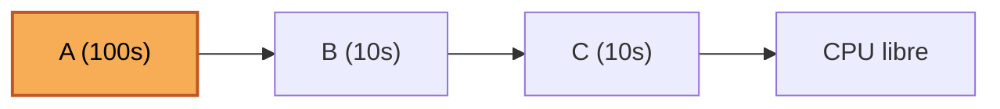

# Políticas de Planificación de CPU (Scheduling)

## Objetivos de Aprendizaje

* **Identificar**: El rol del planificador (*scheduler*) y las suposiciones idealizadas sobre la carga de trabajo (*workload assumptions*) usadas para analizar las políticas de planificación.
* **Calcular**: Las métricas de Turnaround Time y Response Time en distintos escenarios de llegada y duración de procesos.
* **Comparar**: El comportamiento de FCFS, SJF, STCF y Round Robin frente al efecto convoy y al compromiso entre tiempo de retorno y tiempo de respuesta.
* **Explicar**: Cómo el solapamiento (*overlap*) de operaciones de I/O mejora el uso de la CPU y ambas métricas de desempeño.
* **Reconocer**: Por qué se necesita un planificador como MLFQ cuando no se conoce de antemano el tiempo de ejecución de los procesos.

## Contextualización: ¿Cómo Desarrollar una Política de Scheduling?

Para diseñar un *framework* básico que permita razonar sobre las políticas de planificación (*scheduling policies*), es necesario responder cuatro preguntas: ¿qué suposiciones clave usar sobre la carga de trabajo?, ¿cuáles son las métricas más importantes?, ¿cuáles son los enfoques básicos usados en los primeros sistemas informáticos?, y en el fondo, ¿a quién le toca la CPU y cómo se decide?

El **planificador (scheduler)** es el encargado de decidir cómo y cuándo los procesos acceden a la CPU, de acuerdo con una **métrica** específica. El **workload** (carga de trabajo) es el conjunto de procesos en ejecución en el sistema en un momento dado.

## Suposiciones de Carga de Trabajo (*Workload Assumptions*)

Para simplificar el análisis inicial, se parte de un escenario idealizado con **cinco suposiciones**, reconocidas como "ideales y poco realistas":

1. **Cada trabajo se ejecuta por la misma cantidad de tiempo.**
2. **Todos los trabajos son iniciados al mismo tiempo** (*arrival time*).
3. **Una vez iniciado, cada trabajo se ejecuta hasta su finalización** (no se puede interrumpir).
4. **Todos los trabajos solo usan la CPU** (no I/O) — esto simplifica el modelo de 3 estados (Ready/Run/Block) a un modelo de 2 estados (Ready/Run).
5. **El tiempo de ejecución de cada trabajo es conocido** (*runtime*).

A lo largo de la sesión, cada suposición se va relajando una a una para acercar el modelo a un sistema operativo real: primero se relaja la 1 (duraciones distintas), luego la 2 (llegadas distintas), luego la 3 (posibilidad de interrupción/apropiación), y en la sesión del 25/08 se relajan la 4 (procesos con I/O) y finalmente la 5 (tiempo de ejecución desconocido).

## Métricas de Planificación: Turnaround Time

Se definieron tres métricas de desempeño usadas para *scheduling*: **Turnaround time**, **Fairness** (equidad) y **Response time**. La primera en desarrollarse fue el Turnaround Time.

**Turnaround Time**: tiempo comprendido entre la llegada y la finalización de un proceso.

$$T_{turnaround} = T_{completion} - T_{arrival}$$

Donde:
* $T_{arrival}$: instante en que el proceso llega a la cola de listos (*Ready*).
* $T_{firstrun}$: instante en que el proceso entra a la CPU por primera vez (*Run*).
* $T_{completion}$: instante en que el proceso termina.

> [!Note]
> El Turnaround Time siempre se calcula desde el momento en que el proceso **llega** al sistema, no desde que **empieza a ejecutarse**. Esta distinción es clave para los ejemplos con llegada diferida (SJF y STCF).

## Algoritmos de Planificación de Procesos

El planificador de procesos depende del **algoritmo de planificación**, el cual, basado en una **política específica**, asigna la CPU y mueve los distintos trabajos a través del sistema. Los algoritmos vistos en esta sesión, en el orden en que se presentaron, son:

* **First-Come, First-Served (FCFS / FIFO)**
* **Shortest Job First (SJF)**
* **Shortest Time-to-Completion First (STCF)**
* **Round Robin (RR)**

## First-Come, First-Served (FCFS)

Los procesos son manejados de acuerdo a su tiempo de llegada: el primer trabajo que llega es el primero en ser atendido. Se implementa mediante una cola **FIFO (First-In, First-Out)** y es **no apropiativo (non-preemptive)**: solo se selecciona un nuevo proceso cuando el anterior termina.

**Escenario ideal**: tres procesos A, B y C llegan al tiempo 0 en el orden A-B-C, cada uno con 10 segundos de ejecución.

| Proceso | Arrival time | Run-time |
| --- | --- | --- |
| A | 0 | 10 |
| B | 0 | 10 |
| C | 0 | 10 |

```
./scheduler.py -l 10,10,10 -p FIFO -c
```

$$T_{ta}(A)=10 \quad T_{ta}(B)=20 \quad T_{ta}(C)=30 \quad T_{ta(avg)}=\frac{10+20+30}{3}=20$$

**Escenario con duraciones distintas** (se relaja la suposición 1): A ahora se ejecuta por 100 segundos, mientras B y C duran 10 segundos cada uno, llegando en el mismo orden A-B-C.

| Proceso | Arrival time | Run-time |
| --- | --- | --- |
| A | 0 | 100 |
| B | 0 | 10 |
| C | 0 | 10 |

```
./scheduler.py -l 100,10,10 -p FIFO -c
```

$$T_{ta}(A)=100 \quad T_{ta}(B)=110 \quad T_{ta}(C)=120 \quad T_{ta(avg)}=\frac{100+110+120}{3}=110$$

### Efecto Convoy

El promedio de Turnaround Time pasa de 20 a 110 segundos. Este fenómeno se conoce como **Efecto Convoy**: ocurre cuando un proceso que requiere mucho tiempo de CPU se ejecuta primero (va por delante) de procesos más ligeros, haciendo que estos últimos esperen innecesariamente y que los tiempos de respuesta y finalización se resientan. El trabajo más grande es el que más influye en el turnaround promedio.



> [!Important]
> FCFS es simple y justo en orden de llegada, pero no optimiza el turnaround promedio cuando las duraciones son heterogéneas.

## Shortest Job First (SJF)

Para resolver el efecto convoy, SJF relaja la suposición 1 (duración equitativa): el planificador ejecuta primero los procesos con el **menor tiempo de ejecución**. Sigue siendo **no apropiativo (non-preemptive)**: solo se selecciona un nuevo proceso cuando el anterior termina.

**Escenario con llegada simultánea**: retomando A(100s), B(10s), C(10s), todos llegando en t=0, SJF reordena la ejecución a B, C, A.

```
./scheduler.py -l 100,10,10 -p SJF -c
```

$$T_{ta}(B)=10 \quad T_{ta}(C)=20 \quad T_{ta}(A)=120 \quad T_{ta(avg)}=\frac{10+20+120}{3}=50$$

El promedio baja de 110s (FCFS) a 50s: al mover los trabajos cortos al principio, su tiempo de espera disminuye drásticamente.

**Limitación de SJF (llegada diferida)**: al relajar también la suposición 2 (llegada simultánea), el problema reaparece. Si A(100s) llega en t=0, mientras B(10s) y C(10s) llegan en t=20, A ya está en ejecución y, como SJF es no apropiativo, no puede ser interrumpido.

| Proceso | Arrival time | Run-time |
| --- | --- | --- |
| A | 0 | 100 |
| B | 20 | 10 |
| C | 20 | 10 |

$$T_{ta}(A)=100 \quad T_{ta}(B)=90 \quad T_{ta}(C)=100 \quad T_{ta(avg)}=\frac{100+90+100}{3}=96.7$$

> [!Important]
> SJF es óptimo bajo llegada simultánea, pero reproduce el efecto convoy cuando los procesos cortos llegan después de uno largo ya en ejecución, ya que no es apropiativo.

## Shortest Time-to-Completion First (STCF)

Para resolver la limitación de SJF, se relaja la suposición 3 (ejecución hasta finalizar), introduciendo la **apropiación (preemption)**. STCF es la **versión apropiativa de SJF**: si llega un nuevo trabajo a la cola *Ready* con un tiempo de ejecución menor al tiempo **restante** del proceso en ejecución, este último es expulsado (vuelve a *Ready*) y se le asigna la CPU al proceso más corto.

Usando el mismo escenario que rompió a SJF (A(100s) en t=0; B(10s) y C(10s) en t=20): cuando B y C llegan, a A le restan 80s. Como 10 < 80, se le quita la CPU a A. Se ejecuta B (t=20 a 30), luego C (t=30 a 40), y finalmente A retoma y termina en t=120.

$$T_{ta}(B)=10 \quad T_{ta}(C)=20 \quad T_{ta}(A)=120 \quad T_{ta(avg)}=\frac{120+10+20}{3}=50$$

STCF elimina el efecto convoy presente en la versión no apropiativa de SJF (96.7 → 50), a costa de introducir mayor complejidad y sobrecosto por cambios de contexto (*context switches*) cuando hay muchas preempciones.

> [!Note]
> Continuación de la sesión del 25/08/2026 — a partir de aquí se repasó lo dictado el 20/08 y se introdujeron Response Time, Round Robin, I/O y MLFQ.

## Repaso: FCFS, SJF y STCF

Al inicio de la sesión del 25/08 se repasaron las tres políticas anteriores con los mismos tres ejemplos progresivos: (1) A, B, C de 10s cada uno llegando en t=0 con FCFS ($T_{ta(avg)}=20$); (2) el mismo trio con A=100s, B=10s, C=10s llegando en t=0, comparando FCFS ($T_{ta(avg)}=110$) contra SJF ($T_{ta(avg)}=50$); y (3) el caso con B y C llegando en t=20, comparando SJF ($T_{ta(avg)}=96.7$) contra STCF ($T_{ta(avg)}=50$).

## Tiempo de Respuesta (*Response Time*)

Optimizar solo el turnaround no garantiza una buena experiencia en sistemas interactivos, donde el usuario espera ver una respuesta rápida. El **Response Time** mide el tiempo desde que el trabajo llega hasta que es **atendido (programado) por primera vez**:

$$T_{response} = T_{firstrun} - T_{arrival}$$

## Round Robin (RR)

Round Robin introduce la planificación por porciones de tiempo (*time slicing*): ejecuta un trabajo por una porción de tiempo fija llamada **quantum**, y luego pasa al siguiente trabajo de la cola de listos, repitiendo el ciclo hasta que todos finalicen. Es un algoritmo **apropiativo (preemptive)**. La duración del quantum debe ser un **múltiplo del período de interrupción del timer** del sistema.

**Ejemplo**: A, B, C llegan en t=0 en ese orden, cada uno con 30 segundos de ejecución.

| Proceso | Arrival time | Run-time |
| --- | --- | --- |
| A | 0 | 30 |
| B | 0 | 30 |
| C | 0 | 30 |

Con **SJF** (equivalente a un quantum de 30, igual a la duración total de cada proceso, RR se comporta como FCFS):

```
./scheduler.py -l 30,30,30 -p SJF -c
```

$$T_{response(avg)}=\frac{0+30+60}{3}=30 \qquad T_{ta(avg)}=\frac{30+60+90}{3}=60$$

Con **RR y quantum = 10**, el orden de ejecución es A, B, C, A, B, C, A, B, C:

```
./scheduler.py -l 30,30,30 -p RR -q 10 -c
```

$$T_{response(avg)}=\frac{0+10+20}{3}=10 \qquad T_{ta(avg)}=\frac{70+80+90}{3}=80$$

### Comparación Round Robin vs. SJF

| Política | $T_{response(avg)}$ | $T_{ta(avg)}$ |
| --- | --- | --- |
| SJF (quantum = 30) | 30 | 60 |
| RR (quantum = 10) | 10 | 80 |

> [!tip]
> Típicamente, RR tiene un turnaround time más alto que SJF (y similares), pero un tiempo de respuesta mucho mejor. RR es justo (*fair*), pero de bajo desempeño en términos de turnaround.

### Importancia de la Duración del Quantum

| Entre más corto el quantum | Entre más largo el quantum |
| --- | --- |
| Mejor tiempo de respuesta. | Disminuye el costo total del cambio de contexto. |
| El costo del *context switch* **dominará** el desempeño global. | **Deteriora** el tiempo de respuesta. |

Con los mismos tres procesos (30s cada uno, llegada en t=0):

```
./scheduler.py -l 30,30,30 -p RR -q 5
```
$$T_{ta(avg)}=85 \qquad T_{response(avg)}=5$$

```
./scheduler.py -l 30,30,30 -p RR -q 10
```
$$T_{ta(avg)}=80 \qquad T_{response(avg)}=10$$

> [!Important]
> Decidir la longitud del quantum es un compromiso (*trade-off*) que debe contemplar el diseñador del sistema: un quantum muy pequeño incrementa la frecuencia de cambios de contexto, y su costo acumulado puede dominar el desempeño global si es demasiado reducido.

## Incorporación de Operaciones de I/O

Al relajar la suposición 4 (uso exclusivo de CPU), se incorporan las operaciones de **Entrada/Salida (I/O)**. Cuando un trabajo inicia un requerimiento de I/O, queda **bloqueado** en espera de que la operación termine, y el planificador debería seleccionar otro trabajo para que use la CPU mientras tanto. Cuando la I/O finaliza, se lanza una interrupción y el proceso pasa de *Block* a *Ready*.

**Ejemplo**: A y B requieren 40 ms de CPU cada uno. A (interactivo) ejecuta ráfagas de 10 ms de CPU seguidas de una operación de I/O de 10 ms (4 ráfagas de CPU y 3 de I/O). B (tipo batch, CPU-intensive) no realiza I/O y usa sus 40 ms de corrido. El planificador ejecuta primero a A y luego a B.

| Proceso | CPU total | CPU burst | I/O total | I/O burst |
| --- | --- | --- | --- | --- |
| A | 40 | 10 | 30 | 10 |
| B | 40 | — | — | — |

**Sin conciencia de I/O** (*not I/O aware*): la CPU permanece ociosa mientras A espera su I/O, antes de que B pueda usarla.

$$T_{ta(avg)}=\frac{70+120}{2}=95 \qquad T_{response(avg)}=\frac{0+70}{2}=35$$

**Con solapamiento** (*I/O-aware*, *overlap*): el planificador (aplicando STCF) trata cada ráfaga de CPU como un trabajo independiente, de forma que B usa la CPU mientras A está bloqueado esperando I/O.

$$T_{ta(avg)}=\frac{70+80}{2}=75 \qquad T_{response(avg)}=\frac{0+10}{2}=5$$

> [!tip]
> El solapamiento (*overlap*) mejora ambas métricas al mantener la CPU ocupada durante los períodos de bloqueo por I/O, evitando el desperdicio de recursos.

## Hacia un Planificador sin Conocimiento Perfecto: Introducción a MLFQ

Todas las políticas vistas (SJF, STCF) dependen de la suposición 5: conocer de antemano el tiempo de ejecución (*runtime*) de cada proceso — una premisa casi imposible de cumplir en un sistema operativo real, donde no se sabe cuánto durará un proceso que el usuario acaba de abrir.

El desafío consiste en diseñar un planificador de propósito general que funcione bien tanto para procesos **interactivos** (que priorizan el Response Time) como para procesos tipo **batch** o *CPU-bound* (que priorizan el Turnaround Time), sin conocer a priori cuánto tiempo usará la CPU cada proceso. La solución que se introdujo, a desarrollar en la siguiente clase, es el **Multi-Level Feedback Queue (MLFQ)**:

* Usa **múltiples colas** de procesos, cada una con un nivel de prioridad distinto.
* Cada proceso listo se asigna a una de las colas, y los procesos en colas de mayor prioridad se atienden antes que los de colas de menor prioridad.
* La prioridad de un proceso puede **cambiar dinámicamente** según su comportamiento observado.
* En términos de tipo de proceso, las colas de mayor prioridad atienden procesos de tiempo real (críticos), seguidos de procesos del sistema operativo (interrupciones, excepciones) y finalmente procesos interactivos y de usuario; los procesos tipo batch, al consumir grandes cantidades de CPU, tienden a ubicarse en colas de menor prioridad.

> [!Note]
> El análisis detallado de las reglas del MLFQ, sus ejemplos prácticos y los problemas que pueden surgir quedan pendientes para la siguiente clase.

---

> [!IMPORTANT]
> **Nota de Transparencia:** Este documento fue generado y adaptado mediante el uso de **IA Generativa**, a partir del manuscrito anotado de la clase y los resúmenes de las sesiones de Zoom del 20/08/2026 y 25/08/2026. El contenido ha sido supervisado, validado y refinado por intervención humana para garantizar su precisión técnica y coherencia pedagógica. No obstante, pueden haber errores.
