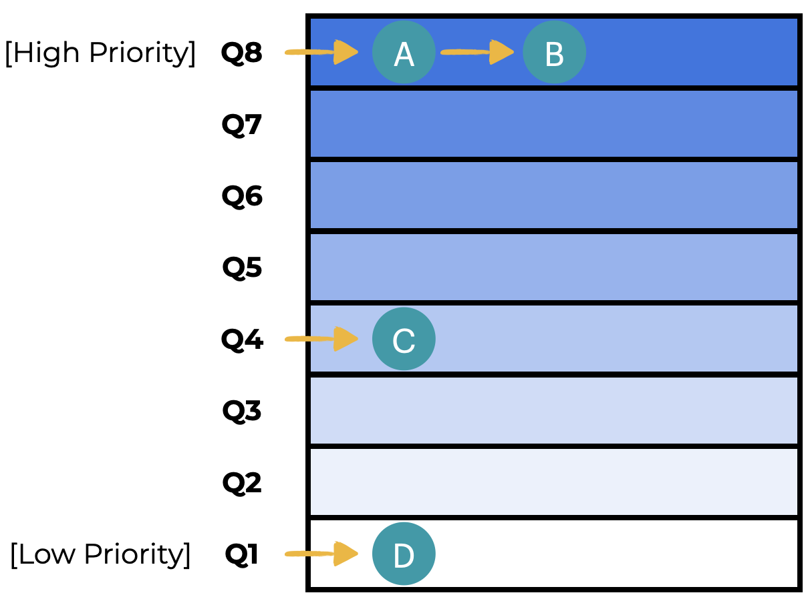
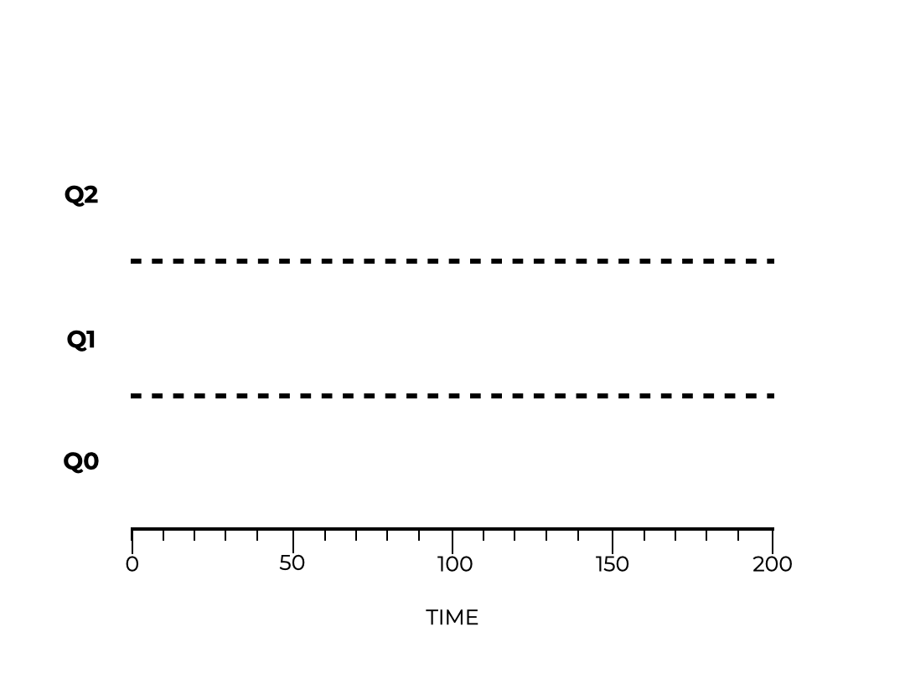
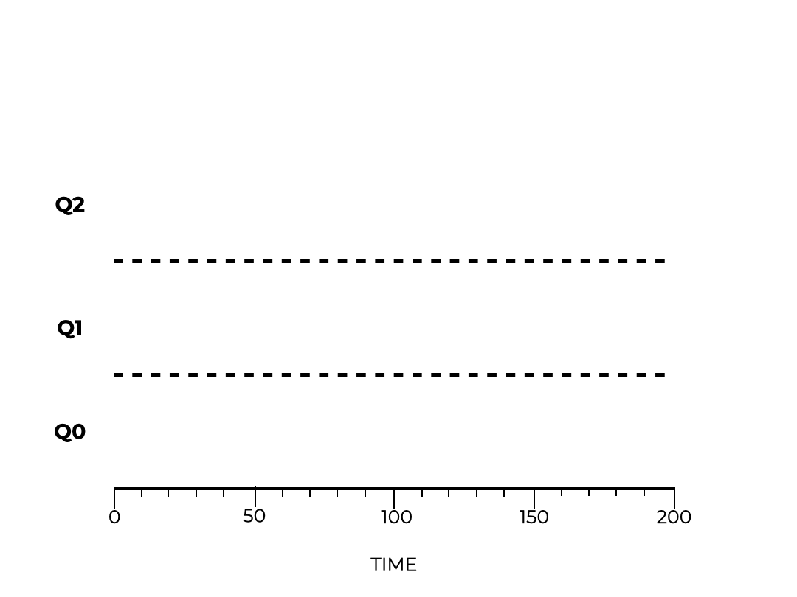
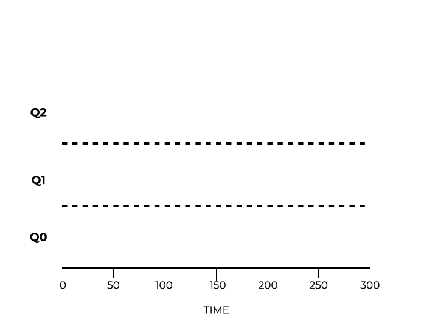

# MLFQ (Cola Multinivel con Retroalimentación)

## Duración de los trabajos

Se concluyó la lección anterior revisando el supuesto de que el planificador conoce la duración de cada trabajo. En la práctica, no es así, lo cual dificulta la implementación de las políticas discutidas previamente.

El uso de un planificador de **cola multinivel con retroalimentación** abordará estos problemas. Este planificador predice el futuro utilizando eventos del pasado reciente.

A lo largo de esta lección, se pretende responder a la siguiente pregunta:

> [!tip]
> ¿Cómo se puede crear un planificador que mejore el tiempo de retorno y el tiempo de respuesta cuando se desconoce la duración del trabajo?

## Introducción

Los sistemas modernos hacen uso de un planificador de **cola multinivel con retroalimentación (MLFQ)**, el cual se ha desarrollado a lo largo de muchos años.

La **MLFQ** puede ayudar a reducir el tiempo de retorno al ejecutar primero el trabajo más corto (incluso cuando no se conoce la duración del trabajo). También puede reducir el tiempo de respuesta, lo que hace que el sistema se sienta más receptivo para los usuarios. Para lograrlo, sin embargo, se deben tener en cuenta las siguientes preguntas:

> [!important]
> * ¿Cómo puede un planificador cumplir estos objetivos cuando se sabe tan poco sobre los trabajos?
> * ¿Cómo puede un planificador tomar mejores decisiones de planificación aprendiendo de los trabajos que completa?

## MLFQ: Reglas básicas

La MLFQ tiene varias **colas** diferentes. Cada cola tiene su propio **nivel de prioridad**. Se puede ejecutar un trabajo en cualquier momento. Cuando se tienen trabajos que compiten, la MLFQ selecciona el trabajo que tiene la prioridad más alta (ubicado en la cola con el nivel de prioridad más alto). Si hay varios trabajos en la misma cola, se puede utilizar la planificación *Round Robin*. Estas ideas se pueden sintetizar en dos reglas:

> [!note]
> * **Regla 1**: Si Prioridad(A) > Prioridad(B), se ejecuta A pero no B.
> * **Regla 2**: Si Prioridad(A) = Prioridad(B), se ejecutan tanto A como B con Round Robin.

La **priorización** es fundamental en la planificación MLFQ. Se determina la **prioridad** de un trabajo por el **comportamiento observado** del mismo. No se utiliza un valor fijo para establecer la prioridad. Esto significa que, si un trabajo utiliza E/S en lugar de la CPU, la MLFQ mantendrá la prioridad alta. A medida que la CPU se utiliza por periodos prolongados, la prioridad disminuirá. La MLFQ utiliza este historial para anticipar el comportamiento de trabajos futuros.

Una cola (en cualquier momento dado) puede verse como la imagen de la izquierda. Los trabajos A y B tienen la prioridad más alta, mientras que los trabajos C y D tienen una prioridad más baja. El planificador utilizaría *Round Robin* para alternar entre los trabajos A y B debido a su prioridad. En este ejemplo, los trabajos C y D no se ejecutan.

Se requiere una mejor comprensión de cómo la MLFQ cambia la prioridad a lo largo del tiempo.

## Intento #1: Cómo cambiar la prioridad

Considérese la carga de trabajo para un planificador. Existe una mezcla de trabajos que se ejecutan rápidamente o que utilizan la CPU durante un periodo prolongado. Utilizando esta premisa, se pueden crear algunas reglas adicionales para la MLFQ:

> [!note]
> * **Regla 3**: Los trabajos añadidos al sistema reciben la máxima prioridad (cola superior).
> * **Regla 4a**: La prioridad se reduce si el trabajo no puede completarse en una fracción de tiempo (se mueve una cola hacia abajo).
> * **Regla 4b**: La prioridad se mantiene igual si el trabajo se completa antes de que finalice la fracción de tiempo o si el trabajo cede el acceso a la CPU.

### Ejemplo 1: Un trabajo largo

Asuma que existe un único trabajo que se ejecuta durante mucho tiempo. Tal y como se muestra en la animación, el trabajo se desplaza a través de tres colas diferentes. El trabajo entra primero en la cola de mayor prioridad. Sin embargo, no puede terminar dentro de la fracción de tiempo (*time slice*), por lo que su prioridad se reduce. El trabajo no puede terminar en la siguiente fracción de tiempo, por lo que su prioridad pasa al ajuste más bajo. Aquí, el trabajo permanece hasta que se completa.

### Ejemplo 2: Un trabajo largo, un trabajo corto

Se examina un ejemplo más complejo que tiene dos trabajos. El trabajo A se ejecuta durante mucho tiempo y utiliza la CPU. El trabajo B se ejecuta brevemente y es interactivo. Se asume que el trabajo A se ejecuta durante un tiempo hasta que llega el trabajo B. El siguiente gráfico muestra cómo un planificador MLFQ manejaría esta situación.

El trabajo A desciende a través de los niveles de prioridad debido a su larga duración. Cuando llega el trabajo B, este entra en la cola más alta. El sistema entonces ejecuta el trabajo B. Se degrada puesto que no terminó en la primera fracción de tiempo. El sistema ejecuta B desde la siguiente cola y completa la tarea. Finalmente, el sistema reanuda el trabajo A en la prioridad más baja.

El sistema no sabía si el trabajo B sería largo o corto. Realiza una estimación y coloca al trabajo B en la cola de mayor prioridad. El sistema terminará rápidamente el trabajo si es pequeño; de lo contrario, el trabajo descenderá a través de las colas. La MLFQ se aproxima a replicar la política SJF (*Shortest Job First*).

### Ejemplo 3: I/O

Se presenta un ejemplo en el que un trabajo utiliza I/O. El trabajo A es una tarea de larga duración con uso intensivo de CPU, mientras que el trabajo B hace un uso intensivo de E/S. Se recuerda que la Regla 4b establece que un proceso mantiene su prioridad si cede el acceso a la CPU.

El trabajo A desciende por las diferentes colas hasta establecerse en la prioridad más baja. Cuando llega el trabajo B, se coloca en la cola de mayor prioridad. Debido a que cede continuamente el acceso a la CPU, su prioridad no cambia. Mientras el trabajo B accede a la I/O, el planificador continúa con el trabajo A hasta que el trabajo B termina su operación de I/O. Este proceso continúa hasta que el trabajo B se completa. El planificador entonces termina el trabajo A.

Se observa cómo la MLFQ equilibra eficientemente ambos trabajos.

## Problemas con el modelo actual

Los últimos ejemplos presentan uno de los trabajos como una tarea de larga duración con uso intensivo de CPU. La política MLFQ parece funcionar bien con este tipo de trabajos; sin embargo, no es un modelo perfecto. Si se tuviera una gran cantidad de trabajos de E/S, estos obtendrían todos los recursos debido a su prioridad. Los trabajos de larga duración sufrirían de **inanición (*starvation*)** porque se les deniegan los recursos del sistema. Además, los desarrolladores de software pueden **engañar al planificador (*gaming the scheduler*)** escribiendo código con muchas llamadas de E/S para empujar su aplicación a la parte superior de la cola de prioridad.

El planificador debería intentar mantener la equidad y no incentivar a los usuarios a engañar al sistema para recibir un trato preferencial. Por ejemplo, un desarrollador puede escribir en un archivo que no es importante; las numerosas llamadas a E/S aseguran que el trabajo permanezca en la cola de mayor prioridad. La siguiente figura muestra cómo los trabajos B y C dominan los recursos y dejan al trabajo A esperando su turno en la CPU.

Otro problema potencial ocurre cuando un trabajo de larga duración necesita repentinamente acceder a la E/S. Al estar en la cola de menor prioridad, el programa no tendrá la oportunidad de ejecutar estas tareas de E/S con rapidez, ya que otros trabajos tienen prioridad.

## Intento #2: El refuerzo de prioridad

Añadir otra regla debería ayudar a evitar la inanición. Se desea asegurar que los trabajos de larga duración puedan seguir progresando elevando regularmente la prioridad de todos los trabajos en el sistema.

> [!note]
> * **Regla 5**: Después de una cantidad de tiempo predeterminada, **S**, todos los trabajos en el sistema se mueven a la cola superior.

Al empujar todos los trabajos a la cola superior, se garantiza que un trabajo no sufra de inanición. Además, si un trabajo de larga duración necesita repentinamente acceder a la I/O, estará en la cola de mayor prioridad y estas tareas serán atendidas oportunamente.

Si se comparan las dos figuras que se muestan a continuación. se observa cómo, en la figura de abajo, el trabajo A es promovido de nuevo a la cola superior y puede acceder a la I/O. En la figura de arriba, no hay refuerzo de prioridad; el trabajo A está atrapado en la cola más baja y sufre inanición por los dos trabajos que utilizan mucha I/O.

Sin refuerzo de prioridad

Con refuerzo de prioridad

Seleccionar el valor adecuado para **S** (el límite de tiempo para reforzar la prioridad) puede ser difícil. Si el periodo de tiempo es demasiado corto, los trabajos interactivos verán un rendimiento más lento. Si se establece un intervalo demasiado grande, los trabajos de larga duración no se ejecutarán de manera adecuada. Se requiere alcanzar un equilibrio.

## Intento #3: Mejor contabilidad

El refuerzo de prioridad ayuda a prevenir la inanición, pero no evita que se engañe al planificador. Las reglas **4a** y **4b** establecen que los trabajos mantendrán su prioridad siempre que liberen la CPU antes de que expire una fracción de tiempo. Como se observan en las figuras a continuación; la de la arriba representa un trabajo de larga duración que engaña al planificador mediante llamadas de I/O para mantener su alta prioridad. Por otro lado en la de abajo, el mismo trabajo no mantiene su estatus en la cola superior.

Sin tolerancia al engaño

Con tolerancia al engaño

Se puede evitar que se engañe al planificador realizando un seguimiento de cuánto tiempo total se utiliza en cada nivel de prioridad. Si un trabajo excede un límite de tiempo acumulado, se disminuye su prioridad. En la figura anterior (inferior), tanto el trabajo A como el B hacen uso de la CPU y la I/O; sin embargo, no mantienen la prioridad más alta. Los trabajos son degradados en prioridad cuanto más tiempo se ejecutan.

Menor prioridad, Quanta más largos

Esta solución requiere que se reescriba la Regla 4 en una sola norma:

> [!note]
> * **Regla 4**: Los trabajos que exceden un límite de tiempo ven reducida su prioridad (se mueven una cola hacia abajo).**

De este modo, los trabajos ya no pueden mantener artificialmente un lugar privilegiado en la cola superior. Esto ayuda a mantener la equidad en el planificador.

## Ajuste de MLFQ y otros problemas

Se ha visto cómo el refuerzo de prioridad y el seguimiento del tiempo invertido ayudan a mejorar el rendimiento de MLFQ. Sin embargo, todavía existen interrogantes adicionales. ¿Cómo puede ser **parametrizado** el planificador? ¿Cuál debería ser el tamaño de cada cola? No hay una respuesta sencilla, razón por la cual se encuentran diversas variaciones de MLFQ.

Algunos planificadores MLFQ cambiarán las duraciones de las fracciones de tiempo entre las diferentes colas. Otros utilizan matemáticas más complejas para determinar cómo cambia la prioridad con el tiempo, qué longitud debe tener cada fracción de tiempo y con qué frecuencia se refuerza la prioridad de un trabajo.

Finalmente, se desarrollan planificadores MLFQ con nuevas características para ayudar a equilibrar el rendimiento. Por ejemplo, la prioridad más alta solo está disponible para tareas del sistema operativo. Esto evitaría que los programas de usuario abusen de la cola de mayor prioridad.

## Resumen

En esta lección, se introdujo el planificador de cola multinivel con retroalimentación (MLFQ). Esta política tiene varias colas, cada una con su propio nivel de prioridad. El planificador coloca los trabajos en la cola apropiada para maximizar el rendimiento. MLFQ utiliza el comportamiento de cada trabajo para determinar su prioridad. A medida que el comportamiento cambia con el tiempo, también puede cambiar la prioridad del trabajo.

Estas reglas de MLFQ se proporcionan aquí para su referencia:

> [!note]
> * **Regla 1**: Si Prioridad(A) > Prioridad(B), entonces se ejecuta A.
> * **Regla 2**: Si Prioridad(A) = Prioridad(B), entonces ambos se ejecutan utilizando una política *Round Robin*.
> * **Regla 3**: Los trabajos que entran al sistema se colocan en la cola superior con la prioridad más alta.
> * **Regla 4**: Si un trabajo tarda más de un tiempo especificado (incluso si libera la CPU), su prioridad se degrada.
> * **Regla 5**: Mover todos los trabajos a la cola superior después de algún periodo de tiempo **S**.

**MLFQ** es de gran interés porque resulta difícil optimizar el rendimiento sin conocer información como la duración de una tarea, la cual es imposible de conocer de antemano. Aun así, MLFQ utiliza el comportamiento para realizar estimaciones fundamentadas sobre la prioridad del trabajo. MLFQ alcanza un equilibrio notable entre el tiempo de retorno y el tiempo de respuesta.

