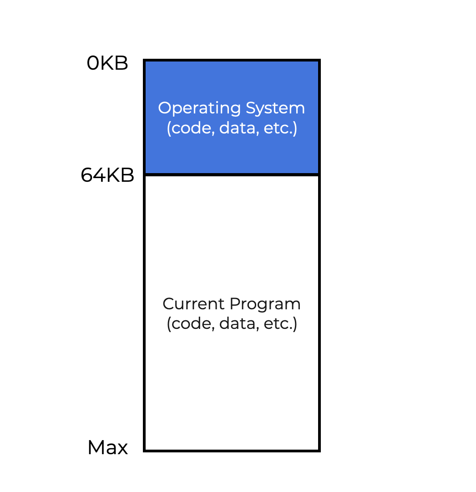
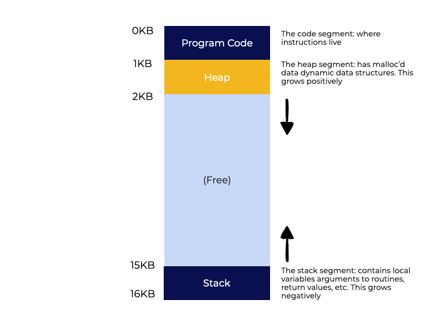
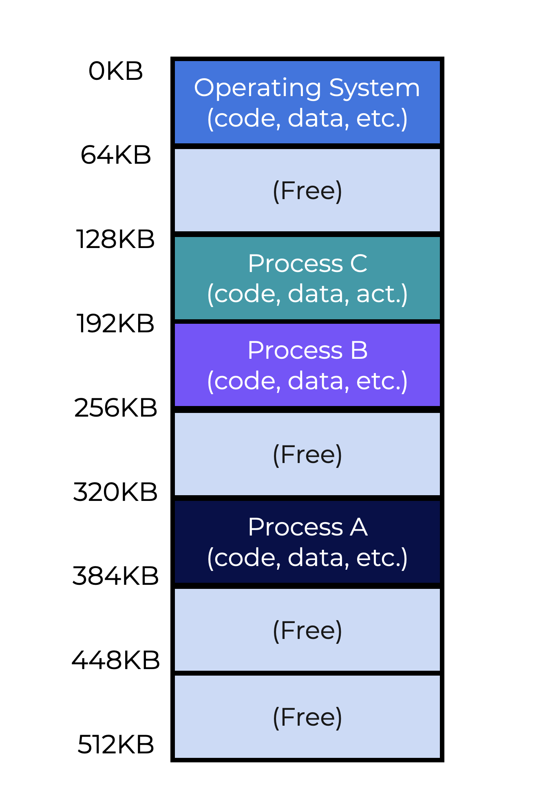

# Espacios de Direccionamiento

## Resumen

A continuación se explora cómo un sistema operativo virtualiza la memoria. Mientras revisas los conceptos fundamentales, mantén en mente la siguiente pregunta:

> [!note]
> Con una sola pieza física de memoria, ¿cómo logra el SO representar espacios de memoria separados para los múltiples procesos que se ejecutan al mismo tiempo?

## Introducción

### Máquinas Antiguas

Las primeras computadoras no ofrecían una **abstracción de memoria** para sus usuarios. La imagen a la izquierda es una buena representación de cómo se gestionaba la memoria inicialmente.

El SO era tratado como una biblioteca (o un conjunto de rutinas) almacenada en memoria. En este ejemplo, el SO abarca los primeros 64k de la memoria. El programa o proceso en ejecución ocupaba el resto del espacio.

<p align="center">
  
</p>

## Multiprogramación y Tiempo Compartido

Debido a su enorme costo, las computadoras se convirtieron en recursos compartidos. Esto significó que los sistemas operativos debían ser capaces de manejar a más de un usuario a la vez. Se introdujo la **multiprogramación** para que varios procesos se ejecutaran simultáneamente. El sistema conmutaba entre ellos (realizando E/S), lo que mejoró la **eficiencia de la CPU**.

Los usuarios necesitaban **interactividad** para obtener respuestas rápidas de la máquina. Esto dio paso al **tiempo compartido** (*time sharing*). El tiempo compartido comenzó ejecutando un proceso por un breve momento, deteniéndolo, guardando su estado en el disco, cargando el estado de otro proceso, ejecutándolo por un corto tiempo, y así sucesivamente.

Sin embargo, escribir en el disco es una tarea relativamente lenta para una computadora. Para que el tiempo compartido fuera más efectivo, el estado del proceso se empezó a guardar y cargar desde la memoria, lo cual es mucho más rápido que leer y escribir en el disco.

La **interactividad** se volvió crucial porque múltiples usuarios podían estar utilizando un sistema al mismo tiempo, cada uno esperando una respuesta ágil de su tarea actual; así nació la era del **tiempo compartido**.

El siguiente diagrama muestra cómo tres procesos (A, B y C) comparten la memoria. Cada proceso tiene su propio bloque de memoria. La CPU lee y escribe en el bloque asociado a cada proceso, mientras los demás permanecen en una cola de listos (*ready queue*).

<p align="center">
  
</p>

## El Espacio de direcciones

El sistema operativo ahora necesita una abstracción para lidiar con áreas separadas de memoria. Esta abstracción se denomina **espacio de direcciones** (*address space*). Una aplicación en ejecución solo puede ver la información en su propio espacio de direccionamiento; los demás bloques de memoria están fuera de su alcance.

El espacio de direccionamiento de un proceso contiene el estado del programa, lo que incluye el **código**. Se utiliza una **pila** (*stack*) para crear variables, pasar parámetros y, en general, realizar un seguimiento de la posición del proceso en la cadena de llamadas a funciones. Un **montículo** (*heap*) se utiliza para asignar memoria de forma dinámica. Por ejemplo, el heap se utiliza con una llamada a `malloc()`.

En resumen, el **espacio de direccionamiento** de un proceso contiene todo el estado de memoria del programa, incluido el **código**. El programa usa un **stack** para monitorear su posición en la cadena de llamadas, asignar variables y pasar parámetros. Finalmente, el **heap** se utiliza para la memoria gestionada por el usuario y asignada dinámicamente, como cuando se usa `malloc()`.

La animación muestra un espacio de direccionamiento de 16kb. Debido a que el código del programa es estático, puede ubicarse en el primer 1K del espacio de direccionamiento. Tanto el stack como el heap son dinámicos, por lo que necesitan espacio para aumentar y disminuir durante la vida del programa. Es por eso que se colocan en extremos opuestos del espacio de direccionamiento: pueden crecer y contraerse para aprovechar toda la memoria libre disponible en dicho espacio.

<p align="center">
  
</p>

## Virtualización de la Memoria

Ya vimos cómo funciona la abstracción de los espacios de direccionamiento en un ejemplo dado, pero ¿cómo gestiona el sistema todos los espacios de direccionamiento separados que se ejecutan sobre una única memoria física?

Esto se conoce como **virtualización de la memoria**. La animación de la página anterior mostraba el código del programa ocupando el primer 1kb de memoria. El stack y el heap tienen direcciones diferentes. Sin embargo, esto es una abstracción. El espacio de direccionamiento de un proceso no se corresponde directamente con la memoria física.

Según lo visto, el Proceso A "cree" que su código reside al principio del bloque de memoria (0kb). Esta es, en realidad, una **dirección virtual**. Ahora, observa la imagen de la izquierda. Cada proceso se almacena en varios bloques de memoria. El Proceso A realmente comienza en la dirección 320kb. El sistema operativo y el hardware trabajan juntos para asegurar que la carga de datos vaya a la dirección correcta (320kb) y no a la dirección virtual (0kb).

<p align="center">
  
</p>

El proceso de traducción entre la dirección virtual y la dirección real es una parte clave de la virtualización de la memoria.

## ¿Dónde está mi programa?

Es posible que alguna vez hayas impreso el valor de un puntero, el cual representa un espacio en memoria. Teniendo en cuenta todo lo que hemos aprendido hasta ahora, el valor de los punteros representa una **dirección virtual**. Es más, cada dirección que ves en un programa a nivel de usuario es una dirección virtual. La dirección real en la memoria física solo la conocen el SO y el hardware.

Compilar y ejecutar el programa a la izquierda devolverá tres valores de dirección diferentes. El primero es para la función `main()`, el segundo para el heap y el tercero para el stack.

### Ejemplo

**Código**: [virtual_address.c](src/virtual_address.c)

```c
#include <stdio.h>
#include <stdlib.h>

int main(int argc, char *argv[]) {
    printf("virtual address of the code : %p\n", main);
    printf("virtual address of the heap : %p\n", malloc(100e6));
    int x = 3; // create a value on the stack
    printf("virtual address of the stack: %p\n", &x);
    return 0;
}
```

**Compilar**

```
gcc -Wall virtual_address.c -o virtual_address
```

**Ejecutar**

```
./virtual_address
```

**Salida**
```
virtual address of the code : 0x5fcc800006fa
virtual address of the heap : 0x79785d997010
virtual address of the stack: 0x7ffcc875e3d4
```

Ninguna de estas direcciones representa la memoria física. Corresponden a una dirección virtual asignada para este programa.

## Objetivos

Tener objetivos claros ayuda al sistema operativo a garantizar que la virtualización de la memoria funcione según lo previsto. El sistema debe enfocarse en tres áreas:

* **Transparencia**: Solo el SO y el hardware deben conocer la dirección de memoria física. Todos los demás componentes deben operar como si la dirección virtual fuera la dirección física.
* **Eficiencia**: La virtualización debe optimizarse en términos de espacio y tiempo. Esto significa no asignar demasiada memoria (espacio) y no ralentizar los programas mientras se ejecutan (tiempo).
* **Protección**: Cada espacio de direccionamiento debe ser un "silo" aislado donde un proceso no pueda afectar a otros procesos fuera de su entorno. Además, procesos externos no deberían poder afectar a otro espacio de direccionamiento.

## Resumen

Aquí están los conceptos clave cubiertos en esta lección:

* La utilización de la memoria tuvo que evolucionar cuando las computadoras se enfocaron en el **tiempo compartido** e **interactividad**.
* La **memoria virtual (VM)** es una parte fundamental del funcionamiento del SO.
* Virtualizar la memoria significa que el sistema necesita una **dirección virtual** (una abstracción) para simular un espacio de direccionamiento separado donde se almacenan las instrucciones y los datos. Todas las direcciones en un programa a nivel de usuario son direcciones virtuales.
* El SO y el hardware traducen la dirección virtual en una **dirección física** en la memoria.
* Una virtualización de memoria efectiva significa que el sistema proporciona **transparencia**, **eficiencia** y **protección**.