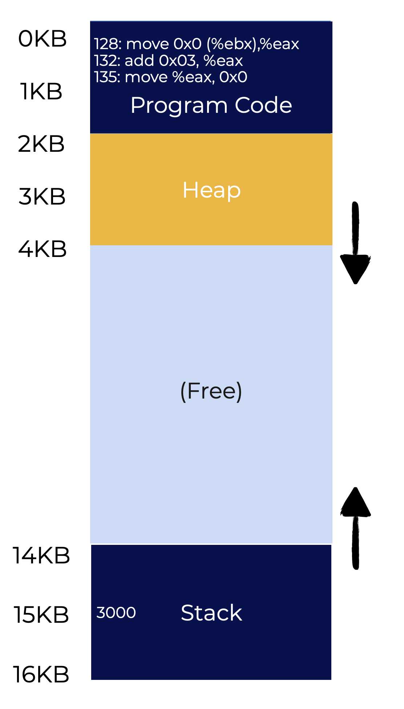
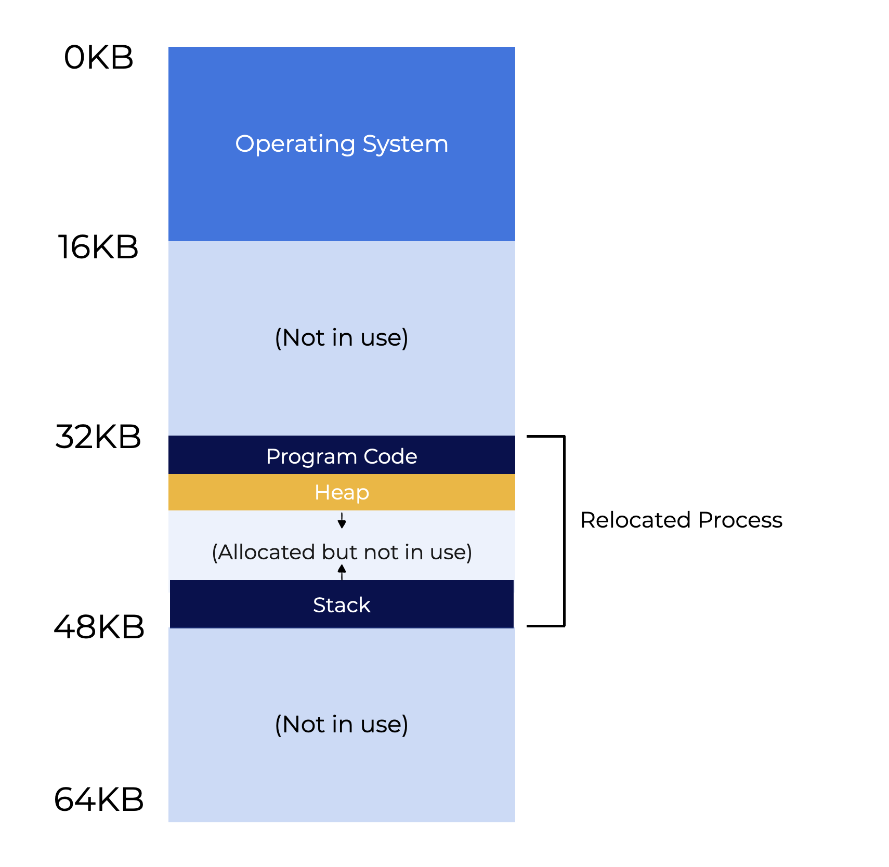
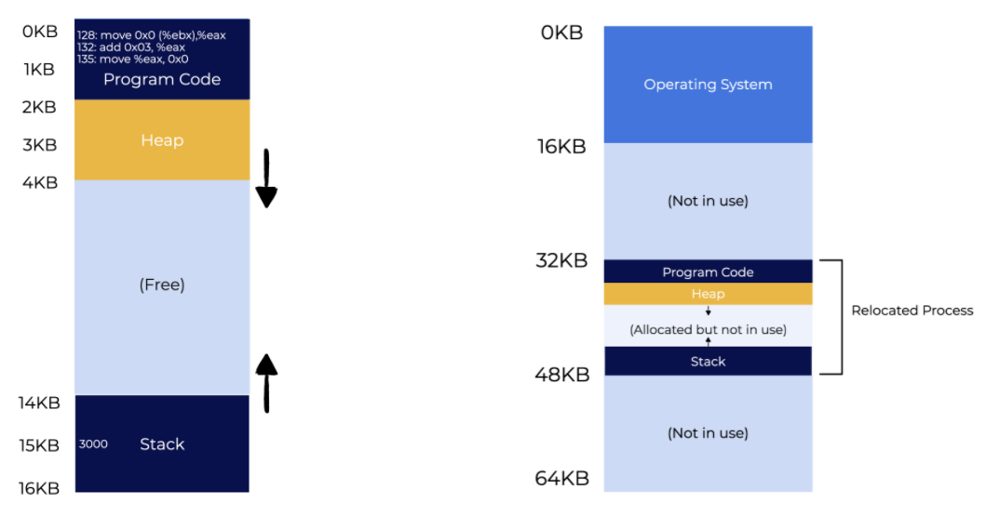

# Traducción de Direcciones: Base y Límite

## Resumen

Esta lección explora cómo virtualizar la memoria de manera eficiente. A medida que avancemos por los diferentes temas, ten en mente las siguientes preguntas:

* ¿Cuáles son algunas formas de virtualizar la memoria eficientemente?
* ¿Cómo limitamos el acceso a las posiciones de memoria que un programa puede usar?
* ¿Cómo podemos hacer lo anterior de forma eficiente?

## Introducción

En la lección sobre virtualización de CPU, introdujimos la idea de la **ejecución directa limitada** (o **LDE**, por sus siglas en inglés). La mayor parte del tiempo, los programas se ejecutan como se espera. Sin embargo, habrá casos en los que el SO necesite tomar el **control**, como en una interrupción de reloj (*timer interrupt*) o cuando un programa realiza una llamada al sistema (*system call*).

Se utiliza un enfoque similar al virtualizar la memoria. El objetivo final es, igualmente, equilibrar la **eficiencia** y el **control**. La eficiencia comienza como algo simple (por ejemplo, mediante registros) y crece en complejidad (como el soporte para tablas de páginas). El control significa que el SO garantiza que los programas no accedan a la memoria asignada a otros programas.

## Traducción de Direcciones

Para que el sistema sea fácil de programar, el sistema de memoria virtual debe ser flexible. Por ejemplo, los programas deben poder usar el espacio de direccionamiento de la manera que consideren adecuada.

El SO utiliza el hardware para traducir la memoria virtual a una dirección de memoria física. Este proceso se denomina **traducción de direcciones**. El hardware interviene cada vez que se hace referencia a la memoria para que el software acceda a la ubicación correcta. El hardware no es responsable de la virtualización de la memoria por sí mismo; realiza las tareas necesarias de bajo nivel. El sistema ayuda al hardware monitoreando qué bloques de memoria están ocupados y cuáles están libres. El SO también mantiene el control sobre el uso de la memoria.

La virtualización de la memoria es una abstracción y, cuando se hace correctamente, el usuario final cree que cada programa tiene su propia memoria privada que contiene el código y los datos necesarios para ejecutarse. No experimentan ralentizaciones ni ningún otro indicador de que la CPU está lidiando simultáneamente con muchos procesos que quieren acceder a los recursos del sistema.

## Supuestos (Assumptions)

Al comenzar a aprender cómo funciona la virtualización de memoria, haremos algunos supuestos simples sobre el funcionamiento del sistema. Ten en cuenta que estos supuestos iniciales no son un reflejo exacto de cómo funciona el SO en la realidad.

* **Supuesto 1** - El espacio de direccionamiento del usuario debe colocarse de forma adyacente en la memoria física.
* **Supuesto 2** - El tamaño del espacio de direccionamiento es menor que el de la memoria física.
* **Supuesto 3** - Cada espacio de direccionamiento tiene exactamente el mismo tamaño.

Iremos relajando estos supuestos gradualmente a medida que estudiemos este proceso con mayor detalle. Los nuevos supuestos se parecerán más a cómo funciona realmente la virtualización, lo que nos permitirá adentrarnos con calma en un tema complejo.

## Ejemplo de Traducción

He aquí un ejemplo de cómo funciona la traducción de direcciones. Utiliza la imagen a la izquierda para ilustrar el espacio de direccionamiento de este ejemplo.

El ejemplo gira en torno a estas tareas simples:

* Cargar un valor desde la memoria.
* Incrementarlo en tres.
* Guardarlo de nuevo en la memoria.

En lenguaje C, las acciones anteriores se verían así:

```c
void func() {
  int x = 3000;  
  x=x+3; 
  ...

```

Cuando el compilador convierte estas acciones a ensamblador x86, las instrucciones se verían así:

```asm
128: movl 0x0(%ebx), %eax  ;load 0+ebx into eax
132: addl $0x03, %eax      ;add 3 to eax register
135: movl %eax, 0x0(%ebx)  ;store eax back to mem

```

El código asume que la dirección de `x` está en el registro `ebx` y:

* Carga el valor en esa ubicación en el registro de propósito general `eax` usando la instrucción `movl`.
* Durante la siguiente instrucción, se suma 3 a `eax`.
* La última instrucción almacena el valor de `eax` de nuevo en la memoria.

<p align="center">
  
</p>

En la ilustración anterior, la dirección 128 (hacia la parte superior del código del programa) almacena la secuencia de código de tres instrucciones, mientras que el valor de `x` se encuentra en la dirección 15KB (hacia la parte inferior del stack). Puedes encontrar el valor inicial de `x` (3000) en el stack.

La ejecución de estas instrucciones hace que el proceso acceda a la memoria de las siguientes formas:

1. Obtener la instrucción en la dirección 128.
2. Ejecutar esta instrucción (cargar desde la dirección 15KB).
3. Obtener la instrucción en la dirección 132.
4. Ejecutar esta instrucción (sin referencia a memoria).
5. Obtener la instrucción de la dirección 135.
6. Ejecutar esta instrucción (almacenar en la dirección 15KB).

El programa de usuario opera como si su espacio de direccionamiento comenzara en la dirección 0 y se expandiera hasta los 16KB. Cualquier referencia a la memoria estará delimitada por estas dos direcciones. Sin embargo, el SO planea virtualizar la memoria ubicando el proceso en algún lugar de la memoria física.

## Reubicación Transparente

<p align="center">
  
</p>

La imagen de arriba muestra lo que sucede en la memoria física. El programa cree que está trabajando con el espacio de direcciones 0KB - 16KB. En realidad, el espacio de direcciones tiene una ubicación diferente en la memoria física. El primer slot de la memoria física está reservado para el SO. Otros procesos se ubicarán en otros lugares.

En este ejemplo, el proceso está en los 32KB. No tiene que estar en el slot de memoria adyacente al SO. Las ubicaciones 16KB - 32KB y 48KB - 64KB permanecen libres.

Las siguientes páginas hablarán sobre la reubicación. Usa las siguientes preguntas como guía:

* **¿Cuál es la mejor manera de mantener la transparencia y reubicar un proceso en la memoria?**
* **¿Cómo es posible la ilusión de un espacio de direcciones virtual que comienza en 0 cuando el espacio de direcciones se encuentra en otro lugar?**

## Reubicación Dinámica (Basada en Hardware): Base y Límite

Una técnica de traducción que utiliza hardware se llama **base y límite** (*base and bounds*), también conocida como **reubicación dinámica**. Estos términos se usarán indistintamente.

Cada CPU requiere dos registros de hardware: uno llamado **base** y el otro llamado **límite** (*bounds* o *limit register*). El par base y límite permite al sistema colocar el espacio de direccionamiento donde quiera en la memoria física. El par de registros también garantiza que el proceso solo tenga acceso a su propio espacio de direccionamiento.

El programa actúa como si estuviera cargado en la dirección 0. Sin embargo, el SO determina dónde debe cargarse el programa en la memoria física y establece el registro base con ese valor.

<p align="center">
  
</p>

La ilustración anterior muestra que el sistema determinó que el proceso debe cargarse en la dirección física **32KB**. Luego, establece el valor del **registro base** en **32KB**.

La traducción de la dirección virtual a la física se puede expresar de la siguiente manera:

```
dirección virtual + base = dirección física
```

Para cada **dirección virtual** generada por un proceso, el hardware suma la base a la dirección virtual. Esto crea una dirección física que puede ser utilizada por el sistema de memoria.

Analicemos qué sucede cuando se realiza una sola instrucción. Supongamos la primera instrucción del ejemplo de hace unas páginas:

```
128: movl 0x0(%ebx), %eax
```

El **contador de programa (PC)** se convierte en **128**.
Esto es lo que hace el hardware cuando necesita buscar (*fetch*) esta instrucción:

1. Suma el valor del PC al valor del **registro base de 32KB (32768)**, lo que genera la **dirección física 32896** (Nota: 128 + 32768).
2. Utiliza esta nueva dirección para recuperar la instrucción.
3. La CPU comienza la ejecución de esta instrucción.
4. El proceso emite una carga (*load*) desde la **dirección virtual 15KB**.
5. La CPU toma esta dirección y la combina con el **registro base** (**32KB**).
6. El resultado final es la dirección física **47KB**, que contiene los datos deseados.

La traducción de direcciones se puede resumir como tomar una **dirección virtual** utilizada por un proceso y transformarla en una **dirección física** donde residen realmente los datos. Esto también se llama **reubicación dinámica** porque el espacio de direccionamiento se puede reubicar incluso después de que un proceso haya comenzado.

## Traducción de Direcciones (Continuación)

Anteriormente se analizó sucede con el registro base, pero ¿qué pasa con el registro de **límite** (*bounds*)? El **registro límite** ayuda protegiendo la memoria. Este registro se asegura de que cuando un proceso crea una dirección, esta sea legal y resida dentro de los "límites" del proceso.

Generar una dirección de memoria virtual que sea mayor que el valor del límite hará que la CPU genere una excepción. El proceso infractor suele ser terminado.

Cada procesador tiene algo llamado **Unidad de Gestión de Memoria (MMU)**, que es el componente que ayuda con la traducción de direcciones. A medida que veamos técnicas de gestión de memoria más complejas, la complejidad de la MMU aumentará de la misma manera.

Supongamos que un proceso tiene un espacio de direccionamiento de 4KB en la ubicación 16KB. La tabla siguiente muestra una serie de traducciones de direcciones.

| Dirección Virtual | Dirección Física |
| --- | --- |
| 0 | 16KB |
| 1KB | 17KB |
| 3000 | 19384 |
| 4400 | *Fallo (fuera de límites)* |

Siempre que la dirección virtual (al sumarse a la base) no exceda el límite, la traducción es exitosa. Sin embargo, la última entrada en la tabla solicita una dirección virtual que excede los límites del espacio de direccionamiento. Esto resulta en un **fallo** (*fault*), lo que hace que el SO emita una excepción.

> [!important]
> **Más sobre los Registros Límite** >
> Una CPU solo tiene un par de registros de base y límite. Sin embargo, el registro límite se puede definir de otra manera: puede almacenar el tamaño del espacio de direccionamiento (como en el ejemplo de arriba) o la dirección física final del espacio de direccionamiento. De cualquier forma, verifica que cada acceso esté dentro de la frontera permitida.

## Soporte de Hardware

Recordemos lo que hemos cubierto hasta ahora y resumamos cómo el hardware ayuda a que este sea un proceso eficiente.

1. **Modo Privilegiado (Kernel)**
   * Evita que las aplicaciones de usuario realicen operaciones privilegiadas.

2. **Registros de Base y Límite**
   * Este par de registros se utiliza para almacenar la información necesaria para el proceso de traducción.

3. **Traducción y Verificación de Direcciones**
   * Se requiere circuitería para realizar las traducciones y luego verificar los límites.

4. **Actualización de Base/Límite (Instrucción Privilegiada)**
   * El SO debe poder establecer estos valores antes de permitir que se ejecute un programa de usuario.

5. **Registro de Manejadores de Excepciones**
   * El SO debe tener la capacidad de indicarle al hardware qué código ejecutar en caso de una excepción.

6. **Generar Excepciones**
  * El hardware debe generar excepciones cuando un proceso intenta realizar una operación ilegal (instrucción privilegiada, memoria fuera de límites, etc.).


El gráfico a continuación muestra una línea de tiempo de la interacción entre el hardware y el SO.

<p align="center">
  
</p>

El hardware maneja las traducciones de memoria para el Proceso A sin que intervenga el sistema operativo. El Proceso B, sin embargo, ejecuta una "mala carga" (*bad load*, por ejemplo, una dirección de memoria no autorizada). En este caso, el SO debe intervenir para finalizar el proceso, liberar su memoria y eliminarlo de la tabla de procesos.

Todo esto se hace utilizando una estrategia de **ejecución directa limitada**. Normalmente, el sistema operativo configura el hardware y deja que el proceso se ejecute por su cuenta, a menos que el proceso realice una actividad ilegal.

## Resumen

Esta lección aplicó lo que sabemos sobre la ejecución directa limitada a la memoria virtual mediante el uso de la traducción de direcciones.
* **La traducción de direcciones** permite al SO regular cada acceso a la memoria realizado por un proceso, manteniéndolo dentro de su espacio de direccionamiento.
* La virtualización por **base y límite**, también conocida como reubicación dinámica, **protege contra referencias de memoria fuera del área de direccionamiento de un proceso**.
* **La fragmentación interna** resulta de la limitación de colocar un espacio de direccionamiento en un slot de tamaño fijo, incluso cuando puede haber suficiente memoria física para más procesos.
