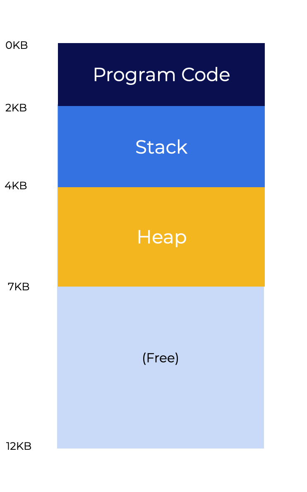

# Laboratorio

## Introducción

En este laboratorio, se utilizará un simulador, [`mem_relocation.py`](mem_relocation.py), para mostrar cómo funciona la traducción de direcciones en un sistema con registros de base y límite.

**Nota**: El laboratorio asume una disposición de memoria ligeramente diferente a la presentada anteriormente. En lugar de tener el montículo (*heap*) y la pila (*stack*) en extremos opuestos de la memoria, el código, el stack y el heap se encuentran todos contiguos.

La memoria solo puede crecer hacia las áreas más altas del espacio de direccionamiento.

<p align="center">
  
</p>

El registro de límite (*bounds*) en la imagen de arriba es de **7KB**, lo cual representa el final del espacio de direccionamiento. Se generaría una excepción si una dirección excede dicho límite.

**Ejecutar simulación**

```
python3 mem_relocation.py 1

Base and Boards Information
----------------------------
Base: 0x0003082 (decimal: 12418)
Limit: 472

Virtual Address Trace:
  * 0x01a9 (decimal: 425)
  * 0x0101 (decimal: 257)
  * 0x021d (decimal: 541)
  * 0x0182 (decimal: 386)
  * 0x0331 (decimal: 817)
```

La salida debería ser:

```
Base and Boards Information
----------------------------
Base: 0x0003082 (decimal: 12418)
Limit: 472

Virtual Address Trace:
* 0x01a9 (decimal: 425)
* 0x0101 (decimal: 257)
* 0x021d (decimal: 541)
* 0x0182 (decimal: 386)
* 0x0331 (decimal: 817)
```

La simulación crea un conjunto de espacios de direcciones virtuales. Se le realizarán preguntas para determinar si la dirección está fuera de los límites o cuál es su dirección física resultante.

* `0x01a9`: dirección válida porque es menor que el límite. La dirección física resultante sería `0x0000322b`.
* `0x0101`: dirección válida porque es menor que el límite. La dirección física resultante sería `0x00003183`.
* `0x021d`: dirección fuera de límites porque excede el límite permitido.
* `0x0182`: dirección válida porque es menor que el límite. La dirección física resultante sería `0x00003204`.
* `0x0331`: dirección fuera de límites porque excede el límite permitido.

Los cálculos se realizan utilizando valores decimales que luego se convierten a hexadecimal. Para la dirección `0x01a9`, el valor decimal es `425`, el cual es menor que el límite de `472`. Sume este valor decimal con el de la base:

```
12418 + 425 = 12843
```

Tome el valor `12843` y conviértalo a hexadecimal. Esto le dará la dirección física final de `0x0000322b`.

Utilice esta información para ayudarse a responder las preguntas en la página siguiente.

## Simulación 1

Ejecute la simulación haciendo clic en el botón de abajo. Utilice la salida para responder las preguntas presentadas a continuación. Puede utilizar este [sitio](https://www.binaryhexconverter.com/decimal-to-hex-converter) para ayudarse a convertir los números a hexadecimal.

```
python3 mem_relocation.py 2

Base and Boards Information
----------------------------
Base: 0x0003082 (decimal: 12418)
Limit: 472

Virtual Address Trace:
  * 0x01e3 (decimal: 483)
  * 0x0171 (decimal: 369)
  * 0x0288 (decimal: 648)
  * 0x01ad (decimal: 429)
  * 0x0d3 (decimal: 211)
```

Seleccione los valores de dirección adecuados para la simulación anterior.

* La dirección para 0x01e3 está fuera de límites.
* La dirección para 0x0171 es 0x000031f3.
* La dirección para 0x0288 está fuera de límites.
* La dirección para 0x01ad es 0x0000322f.
* La dirección para 0x0d3 es 0x00003155.

### Simulación 2

Ejecute la simulación haciendo clic en el botón de abajo. Utilice la salida para responder las preguntas presentadas a continuación. Puede utilizar este [sitio](https://www.binaryhexconverter.com/decimal-to-hex-converter) para ayudarse a convertir los números a hexadecimal.

```
python3 mem_relocation.py 3

Base and Boards Information
----------------------------
Base: 0x0003082 (decimal: 12418)
Limit: 472

Virtual Address Trace:
  * 0x01d8 (decimal: 472)
  * 0x0b6 (decimal: 182)
  * 0x0236 (decimal: 566)
  * 0x01d5 (decimal: 469)
  * 0x01d9 (decimal: 473)
```

Seleccione los valores de dirección adecuados para la simulación anterior.

* La dirección para 0x01d8 está fuera de límites.
* La dirección para 0x0b6 es 0x00003138.
* La dirección para 0x0236 está fuera de límites.
* La dirección para 0x01d5 es 0x00003257.
* La dirección para 0x01d9 está fuera de límites.

