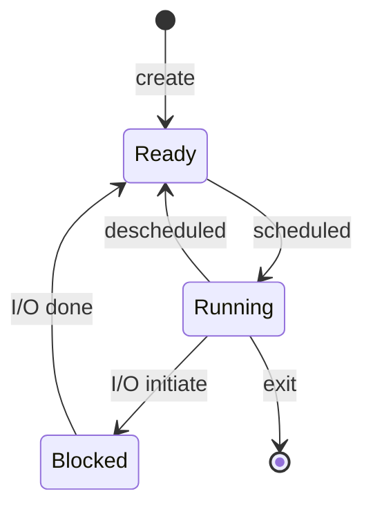
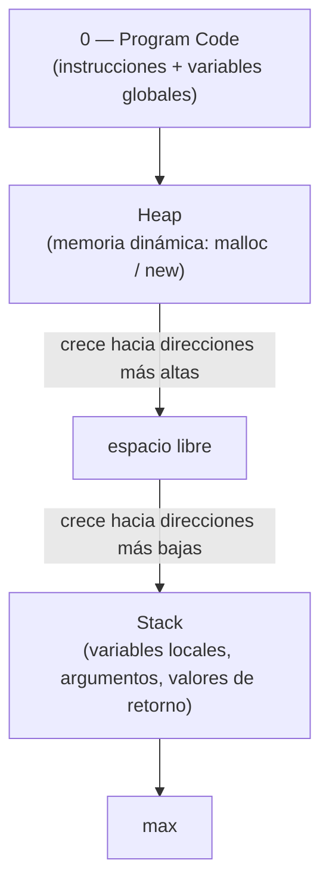

# Virtualización de Memoria y Espacio de Direcciones (Address Space)

## Objetivos de Aprendizaje

* **Consolidar**: los conceptos clave de la virtualización de CPU (proceso, scheduler, ejecución directa limitada, PCB, políticas de planificación) como cierre del Módulo 1, antes de iniciar el Módulo 2.
* **Explicar**: el problema central de la virtualización de memoria y por qué el sistema operativo necesita darle a cada proceso la ilusión de una memoria privada.
* **Diferenciar**: dirección virtual y dirección física, y describir a nivel conceptual el mecanismo de traducción de direcciones (address translation).
* **Identificar**: las secciones del espacio de direcciones (Address Space) — Program Code, Heap y Stack — y clasificar variables de un programa en C según la sección donde residen.

## Cierre del Módulo 1: Virtualización de CPU (repaso)

La sesión abrió con un repaso rápido de la virtualización de CPU para tender el puente hacia el nuevo módulo:

* **Proceso** = CPU + Memory + I/O Info: un programa estático en disco se convierte en una entidad dinámica (proceso) al cargarse en memoria.
* **Ilusión de múltiples CPUs**: aunque existe una sola CPU física, el SO la reparte tan rápido entre procesos que da la sensación de ejecución simultánea.
* **Implementación de la virtualización**, en tres niveles: **Abstracción** (modelo de 3 estados + API POSIX `fork()`/`exec()`/`wait()`/`exit()`), **Políticas** (el *scheduler* decide qué proceso ocupa la CPU) y **Mecanismos** (cómo se ejecuta ese cambio a bajo nivel).
* **Modelo de 3 estados** y colas de procesos, gestionados a través del **PCB (Process Control Block)**, que guarda estado del proceso, PID, program counter, registros, límites de memoria y lista de archivos abiertos.



* **Mecanismo de Ejecución Directa Limitada (LDE)**: dos modos de operación, usuario (`mode = 1`) y kernel (`mode = 0`), con transiciones vía `trap` / `return from trap`.
* **Políticas de planificación** vistas: FCFS, SJF y STCF (bajo supuestos ideales) y RR, hasta llegar a **MLFQ** (Multi-Level Feedback Queue) como planificador general que combina procesos batch (intensivos en CPU) e interactivos (intensivos en I/O), evaluados con las métricas *turnaround time* ($T_{ta}$) y *response time* ($T_{res}$).

## Virtualización de Memoria: El Problema Central

Con el Módulo 1 cerrado, la clase arrancó formalmente el **Módulo 2 (Memoria)** ampliando la ecuación del proceso: `Proceso = CPU + Memory + I/O Info`, marcando la **Memory** como el nuevo foco.

> [!IMPORTANT]
> **Problema central (crux):** ¿Cómo puede el sistema operativo construir la ilusión de que cada proceso tiene su propio espacio de memoria privado y grande, si en realidad todos comparten una única memoria física?

### Demostración con `mem.c`

Para plantear el problema, se ejecutó un programa en C que reserva un entero en el heap y lo incrementa en un ciclo infinito, imprimiendo el PID del proceso, la dirección de memoria y el valor almacenado:

```c
#include <unistd.h>
#include <stdio.h>
#include <stdlib.h>
#include "common.h"

int main(int argc, char *argv[]) {
    if (argc != 2) {
        fprintf(stderr, "usage: mem <value>\n");
        exit(1);
    }
    int *p;
    p = malloc(sizeof(int));
    assert(p != NULL);
    printf("(%d) addr pointed to by p: %p\n", (int) getpid(), p);
    *p = atoi(argv[1]); // assign value to addr stored in p
    while (1) {
        Spin(1);
        *p = *p + 1;
        printf("(%d) value of p: %d\n", getpid(), *p);
    }
    return 0;
}
```

Al correr **una sola instancia**:

```
prompt> ./mem 1
(2134) address pointed to by p: 0x200000
(2134) p: 1
(2134) p: 2
(2134) p: 3
(2134) p: 4
(2134) p: 5
^C
```

Al correr **dos instancias simultáneas** del mismo programa:

```
prompt> ./mem 1 &; ./mem 1 &
[1] 24113
[2] 24114
(24113) address pointed to by p: 0x200000
(24114) address pointed to by p: 0x200000
(24113) p: 1
(24114) p: 1
(24114) p: 2
(24113) p: 2
(24113) p: 3
(24114) p: 3
(24113) p: 4
(24114) p: 4
...
```

Ambos procesos (PID distintos) reportan la **misma dirección** `0x200000`. Si fueran direcciones físicas reales, los dos estarían escribiendo en el mismo lugar de la RAM — lo cual es imposible, porque cada proceso ve valores independientes. La explicación es que **`0x200000` es una dirección virtual, no física**: cada proceso tiene su propia vista de la memoria (memoria virtual), y el sistema operativo la mapea a una región distinta y no superpuesta de la memoria física (RAM).

Como referencia de escala trabajada en clase: si la memoria física (RAM) tiene un tamaño de 8 GB, eso equivale a $8G = 2^3 \times 2^{30} = 2^{33}$ direcciones posibles, es decir, un espacio de direcciones físicas de `0` a $2^{33}-1$.

### Traducción de direcciones (concepto general)

El manuscrito introduce la traducción de direcciones como una función genérica que el hardware aplica sobre cada dirección virtual generada por el proceso:

$$PA = AT(VA)$$

Por ejemplo, una dirección virtual `VA = 0x200000` podría traducirse a una dirección física `PA = 0x1000000`. El propio manuscrito señala que el mecanismo concreto de esta traducción (**"lo veremos en mod 2"**) se desarrolla más adelante en el módulo — es decir, esta sesión presenta el *qué* y el *para qué* de la traducción de direcciones, no todavía el *cómo* (eso corresponde a la siguiente clase, cuando se vean los registros de la MMU).

### El sistema operativo y la virtualización de memoria

* El SO **virtualiza** la memoria física.
* **Proporciona una ilusión** para el espacio de memoria de cada proceso: cada proceso cree que utiliza todos los recursos de memoria de la máquina.
* A diferencia de la CPU (que se multiplexa **en tiempo**, por turnos), la memoria física se multiplexa **en espacio**: cada proceso recibe simultáneamente una porción distinta de la RAM.
* Analogía usada en clase: cada proceso vive en su propio "mundo" (memoria virtual), como el personaje de *The Truman Show*, sin saber que coexiste con otros procesos en la memoria física real.

### Objetivos de la virtualización de Memoria

* **Transparencia**: el SO virtualiza la memoria de forma invisible para el programa — el proceso corre como si tuviera toda la memoria física para él solo.
* **Eficiencia**: en términos de tiempo y de espacio.
* **Protección (seguridad)**: garantiza aislamiento entre procesos y el SO, y protege contra accesos ilegales de otros procesos.

## Evolución: de un solo proceso a la multiprogramación

* **Primeros sistemas operativos**: el SO era un conjunto de rutinas (biblioteca) ubicado al inicio de la memoria física; solo se cargaba **un proceso** en el resto de la memoria — bajo nivel de utilización, poco eficiente.
* **Multiprogramación (tiempo compartido)**: se cargan múltiples procesos en memoria simultáneamente; el SO ejecuta cada uno por un periodo corto y cambia el uso de la CPU entre ellos, incrementando la utilización y eficiencia — pero esto introduce un **problema de protección**, ya que ahora conviven en memoria física varios procesos y deben evitarse accesos ilegales entre ellos.

| Dirección | Contenido (ejemplo con multiprogramación) |
|---|---|
| 0 KB | Operating System |
| 64 KB | *(libre)* |
| 128 KB | Process C |
| 192 KB | Process B |
| 256 KB | *(libre)* |
| 320 KB | Process A |
| 384 KB – 512 KB | *(libre)* |

## Espacio de Direcciones (Address Space) (OSTEP, cap. 13)

> **Nota:** a partir de aquí corresponde al contenido dictado el 3 de septiembre (continuación de la sesión del 1 de septiembre).

El **Address Space** es la abstracción de la memoria física creada por el sistema operativo: contiene todos los datos e instrucciones de un proceso en ejecución, y siempre comienza en la dirección `0` hasta un valor máximo (`VMAX`) — sin importar en qué región de la memoria física esté realmente ubicado el proceso. También se le llama memoria virtual o espacio lógico del proceso.

Analogía usada en clase: la memoria es como un armario donde cada tipo de objeto (zapatos, pantalones, camisas) ocupa un lugar específico; de igual forma, cada tipo de variable ocupa una sección determinada del Address Space.



| Segmento | Observaciones |
|---|---|
| **Program Code** | Instrucciones ejecutables (funciones, declaraciones) y variables globales — en este curso se sigue la convención de OSTEP/Remzi, que agrupa código y datos globales en una sola zona (a diferencia de otros textos, como el libro del dinosaurio, que los separa). Ocupa las direcciones más bajas. |
| **Heap** | Memoria asignada dinámicamente en tiempo de ejecución (`malloc` en C, `new` en Java/C++). El programador es responsable de administrarla: crece al reservar y decrece al liberar (`free`). En C no existe *garbage collector*, por lo que liberar la memoria es obligatorio para evitar fugas. Crece hacia direcciones más altas. |
| **Stack** | Memoria automática: variables locales, argumentos pasados a funciones, y direcciones/valores de retorno. Es gestionada automáticamente por el sistema — al salir de una función, sus variables locales se eliminan del Stack. Crece hacia direcciones más bajas. |

Si el Heap y el Stack crecen sin control y llegan a encontrarse, el sistema operativo puede terminar el proceso como medida de protección.

### Las direcciones que ve un programa son siempre virtuales

Un ejemplo real, corrido en una máquina Linux de 64 bits, ilustra las distancias entre segmentos:

```c
#include <stdio.h>
#include <stdlib.h>

int main(int argc, char *argv[]) {
  printf("location of code  : %p\n", (void *) main);
  printf("location of heap  : %p\n", (void *) malloc(1));
  int x = 3;
  printf("location of stack : %p\n", (void *) &x);
  return x;
}
```

```
location of code  : 0x40057d
location of heap  : 0xcf2010
location of stack : 0x7fff9ca45fcc
```

Se observa que la dirección del código (Program Code) está en una zona muy distante de la del Heap, y que la dirección de la variable local (Stack) está mucho más lejos aún — coherente con el mapa de memoria de la sección anterior.

### Ejercicio: clasificar variables por segmento

Dado el siguiente fragmento de código:

```c
int x;                              // global

int main(int argc, char *argv[]) {
  int y;
  int *z = malloc(sizeof(int));
}
```

| Variable | Ubicación |
|---|---|
| `x` (global) | Program Code |
| `main` (instrucciones) | Program Code |
| `y` (local) | Stack |
| `z` (puntero local) | Stack — el puntero en sí vive en el Stack; el bloque de memoria al que apunta (reservado con `malloc`) vive en el Heap |

---

> [!NOTE]
> La traducción de direcciones con la MMU (registros Base y Bound, fórmula de traducción y el ejemplo numérico trabajado en clase) corresponde a la parte final de la sesión y se documentará en el apunte de la siguiente clase, con su propio manuscrito como fuente primaria.

> [!IMPORTANT]
> **Nota de Transparencia:** Este documento fue generado y adaptado mediante el uso de **IA Generativa**, a partir del manuscrito anotado de la clase y el resumen de la sesión de Zoom. El contenido ha sido supervisado, validado y refinado por intervención humana para garantizar su precisión técnica y coherencia pedagógica. No obstante, pueden haber errores.
