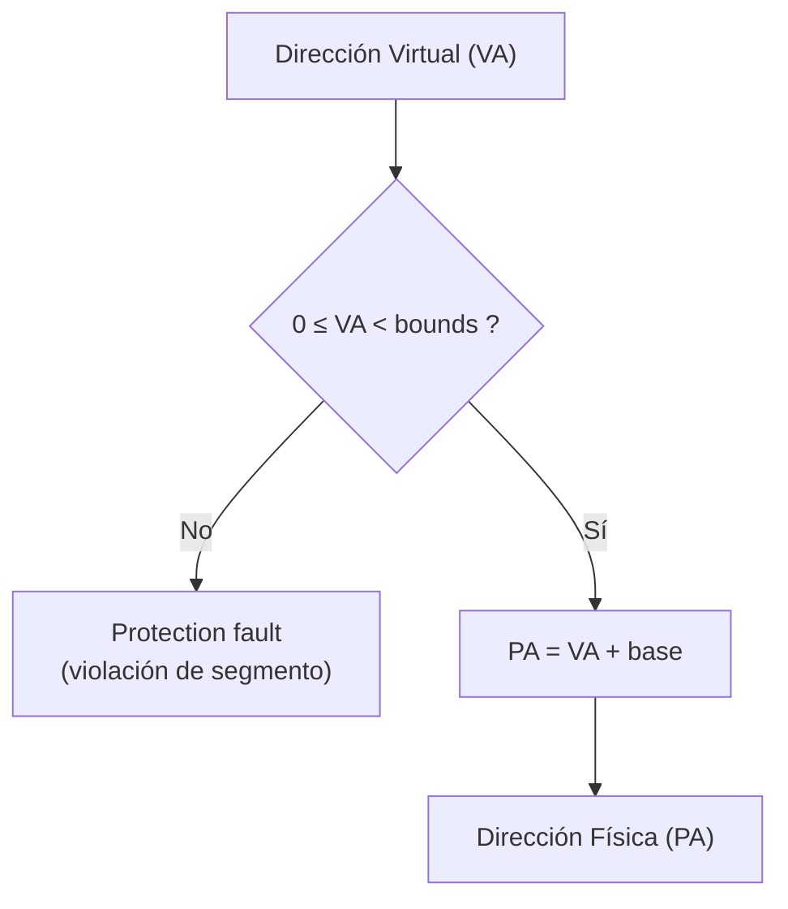
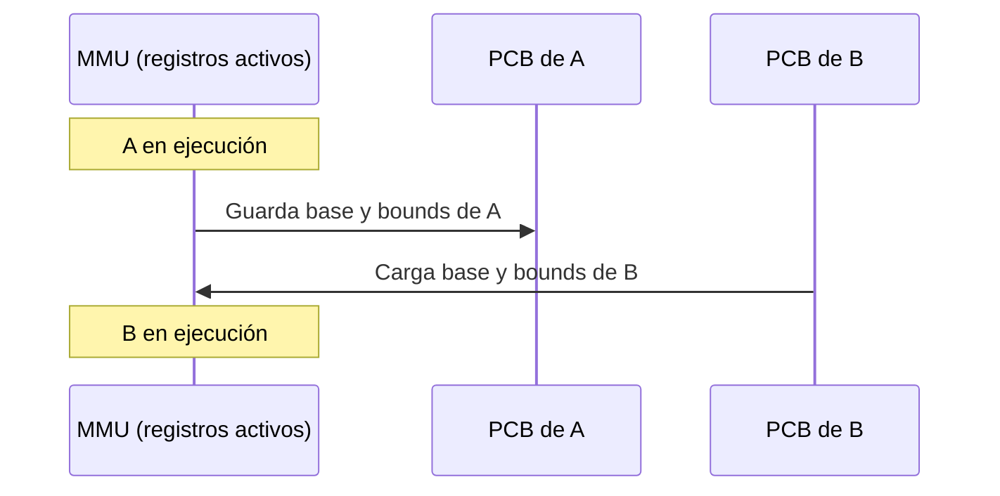

# Reubicación Dinámica: Traducción de Direcciones con Base y Bound (OSTEP, cap. 15)

## Objetivos de Aprendizaje

* **Explicar**: el mecanismo de reubicación dinámica (*Dynamic Relocation*) mediante los registros Base y Bound de la MMU para traducir direcciones virtuales a físicas.
* **Aplicar**: las fórmulas de chequeo de límites (`0 ≤ VA < Bound`) y de traducción (`PA = VA + Base`) para resolver ejercicios de mapeo de direcciones, incluyendo casos de violación de límites.
* **Utilizar**: el simulador `relocation.py` para practicar y verificar traducciones de direcciones válidas e inválidas.
* **Describir**: las acciones que ejecuta el sistema operativo (gestión de la *freelist*, actualización del PCB) al crear, terminar y cambiar de contexto entre procesos bajo este esquema.

## Repaso: de la ilusión de memoria a la traducción de direcciones

Retomando la clase anterior: cada proceso cree tener su propia memoria (analogía del "mundo de Truman"), cuando en realidad el sistema operativo mapea su Address Space a una región de la memoria física real. Al correr dos instancias del mismo programa, ambas reportan la misma dirección virtual (`0x200000`), pero el sistema operativo las traduce a regiones físicas distintas y no superpuestas.

El proceso de convertir una dirección virtual (VA) en una dirección física (PA) se llama **Address Translation** — de forma genérica, $PA = AT(VA)$ (por ejemplo, `VA = 0x200000` podría traducirse a `PA = 0xFFFF0000`, según dónde haya ubicado el SO al proceso en memoria física).

## Soporte en Hardware: la MMU

La virtualización de memoria, igual que la Ejecución Directa Limitada del Módulo 1, **requiere soporte de hardware**: registros dedicados dentro del chip de la CPU. Sus objetivos son:

* **Eficiencia**: usar el recurso de la mejor forma posible.
* **Control**: proteger la memoria y garantizar accesos correctos.

Ese soporte de hardware incluye modos de CPU, interrupciones, registros y, específicamente para memoria, mecanismos como *segment tables*, *TLB* y *page tables* (se verán en clases posteriores). El componente central es la **MMU (Memory Management Unit)**: reside físicamente dentro de la CPU, junto al Program Counter y los registros generales, y es la encargada de traducir cada dirección virtual (VA) que genera la CPU en una dirección física (PA) antes de acceder a la memoria principal.


## Ejemplo: ciclo de instrucción y acceso a memoria

Para contextualizar por qué la CPU necesita traducir direcciones en *cada* acceso, se analizó el siguiente fragmento en C y su equivalente en ensamblador (similar a MIPS), asumiendo que la variable `x` está en la dirección virtual `15360` (`15K = 15 × 2^10 = 15 360`):

```c
void func() {
    int x = 3000;
    x = x + 3;
}
```

```
128  lw   $S0, 15360
132  addi $S0, $S0, 3
135  sw   $S0, 15360
```

Cada instrucción se ejecuta con el ciclo **Fetch → Decode → Execute → Update PC**, y el CPU accede a memoria tanto para traer la instrucción como, cuando aplica, para leer/escribir su operando:

* **`lw $S0, 15360`** (dir. 128): *fetch* de la instrucción en 128 → **acceso a memoria**: carga el dato desde la dirección 15360.
* **`addi $S0, $S0, 3`** (dir. 132): *fetch* de la instrucción en 132 → sin acceso a memoria (solo incrementa `$s0` en 3, en el registro).
* **`sw $S0, 15360`** (dir. 135): *fetch* de la instrucción en 135 → **acceso a memoria**: guarda el dato en la dirección 15360.

Tanto la dirección de la instrucción (128, 132, 135) como la del dato (15360) son **direcciones virtuales**: cada una debe pasar por la MMU antes de llegar a la memoria física real.

## Reubicación Dinámica (Dynamic Relocation): Registros Base y Bound

**Objetivo**: traducir una dirección virtual a una física sumándole un *offset* fijo. También se conoce como *hardware-based relocation* o *base & bound relocation*. Usa dos registros dedicados dentro de la MMU:

* **`base`**: almacena la dirección física más baja desde la cual se mapea el proceso en la RAM. El sistema operativo la fija al decidir dónde cargar el proceso — potencialmente en cualquier lugar de la memoria física, no necesariamente en la dirección 0.
* **`bounds`** (límite): almacena el **tamaño** del espacio de direcciones virtual del proceso (no la dirección física máxima) — por ejemplo, `16 384` para un proceso de 16 K.

### Reglas y fórmulas

La traducción implica dos pasos:

1. **Chequeo de límites** — la dirección virtual debe estar dentro del espacio del proceso:
   $$0 \le VA < bounds$$
   Si no se cumple, se produce un **protection fault** (violación de segmento): no existe dirección física asociada.
2. **Cálculo de la dirección física** — si el chequeo es válido:
   $$PA = VA + base$$



**Ejemplo con particiones**: con `Limit register = 0x2200` y `Base register = 0x3200`, una dirección virtual `VA = 0x362` se traduce a `PA = 0x362 + 0x3200 = 0x3562` (ubicada dentro de la Partition 1 de la memoria física).

### Ejemplo completo: acceso a memoria de una instrucción real

Retomando el ejemplo `lw $S0, 15360` (dir. 128), y asumiendo `base = 32 768` y `bounds = 16 384` (proceso con Address Space de 16 K, ubicado a partir de la dirección física 32 K, dentro de una memoria física de 64 K):

Para ejecutar la instrucción se hacen **dos accesos a memoria** (cada uno con su propia traducción):

1. **Traer (fetch) la instrucción** desde la dirección virtual `128`:
   * Chequeo: $0 \le 128 < 16\,384$ ✓
   * $PA = 128 + 32\,768 = 32\,896$
2. **Ejecutar la instrucción** (`lw` carga el dato desde la dirección virtual `15360`):
   * Chequeo: $0 \le 15\,360 < 16\,384$ ✓
   * $PA = 15\,360 + 32\,768 = 48\,128$ → se carga el valor almacenado ahí (`3000`) en `$s0`.

## Ejercicio: traducción de direcciones en un proceso de 4 K

**Enunciado**: un proceso con un espacio de direccionamiento de 4 KB fue asignado a una memoria física de 64 K a partir de 16 KB. Es decir: `bounds = 4 096` (4 K), `base = 16 384` (16 K), `size(AS) = 4 K`, `size(PM) = 64 K`.

| Dirección Virtual (VA) | Chequeo (`0 ≤ VA < 4096`) | Dirección Física (PA) |
|---|---|---|
| 0 | Válido | `0 + 16 384 = 16 384` (16 K) |
| 1 K (1 024) | Válido | `1 024 + 16 384 = 17 408` (17 K) |
| 3 300 | Válido | `3 300 + 16 384 = 19 684` |
| 4 400 | **Inválido** (4 400 > 4 096) | — **Fault** (out of bounds) |

La dirección virtual `4 400` excede el rango válido del proceso (`[0, 4095]`), por lo que no tiene dirección física asociada: se produce una violación de segmento.

## Simulador `relocation.py`

El libro de referencia (OSTEP) incluye un simulador de línea de comandos para practicar la reubicación dinámica:

```
./relocation.py -a 4k -p 64k -b 16k -l 4k
```

| Bandera | Significado |
|---|---|
| `-a` | *asize* — tamaño del espacio de direcciones (Address Space) |
| `-p` | *physmem* — tamaño de la memoria física |
| `-b` | *base* — valor del registro base |
| `-l` | *limit* — valor del registro bounds (tamaño de la memoria virtual) |
| `-n` | número de direcciones virtuales a generar |
| `-s` | *seed* — semilla para aleatorizar las direcciones generadas |
| `-c` | muestra las respuestas (traducción de cada dirección) |

Cuando el tamaño del espacio de direcciones (`-a`) es mayor que el límite (`-l`), el simulador ilustra una zona **fuera de bounds** (violación) dentro del propio rango de direcciones que puede generar aleatoriamente.

Ejemplo de ejecución con `-c` (semilla 7, `-a 8k -p 64k -b 16k -l 4k -n 4 -s 7`):

```
ARG seed 7
ARG address space size 8k
ARG phys mem size 64k

Base-and-Bounds register information:
  Base  : 0x00004000 (decimal 16384)
  Limit : 4096 (4K)

Virtual Address Trace
  VA 0: 0x00000a5c (decimal: 2652) --> VALID: 0x00004a5c (decimal: 19036)
  VA 1: 0x000004d3 (decimal: 1235) --> VALID: 0x000044d3 (decimal: 17619)
  VA 2: 0x000014d4 (decimal: 5332) --> SEGMENTATION VIOLATION
  VA 3: 0x00000251 (decimal: 593)  --> VALID: 0x00004251 (decimal: 16977)
```

El código del simulador implementa exactamente las dos operaciones del mapeo vistas arriba: primero el chequeo de límites y luego la suma aritmética con la base.

## Acciones del Sistema Operativo: *Freelist* y PCB

El sistema operativo mantiene una **freelist** (lista enlazada de rangos de memoria física disponibles) para administrar el esquema de base y bound.

> [!NOTE]
> En estos ejemplos, la memoria física tiene 64 K en total, con el sistema operativo ocupando los primeros 16 K — el espacio disponible para procesos de usuario son los 48 K restantes.

* **Creación de un proceso**: el SO busca en la *freelist* un bloque libre suficientemente grande, elimina esa entrada y registra los valores de `base` y `bounds` correspondientes en el **PCB** del proceso. Ejemplo: si el proceso A ocupa 16 K a partir de la posición 32 K, su PCB queda con `base = 32K`, `bounds = 16K`.
* **Terminación de un proceso**: el bloque de memoria que ocupaba se devuelve a la *freelist*, y su PCB (y los valores de `base`/`bounds` que contenía) deja de ser necesario.
* **Cambio de contexto**: el SO guarda los registros `base` y `bounds` del proceso saliente en su PCB, y carga en la MMU los valores `base`/`bounds` almacenados en el PCB del proceso entrante.



> [!NOTE]
> En la diapositiva de cambio de contexto del manuscrito, el campo **`bounds`** se anota como la dirección física donde termina la región del proceso (`base + tamaño`) — por ejemplo, Proceso A con `base = 32KB, bounds = 48KB` y Proceso B con `base = 48KB, bounds = 64KB` — a diferencia de los ejercicios numéricos anteriores, donde `bounds` se usa como el *tamaño* del espacio virtual (p. ej. `4096`, `16384`). Se transcribe tal como aparece en el manuscrito; ambas lecturas son equivalentes si se tiene en cuenta que `bounds (tamaño) = bounds (dirección física final) − base`.

Este mecanismo de guardar y restaurar `base`/`bounds` en cada cambio de contexto es lo que permite que cada proceso "crea" tener su propia memoria privada: el Program Counter siempre genera direcciones virtuales desde 0, pero la MMU las traduce a la región física correspondiente según cuál sea el proceso activo en ese momento.

---

> [!NOTE]
> Las limitaciones de este esquema (incluida la fragmentación interna) son el punto de partida de la siguiente clase y se documentarán en su propio apunte.

> [!IMPORTANT]
> **Nota de Transparencia:** Este documento fue generado y adaptado mediante el uso de **IA Generativa**, a partir del manuscrito anotado de la clase y el resumen de la sesión de Zoom. El contenido ha sido supervisado, validado y refinado por intervención humana para garantizar su precisión técnica y coherencia pedagógica. No obstante, pueden haber errores.
