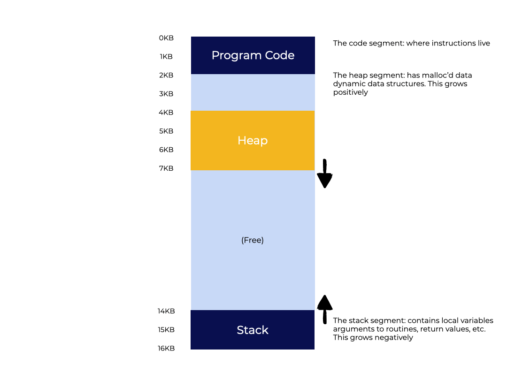
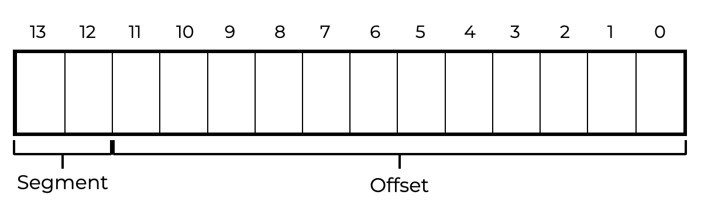
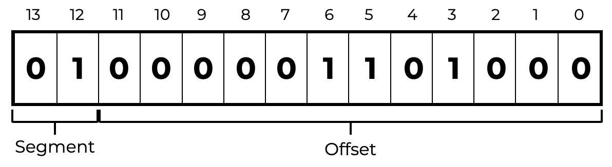
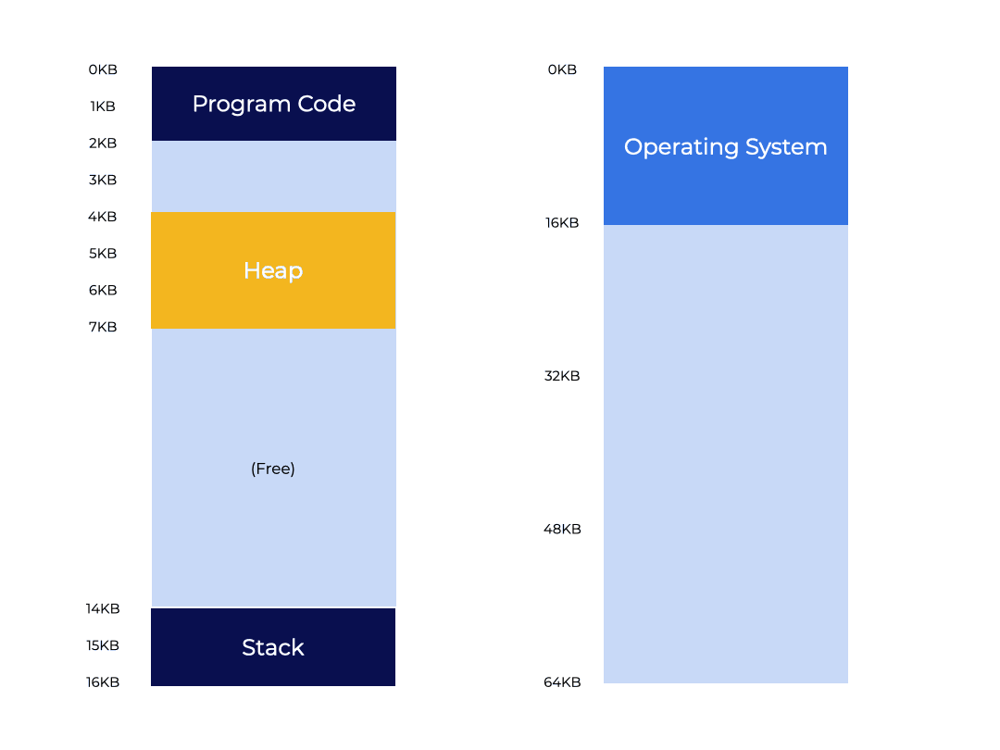
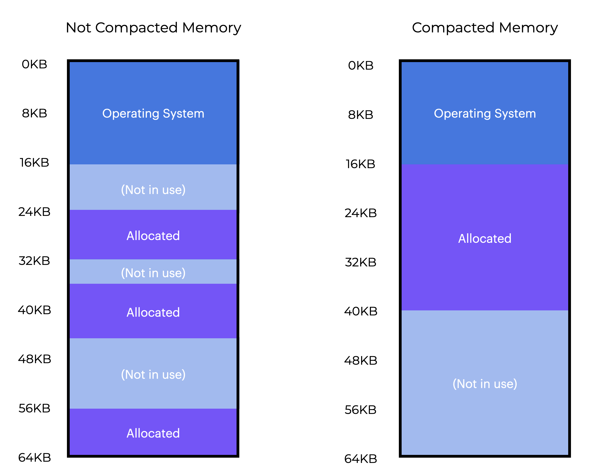

# Segmentación

## Resumen

Exploremos cómo soportar un espacio de direcciones más grande.

Esta sección debería ayudarnos a responder la siguiente pregunta:
* **¿Cómo podemos soportar un espacio de direcciones grande que posiblemente tenga mucho espacio libre entre el stack y el heap?**

## Introducción

### Hasta ahora, hemos almacenado el espacio de direcciones completo de cada proceso en memoria.

El SO puede simplemente mover los procesos dentro de la memoria física utilizando los **registros de base y límite (base and bounds)**.

<p align="center">
  
</p>


En el gráfico anterior, notarás que hay una gran área *"libre"* entre el stack y el heap. Sin embargo, aunque el espacio esté "libre", sigue ocupando memoria física cuando movemos todo el espacio de direcciones a otro lugar de la memoria física.

En este caso, usar un registro de base y límite para la virtualización de memoria resulta ineficiente. Esto también dificulta ejecutar un programa cuando el espacio de direcciones completo no cabe en memoria.

Sigamos explorando cómo soportar un espacio de direcciones más grande.

## Segmentación: Base y Límite Generalizados

La **segmentación (segmentation)** se creó para contrarrestar la **fragmentación interna (internal fragmentation)**, que ocurre cuando a un proceso se le asigna un bloque de memoria más grande de lo necesario. Esto genera memoria desperdiciada, como vimos en el ejemplo anterior. En la segmentación, la memoria se divide en tamaños de segmento variados. Un **segmento (segment)** es un fragmento ininterrumpido del espacio de direcciones con una longitud particular. Cada uno de estos segmentos tiene su propio par de base y límite, en lugar de que toda la unidad de gestión de memoria tenga un único par.

Existen tres tipos diferentes de segmentos que pueden ocupar el espacio de direcciones:
* Código (Code)
* Stack
* Heap

La **segmentación** le permite al SO colocar cada uno de esos segmentos en diferentes partes de la memoria física, evitando llenar la memoria física con espacio de direcciones virtual sin usar.

Supongamos que queremos ubicar el espacio de direcciones de nuestro gráfico anterior en la memoria física. Si tenemos un par de base y límite para cada segmento, podemos ubicar cada uno de forma independiente en la memoria física.

En el gráfico de la izquierda, vemos una memoria física de `64KB` con nuestros tres segmentos ubicados en ella. Se pueden acomodar espacios de direcciones enormes con grandes cantidades de **espacio de direcciones disperso (sparse address space)**, porque solo se asigna espacio en memoria física a la memoria que realmente se usa.

La estructura de hardware de nuestra MMU necesita un conjunto de tres pares de registros de base y límite para manejar la segmentación. La siguiente tabla muestra los valores de los registros para este ejemplo. Cada registro límite almacena el tamaño de un segmento.

| Segmento | Base | Tamaño |
|---|---|---|
|Código|`32KB`|`2KB`|
|Heap|`34KB`|`3KB`|
|Stack|`28KB`|`2KB`|

<p align="center">
  
</p>

* El segmento de código se ubica en la dirección física `32KB` y tiene un tamaño de `2KB`
* El segmento de heap se ubica en `34KB` y tiene un tamaño de `3KB`
* El segmento de stack se ubica en `28KB` y tiene un tamaño de `2KB`

El tamaño del segmento es equivalente al registro límite que mencionamos anteriormente. Le indica al hardware el número de bytes válidos en el segmento. Esto le permite al hardware detectar cuando un software ha accedido a datos fuera de estos límites sin permiso.

### Pregunta

Completa el espacio en blanco para terminar el siguiente enunciado.

Haz clic en el botón de abajo para enviar tu respuesta.

En un sistema que usa **`segmentación`**, los programas se representan como una colección de **`segmentos`** almacenados en un bloque de memoria **`contiguo`**.

> **Solución**
>
> En un sistema que usa **`segmentación`**, los programas se representan como una colección de **`segmentos`** almacenados en un bloque de memoria **`contiguo`**.

## Falla de Segmentación (Segmentation Fault)

Traduzcamos el espacio de direcciones del gráfico de la izquierda.

Supongamos que `100` es la dirección virtual (que está dentro del segmento de código). Cuando ocurre la referencia (como en un *instruction fetch*), el hardware suma el valor base al offset dentro de este segmento (`100`) para obtener la dirección física deseada:

$$
100 + 32KB = 32868
$$

Luego, el hardware verifica si la dirección está dentro de los límites (¿es `100 < 2KB`?), confirma que sí lo está, y emite la referencia a la dirección de memoria física `32868`.

¿Qué pasa con una dirección virtual de `4200` en el heap? Sumar la dirección virtual `4200` a la base del heap (`34KB`) nos da una dirección física de `39016`, lo cual es incorrecto.

El primer paso es obtener el **offset** dentro del heap, que nos indica a qué byte(s) de este segmento pertenece la dirección. Como el heap comienza en la dirección virtual `4KB` (`4096`), el offset `4200` en realidad es `4200 - 4096`, es decir, `104`. **Luego sumamos este offset (`104`) a la dirección física del registro base (`34KB`) para obtener el resultado deseado: `34920`**.

**¿Qué pasaría si intentáramos referirnos a una dirección ilegal más allá del final del heap (es decir, una dirección virtual de `7KB` o más)?**

Probablemente puedas adivinar qué pasa después. El hardware determina que la dirección está fuera de los límites y, muy probablemente, termine el proceso. Esto es lo que se conoce comúnmente como **falla de segmentación (segmentation fault)**.

### Pregunta

¿Cuál de las siguientes opciones ocurre cuando hacemos referencia a un espacio de direcciones que está más allá del final del heap?

Selecciona una respuesta y haz clic en el botón de abajo para enviarla.
- [x] Falla de Segmentación
- [ ] Traducción de Direcciones
- [ ] Paginación
- [ ] Segmentación No Contigua

> **Solución**
>
> Cuando un espacio de direcciones está más allá del final del heap, el hardware determina que la dirección está fuera de los límites y probablemente termine el proceso. Esto se llama **`Falla de Segmentación`**.


## ¿A Qué Segmento Nos Referimos?

Durante la traducción, el hardware hace uso de los **registros de segmento (segment registers)**. ¿Cómo determina el offset dentro de un segmento, así como a qué segmento pertenece una dirección? Un enfoque común, conocido como **enfoque explícito (explicit approach)**, consiste en dividir el espacio de direcciones en segmentos con base en los primeros bits de la dirección virtual.

```c
// get top 2 bits of 14-bit VA
Segment = (VirtualAddress & SEG_MASK) >> SEG_SHIFT
// now get offset
Offset  = VirtualAddress & OFFSET_MASK
if (Offset >= Bounds[Segment])
    RaiseException(PROTECTION_FAULT)
else
    PhysAddr = Base[Segment] + Offset
    Register = AccessMemory(PhysAddr)
```

En nuestro ejemplo anterior, tenemos tres segmentos, así que solo necesitamos dos bits para completar la asignación. Si elegimos el segmento usando los primeros dos bits de nuestra dirección virtual de 14 bits, esta se vería así:

<p align="center">
  
</p>


Si los dos bits superiores son `00`, el hardware entiende que la dirección virtual está en el segmento de **código**, y usa el par de base y límite del código para reubicarla. Si los dos bits superiores son `01`, el hardware usa la base y límite del **heap**.

Para aclarar esto, traduzcamos nuestra dirección virtual del heap anterior (`4200`). Así se ve la dirección virtual `4200` en forma binaria:

<p align="center">
  
</p>

Entonces, los primeros dos bits (`01`) le indican al hardware de qué sección estamos hablando. Los últimos `12` bits indican el offset del segmento: `000001101000`, hexadecimal `0x86`, decimal `104`.

Entonces el hardware usa los primeros dos bits para seleccionar el **registro de segmento**, y los siguientes `12` bits como el offset dentro del segmento. La dirección física final se obtiene sumando el registro base al offset.

El offset también simplifica la verificación de límites. Si el offset no es menor que el límite, la dirección es ilegal.

### Preguntas

Completa el espacio en blanco para terminar el siguiente enunciado.

Haz clic en el botón de abajo para enviar tu respuesta.

El **`offset`** se suma al registro base de un segmento para crear la dirección física completa.


> **Solución**:
>
> El **`offset`** se suma al registro base de un segmento para crear la *dirección física* completa.

## Ejemplo

Para obtener la dirección física deseada, el hardware haría algo similar al fragmento de código de la izquierda, si la base y el límite fueran arreglos (con una entrada por segmento).

En nuestro ejemplo continuo, podemos completar los valores de las constantes en el fragmento de código de la izquierda.
* `SEG_MASK` sería `0x300`
* `SEG_SHIFT` es `12`
* `OFFSET_MASK` es `0xFFF`

Es posible que hayas notado que, al usar los dos bits superiores y tener solo tres segmentos (código, heap y stack), **un segmento del espacio de direcciones queda sin usar**. Algunos sistemas colocan el código en el mismo segmento que el heap para aprovechar completamente el espacio de direcciones virtual (y evitar un segmento sin usar), utilizando solo un bit para decidir qué segmento usar.

**Usar tantos bits para elegir un segmento también limita el uso del espacio de direcciones virtual**. Cada segmento está limitado a un tamaño máximo. En nuestro ejemplo, `4KB` (usar los dos bits superiores para elegir el segmento implica que el espacio de direcciones de `16KB` se divide en cuatro partes, es decir, `4KB` en este caso). Un programa que quiera expandir un segmento (como el heap o el stack) más allá de ese límite, simplemente no podrá hacerlo.

El hardware también puede determinar a qué segmento pertenece una dirección. El **enfoque implícito (implicit approach)** determina el segmento examinando la dirección. Si la dirección proviene del *program counter* (es decir, un *instruction fetch*), está en el segmento de **código**. Si proviene del stack o del *base pointer*, está en el segmento de **stack**. Todas las demás direcciones están en el **heap**.

### Preguntas

Selecciona **todos** los tipos de segmento válidos a continuación.
- [x] heap
- [x] código
- [ ] array
- [ ] contador
- [x] stack
- [ ] base
- [ ] límite

> **Solución**:
>
> Existen tres tipos de segmento válidos: `código`, `stack` y `heap`.

## ¿Qué Pasa con el Stack?

<p align="center">
  
</p>


A continuación, hablemos del **stack**. Si retomamos nuestro gráfico anterior, el stack se desplazó a la dirección física `28KB`, pero con una diferencia importante: ahora crece hacia atrás (hacia direcciones más bajas). "Empieza" en `28 KB` y se expande hacia atrás hasta `26 KB` en memoria física, lo cual corresponde a las direcciones virtuales de `16 KB` a `14 KB`. La traducción debe hacerse de una manera diferente.


Lo primero que necesitamos es un poco más de soporte de hardware. Además de los valores de base y límite, el hardware también debe saber en qué dirección crecerá el segmento (por ejemplo, un bit que se establece en `1` cuando el segmento crece en dirección positiva, y en `0` para la dirección negativa). La siguiente tabla muestra nuestra vista modificada de los registros de hardware:

| Segmento | Base | Tamaño (máx. `4K`) | ¿Crece positivo? |
|---|---|---|---|
|`Code_00`|`32KB`|`2KB`|`1`|
|`Heap_01`|`34KB`|`3KB`|`1`|
|`Stack_11`|`28KB`|`2KB`|`0`|

Como el hardware ahora reconoce que los segmentos pueden crecer en dirección opuesta, debe traducir las direcciones virtuales de una manera diferente. Veamos un ejemplo de dirección virtual del stack y traduzcámosla.

Supongamos que queremos acceder a la dirección virtual `15KB`, que en este ejemplo debería corresponder a la dirección física `27KB`. En representación binaria, nuestra dirección virtual se ve así:

```
11 1100 0000 0000 (hex 0x3C00)
```

Los primeros dos bits (`11`) son usados por el hardware para designar el segmento, y nos queda un offset de `3KB`. Para obtener el offset negativo correcto, restamos el tamaño máximo del segmento a `3KB`. En este caso, un segmento puede ser de `4KB`, así que el offset negativo correcto es:

$$
3KB - 4KB = -1KB
$$

Para obtener la dirección física correcta, sumamos el offset negativo (`-1KB`) a la base (`28KB`). La verificación de límites se hace confirmando que el valor absoluto del offset negativo sea menor o igual al tamaño actual del segmento (en este caso, `2 KB`).

### Preguntas

Al sumar el offset negativo a la base, ¿qué podemos calcular?
- [ ] valor de base y límite
- [x] dirección física
- [ ] crecimiento positivo o negativo
- [ ] tamaño del segmento

> **Respuesta**
>
> Para obtener la **`dirección física`** correcta, sumamos el offset negativo a la base.

## Soporte del SO

Ya deberías entender los fundamentos de la **segmentación**. Mientras el sistema opera, los fragmentos del espacio de direcciones se reubican en la memoria física, ahorrando mucho espacio en comparación con usar un único par de base/límite para todo el espacio de direcciones. En concreto, el espacio vacío entre el stack y el heap no necesita asignarse en memoria física, lo que nos permite soportar espacios de direcciones virtuales más grandes por proceso.

Pero la segmentación presenta nuevos retos para el SO.
1. **¿Qué debe hacer el SO en un cambio de contexto (context switch)?** Los registros de segmento deben guardarse y restaurarse. Cada proceso tiene su propio espacio de direcciones virtual, que el SO debe configurar correctamente antes de continuar la ejecución.
2. **El SO interviene cuando los segmentos crecen (o tal vez se reducen)**. Para asignar un objeto, un programa puede usar `malloc()`. En algunos casos, el heap actual puede satisfacer la solicitud, y `malloc()` encontrará espacio libre para el objeto y devolverá un puntero al llamador. En otros casos, el segmento del heap deberá aumentar de tamaño.
   * En este caso, la biblioteca de asignación de memoria usará una llamada al sistema para expandir el heap (por ejemplo, `sbrk()`). Como resultado, el SO normalmente entrega más espacio, actualiza el registro de tamaño del segmento al nuevo valor (más grande) e informa a la biblioteca del éxito de la operación. El SO puede negar la solicitud si ya no hay más memoria física disponible o si el proceso que la solicita ya tiene demasiada.
3. Finalmente, y quizás lo más importante, **la gestión del espacio libre de la memoria física**. El SO debe ser capaz de encontrar espacio en memoria física para los nuevos espacios de direcciones. Antes asumíamos que cada espacio de direcciones tenía el mismo tamaño, por lo que la memoria física podía describirse como una serie de slots para procesos. Ahora tenemos múltiples segmentos por proceso, cada uno de un tamaño distinto.

El problema principal es que **la memoria física pronto se llena de bolsillos de espacio libre**, haciendo imposible asignar nuevos segmentos o expandir los existentes. A esto le llamamos **fragmentación externa (external fragmentation)**. Podemos ver un ejemplo de esto en la siguiente figura.

<p align="center">
  
</p>

En este caso, un proceso solicita una sección de `20 KB`. Aunque hay `24 KB` libres, no están en un solo bloque (sino en tres fragmentos no contiguos). Por lo tanto, el SO no puede satisfacer la solicitud de `20 KB`. Si los siguientes tantos bytes de espacio físico no están disponibles de forma contigua, **el SO debe negar la solicitud**, incluso si hay bytes libres en otras partes de la memoria física.

**Reorganizar las partes de memoria existentes podría ayudar a compactar la memoria física**. Por ejemplo, el SO podría detener todos los procesos actuales, copiar sus datos a una región contigua de memoria y actualizar los valores de sus registros de segmento para que apunten a las nuevas direcciones físicas. Así, el SO permite que la siguiente solicitud de asignación tenga éxito. Sin embargo, copiar segmentos consume muchos recursos de memoria y bastante tiempo de procesador. La compactación también dificulta satisfacer solicitudes para expandir los segmentos actuales.

### Preguntas

Cuando la memoria física está tan llena de espacio vacío que resulta imposible asignar nuevos segmentos o expandir los existentes, ¿cuál de las siguientes opciones ocurre?

Selecciona una respuesta y haz clic en el botón de abajo para enviarla.
- [x] Fragmentación Externa
- [ ] Falla de Segmentación
- [ ] Límite de Longitud
- [ ] Violación de Límites

> **Respuesta**:
>
> Cuando la memoria física se llena de bolsillos de espacio libre, se vuelve imposible asignar nuevos segmentos o expandir los existentes. A esto le llamamos **`Fragmentación Externa`**.

## Resumen

La segmentación resuelve muchas dificultades y mejora la virtualización de memoria.
* También es rápida, ya que la aritmética de la segmentación es simple y amigable con el hardware. La sobrecarga de traducción es mínima.
* Más allá de la reubicación dinámica, la segmentación ayuda con los espacios de direcciones dispersos, reduciendo la cantidad de memoria desperdiciada a lo largo de los segmentos del espacio de direcciones lógico.
* Sin embargo, como descubrimos, asignar segmentos de tamaño variable en memoria genera ciertos problemas.
* El primero es la fragmentación externa. Como los segmentos varían de tamaño, la memoria libre queda dividida en fragmentos de tamaños irregulares, lo que dificulta la asignación de memoria.

Este es un problema fundamental, difícil de evitar incluso usando algoritmos inteligentes o compactando la memoria periódicamente.
* Segundo, y quizás más importante, la segmentación todavía no es lo suficientemente flexible para soportar un espacio de direcciones disperso y completamente generalizado.
* Si tenemos un heap enorme pero poco usado en un único segmento lógico, debemos mantener todo el heap accesible en memoria.

El modelo de espacio de direcciones que usamos no coincide exactamente con la forma en que la segmentación subyacente fue diseñada para soportarlo, así que necesitamos nuevas soluciones.
