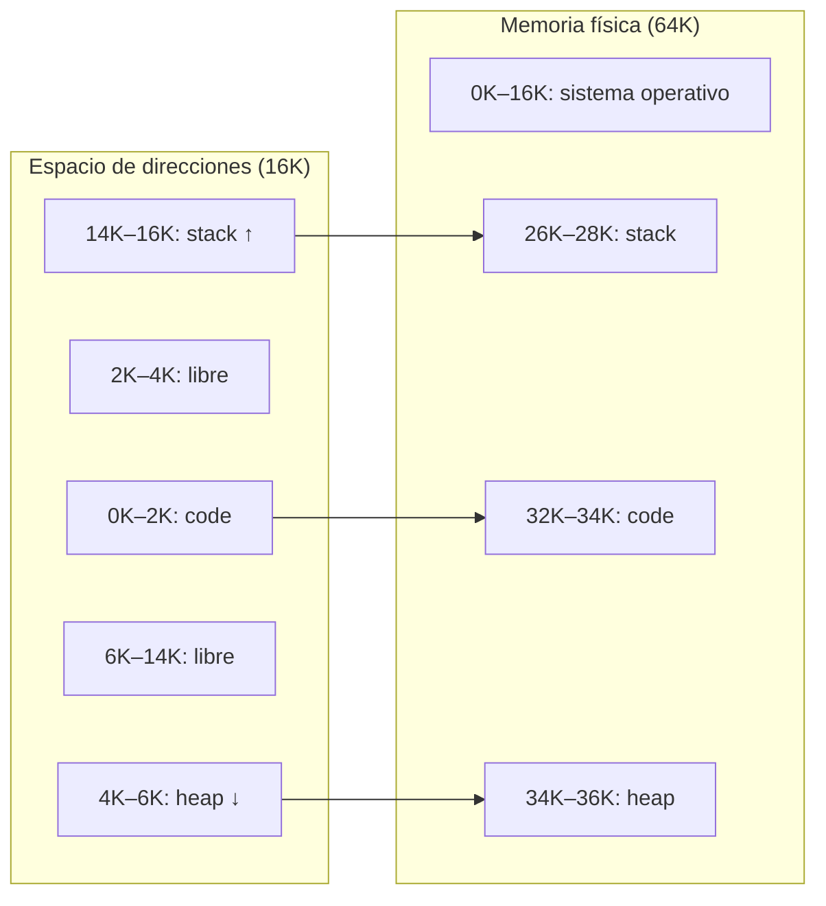
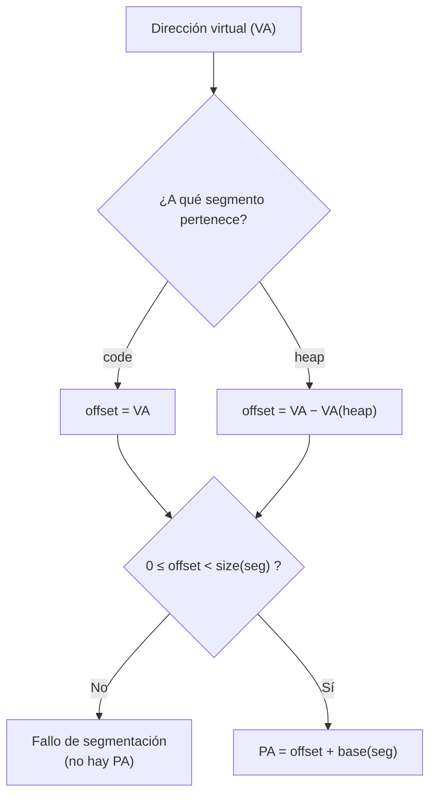
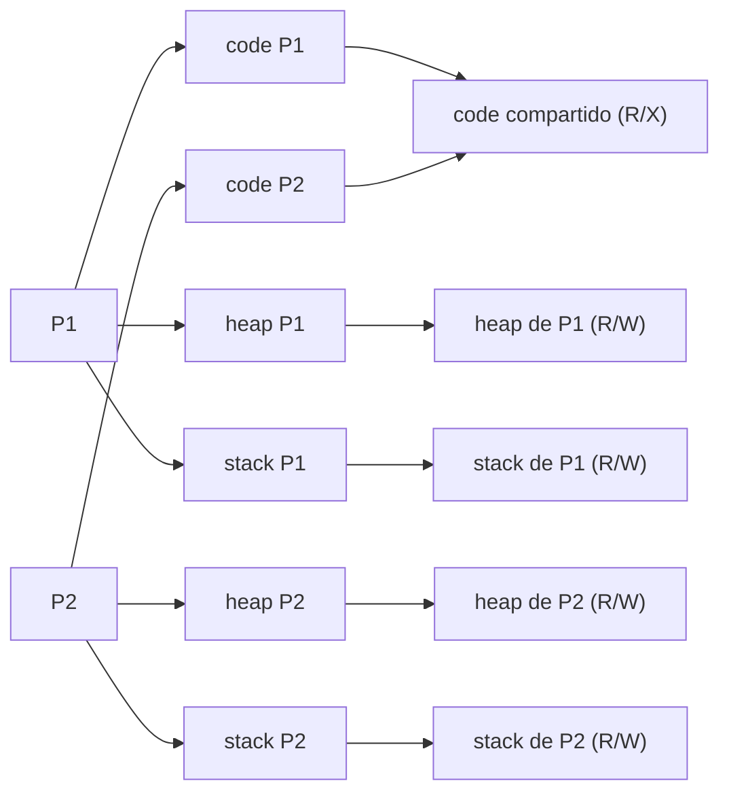

# Segmentación (OSTEP, cap. 16)

## Objetivos de Aprendizaje

* **Explicar**: por qué la segmentación, al asignar un par de registros base/size a cada segmento (code, heap, stack), resuelve el desperdicio de memoria del esquema base & bounds.
* **Calcular**: el número de bits necesarios para direccionar la memoria virtual y la física, y cómo se reparten los bits de una dirección virtual entre segmento y offset.
* **Aplicar**: el procedimiento de traducción (obtener el offset, chequear límites, calcular la PA) a direcciones de los segmentos code, heap y stack, incluyendo el crecimiento negativo del stack y los casos de fallo de segmentación.
* **Utilizar**: el simulador `segmentation.py` para verificar traducciones, entendiendo en qué se diferencia su modelo de 2 segmentos del ejemplo de 3 segmentos visto en clase.
* **Evaluar**: las ventajas y desventajas de la segmentación (segmentos compartidos, protección, fragmentación externa, compactación).

## Contexto: limitaciones de base & bounds

En la clase anterior se trabajó la **reubicación dinámica** (*dynamic relocation*): la MMU tiene dos registros (`base` y `bounds`) y la traducción se hace en dos pasos:

1. **Chequeo de límites**: $0 \le VA < bounds$. Si no se cumple → *protection fault*.
2. **Cálculo de la dirección física**: $PA = VA + base$.

El esquema es rápido, simple, ofrece protección y tiene poco overhead (2 registros por proceso), pero **no es flexible**: como solo se conocen los extremos del espacio de direcciones, toda la región libre entre el heap y el stack queda reservada en memoria física aunque el proceso no la use. El manuscrito llama a este desperdicio **fragmentación interna**.

De ahí la pregunta clave de la clase:

> **¿Cómo soportar un espacio de direcciones grande con un (potencial) espacio libre grande entre el stack y el heap?**

## Segmentación

Un **segmento** es una *porción contigua del espacio de direccionamiento, con un tamaño particular*. Algunos textos (como *Operating System Concepts*, el "libro del dinosaurio") trabajan con 4 segmentos (code, data, heap, stack); el texto guía del curso (OSTEP) trabaja con **3**:

| # | Segmento |
|---|---|
| 0 | code |
| 1 | heap |
| 2 | stack |

**Idea clave**: cada segmento puede ubicarse en una parte distinta de la memoria física porque tiene **su propio par de registros base & bounds**. Así, el espacio libre entre heap y stack ya no ocupa memoria física.

El costo está en el hardware: la MMU pasa de 2 registros a **6** (un par `base`/`size` por cada uno de los 3 segmentos), organizados como una tabla:

| segment | base | size |
|---|---|---|
| code | 32K | 2K |
| heap | 34K | 2K |
| stack | 28K | 2K |

Esta es la tabla del ejemplo que se usa en toda la clase, con un espacio de direcciones de 16K y una memoria física de 64K:



## Cálculo de bits y formato de la dirección

> [!TIP]
> Antes de calcular, dibuja siempre el mapa de memoria: así es fácil ver a qué segmento pertenece cada dirección virtual.

En general, si una memoria tiene tamaño $size$, se necesitan $n$ bits tales que $size = 2^n$, y el rango de direcciones es $[0, 2^n) = [0, 2^n - 1]$.

**Memoria virtual (16K)**:

$$2^n = 16K = (2^4)(2^{10}) = 2^{14} \Rightarrow n = 14 \text{ bits}$$

Rango: $[0, 16\,383]$.

**Memoria física (64K)**:

$$2^n = 64K = (2^6)(2^{10}) = 2^{16} \Rightarrow n = 16 \text{ bits}$$

Rango: $[0, 65\,535]$. Los tamaños de la memoria virtual y la física no tienen por qué coincidir: son espacios independientes.

**Bits de segmento**: hay 3 segmentos; con 1 bit solo se distinguen 2, así que se necesitan 2 bits ($2^2 = 4$ combinaciones, una sobrante).

### Explicit approach: `[segment | offset]`

La dirección virtual de 14 bits se divide en dos campos:

* **segment**: los 2 bits más significativos (bits 13–12). Codificación: `00` = code, `01` = heap, `11` = stack (`10` no se usa).
* **offset**: los 12 bits menos significativos (bits 11–0), el desplazamiento dentro del segmento.

```
 13 12 | 11 10  9  8  7  6  5  4  3  2  1  0
[ seg  |              offset               ]
 n(seg) = 2          n(offset) = 12
```

Ejemplos resueltos en clase:

* **VA = 104** = `0x0068` → `00 0000 0110 1000` → segmento `00` (**code**), offset `0x068` = 104.
* **VA = 4200** = `0x1068` → `01 0000 0110 1000` → segmento `01` (**heap**), offset `0x068` = 104.

## Traducción de direcciones (code y heap)

El procedimiento general tiene dos pasos una vez se conoce el offset:

1. **Obtener el offset**:
   * Segmento **code** (empieza en la VA 0): $offset = VA$.
   * Segmento **heap**: $offset = VA - VA(heap)$, donde $VA(heap)$ es la dirección virtual donde empieza el heap (4K en el ejemplo).
2. **Chequear límites**: $0 \le offset < size(segmento)$. Si no se cumple → **fallo de segmentación**, no hay PA.
3. **Calcular la PA**: $PA = offset + base(segmento)$.

> [!IMPORTANT]
> El concepto central de toda la traducción es el **offset**: la distancia desde el inicio del segmento hasta la dirección en cuestión.



### Ejemplo 1: VA = 100 (code)

* La VA está en code → $offset = VA = 100$.
* Límites: $0 \le 100 < 2K$ ✓
* $PA = 100 + 32K = 100 + 32(1024) = 32\,868$

### Ejemplo 2: VA = 4200 (heap)

* La VA está en el heap (4K = 4096 ≤ 4200 < 6K) → $offset = 4200 - 4K = 4200 - 4096 = 104$.
* Límites: $0 \le 104 < 2K$ ✓
* $PA = 104 + 34K = 104 + 34(1024) = 34\,920$

En binario, la PA de 16 bits es $34\,920$ = `0x8868` = `1000 1000 0110 1000`, es decir, $base(heap) + offset$ = `0x8800` + `0x068`. El offset 104 (`0x68`) que se extrajo de la VA reaparece en los bits bajos de la PA, lo que confirma la coherencia del mapeo.

### Ejemplo 3: VA = 7K (fallo de segmentación)

* $VA = 7K = 7(1024) = 7168$. Parece pertenecer al heap (empieza en 4K) → $offset = 7K - 4K = 3K = 3072$.
* Límites: $0 \le 3072 < 2048$ ✗

La dirección está **más allá del heap**, en una zona no asignada entre el heap y el stack: el sistema operativo lanza un **fallo de segmentación** (*segmentation fault*) y la VA no tiene PA.

### Pseudocódigo de la traducción

Cualquier sistema que implemente segmentación hace, en esencia, lo siguiente (para una VA de 14 bits):

```c
// get top 2 bits of 14-bit VA
Segment = (VirtualAddress & SEG_MASK) >> SEG_SHIFT
// now get offset
Offset  = VirtualAddress & OFFSET_MASK
if (Offset >= Bounds[Segment])
    RaiseException(PROTECTION_FAULT)
else
    PhysAddr = Base[Segment] + Offset
    Register = AccessMemory(PhysAddr)
```

* `SEG_MASK = 0x3000` (`11 0000 0000 0000`): aísla los 2 bits de segmento.
* `SEG_SHIFT = 12` (= $n(offset)$): desplaza esos bits hasta obtener el número de segmento.
* `OFFSET_MASK = 0xFFF` (`00 1111 1111 1111`): aísla los 12 bits de offset.

Con VA = 4200 = `0x1068`: `Segment` = 1 (heap) y `Offset` = `0x068` = 104. El `if` es el **chequeo de límites** y la suma de la línea 8 es el **cálculo de la PA** (34K + 104 = 34 920). El pseudocódigo está también en [`apuntes/segmentation/src/seg.c`](../apuntes/segmentation/src/seg.c).

> [!TIP]
> Las pruebas de escritorio de las evaluaciones consisten esencialmente en ejecutar a mano este pseudocódigo para distintos valores de VA.

## Traducción de direcciones con el segmento stack

> [!NOTE]
> Continuación: sesión del 15/09/2026. La sesión del 10/09 terminó con el pseudocódigo.

El stack **crece hacia atrás** (hacia direcciones menores), así que no basta con restarle la dirección de inicio. Hace falta **soporte de hardware adicional**: un bit por segmento que indique el sentido de crecimiento:

* **1**: crecimiento en dirección positiva (code, heap).
* **0**: crecimiento en dirección negativa (stack).

| segment | base | size (max 4K) | Grows Positive? |
|---|---|---|---|
| code (`00`) | 32K | 2K | 1 |
| heap (`01`) | 34K | 2K | 1 |
| stack (`11`) | 28K | 2K | 0 |

En memoria física el stack ocupa de 26K a 28K: su `base` (28K) es el extremo **superior**, y el segmento crece hacia 26K.

### Ejemplo 4: VA = 15K (stack)

1. **Segmento**: $VA = 15K = 15(1024) = 15\,360$ = `0x3C00` = `11 1100 0000 0000` → bits `11` = **stack**.
2. **Offset** (12 bits bajos): `1100 0000 0000` = `0xC00` = 3072 = **3K**.
3. **Offset máximo**: con 12 bits de offset, $offset(max) = 2^{12} = 4096 = 4K$.
4. **Offset real del stack** (negativo por el crecimiento hacia atrás):
   $$offset(stack) = offset - offset(max) = 3K - 4K = -1K$$
5. **Dirección física**:
   $$PA = base(stack) + offset(stack) = 28K + (-1K) = 27K = 27\,648$$

En binario de 16 bits: $27\,648$ = `0x6C00` = `0110 1100 0000 0000`.

La VA 15K está 1K por debajo del tope del espacio de direcciones (16K). Como el stack crece hacia atrás, en memoria física queda 1K por debajo de su base: 27K, dentro del rango físico del stack (26K–28K).

## Simulador `segmentation.py`

El simulador del curso ([`clase_09/simulador/segmentation.py`](../simulador/segmentation.py), homework `vm-segmentation` de OSTEP) permite verificar estos cálculos. A diferencia del ejemplo de clase, maneja **2 segmentos**:

* **Segmento 0** (*seg0*): code + heap, crece en sentido positivo.
* **Segmento 1** (*seg1*): stack, crece en sentido negativo.

| Bandera | Significado |
|---|---|
| `-a` | tamaño del espacio de direcciones (memoria virtual) |
| `-p` | tamaño de la memoria física |
| `-b` / `-l` | base y límite (tamaño) del segmento 0 |
| `-B` / `-L` | base y límite (tamaño) del segmento 1 |
| `-s` | semilla para generar direcciones virtuales aleatorias |
| `-A` | lista de direcciones virtuales específicas a traducir |
| `-c` | muestra las respuestas (traducción de cada dirección) |
| `-h` | lista todos los parámetros disponibles |

Comando básico con direcciones aleatorias:

```bash
./segmentation.py -a 16k -p 64k -b 32k -l 6k -B 28k -L 2k -s 22
```

Aquí el segmento 0 empieza en 32K con 6K de tamaño (code y heap juntos, de la VA 0 a la 6K), y el segmento 1 (stack) tiene base 28K y 2K de tamaño.

Para verificar las direcciones de la clase se pasaron con `-A` y se pidieron las respuestas con `-c`:

```bash
./segmentation.py -A 100,4200,7096,15360 1 -a 16k -p 64k -b 32k -l 6k -B 28k -L 2k -c
```

```
ARG seed 0
ARG address space size 16k
ARG phys mem size 64k

Segment register information:

  Segment 0 base  (grows positive) : 0x00008000 (decimal 32768)
  Segment 0 limit                  : 6144

  Segment 1 base  (grows negative) : 0x00007000 (decimal 28672)
  Segment 1 limit                  : 2048

Virtual Address Trace
  VA  0: 0x00000064 (decimal:  100) --> VALID in SEG0: 0x00008064 (decimal: 32868)
  VA  1: 0x00001068 (decimal: 4200) --> VALID in SEG0: 0x00009068 (decimal: 36968)
  VA  2: 0x00001bb8 (decimal: 7096) --> SEGMENTATION VIOLATION (SEG0)
  VA  3: 0x00003c00 (decimal: 15360) --> VALID in SEG1: 0x00006c00 (decimal: 27648)
```

Cómo leer la salida frente a los cálculos a mano:

* **VA 100** → 32 868 y **VA 15 360 (15K)** → 27 648: coinciden con los ejemplos 1 y 4.
* **VA 4200** → **36 968**, no 34 920. No es un error: en el simulador code y heap forman un solo segmento que empieza en 32K, así que el heap queda en 32K + 4K = 36K en memoria física ($32\,768 + 4200 = 36\,968$). En el ejemplo de clase el heap es un segmento propio con base 34K.
* **VA 7096** → violación de segmento, igual que el ejemplo 3. En el comando se usó 7096 en lugar de 7168 (7K); ambas caen en la zona sin asignar entre 6K y 8K y el límite del segmento 0 es 6K (6144).

> [!TIP]
> En el código fuente del simulador, revisa la parte que calcula la PA cuando la dirección cae en el stack: `paddr = nbase1 + (vaddr - asize)`, es decir, la base del stack más un offset negativo, seguida del chequeo de límites. Es la misma resta vista en el ejemplo 4.

## Segmentos compartidos y bits de protección

**Escenario**: ¿qué pasa cuando se ejecutan dos procesos con la **misma imagen** (el mismo ejecutable, por ejemplo dos instancias del mismo navegador)?

Su segmento de código es idéntico y no cambia durante la ejecución, así que **puede compartirse**: ambos procesos mapean su segmento code al mismo lugar de la memoria física (RAM), ahorrando memoria. Lo que sí es propio de cada proceso son su heap y su stack. Si los procesos vienen de ejecutables distintos (un navegador y un editor de texto), sus segmentos de código son diferentes y no se comparten.

Para hacerlo de forma segura se agrega **hardware adicional**: **bits de protección** que indican los permisos de cada segmento: **R** (lectura), **W** (escritura) y **X** (ejecución).

| segment | base | size (max 4K) | Grows Positive? | Protección |
|---|---|---|---|---|
| code (`00`) | 32K | 2K | 1 | Read-Execute |
| heap (`01`) | 34K | 2K | 1 | Read-Write |
| stack (`11`) | 28K | 2K | 0 | Read-Write |

Como code es de solo lectura y ejecución (sin escritura), varios procesos pueden apuntar al mismo segmento físico sin riesgo de que uno lo modifique.



El hardware de segmentación completo combina todo lo anterior: los bits de segmento de la VA seleccionan la fila de la tabla (base, size, sentido de crecimiento, protección); el offset se compara con `size` (si falla → *protection fault*) y se suma a `base` para obtener la PA. Por ejemplo, VA = `01|000001101000` (4200) → offset `0x068` = 104 → PA = `0x8868` (34 920).

## Granularidad de la segmentación

| Grano grueso (*coarse-grained*) | Grano fino (*fine-grained*) |
|---|---|
| Pocos segmentos relativamente grandes (p. ej. code, heap, stack). | Muchos segmentos pequeños: mayor flexibilidad, pero requiere más soporte de hardware (una tabla de segmentos). |

## Ventajas y desventajas de la segmentación

| Ventajas | Desventajas |
|---|---|
| Permite espacios de direcciones pequeños; el stack y el heap pueden crecer independientemente. | **Fragmentación externa**: quedan pequeños huecos de espacio libre en memoria física, difíciles de utilizar. |
| Ahorro de memoria al compartir segmentos. | |
| Facilita la protección de los segmentos. | |

**Ejemplo de fragmentación externa** (memoria física de 64K):

| Rango | Estado |
|---|---|
| 0K–16K | Sistema operativo |
| 16K–24K | Libre |
| 24K–32K | Asignado |
| 32K–40K | Libre |
| 40K–48K | Asignado |
| 48K–56K | Libre |
| 56K–64K | Asignado |

* ¿Cuánta memoria está ocupada? **40K**.
* ¿Cuánta está libre? **24K**, pero en huecos que no son contiguos.
* ¿Es posible ubicar un segmento de 20K? **No**: aunque el espacio libre total alcanza, ningún hueco tiene 20K contiguos.

### Compactación

La solución más directa es la **compactación**: reorganizar los segmentos existentes en memoria física para juntar el espacio libre. En el ejemplo, tras compactar, los bloques asignados quedan juntos (16K–40K) y queda un único hueco de 24K (40K–64K), donde sí cabe el segmento de 20K.

Pero es un **proceso costoso**:

* Hay que detener los procesos en ejecución.
* Hay que copiar los datos a un nuevo lugar.
* Hay que cambiar los valores de los registros de cada segmento movido.

Como alternativa, el SO puede elegir con cuidado dónde ubicar cada segmento mediante **algoritmos de ubicación** como *best-fit*, *first-fit* y *worst-fit*.

## Puente hacia la siguiente clase: paginación

La segmentación no elimina la fragmentación externa, y la compactación es cara. En la misma sesión del 15/09 se introdujo la alternativa, que es el tema de la clase 10: la **paginación**. En lugar de segmentos de tamaño variable, divide el espacio de direcciones en unidades **de tamaño fijo** (**páginas**, identificadas por su VPN) y la memoria física en **frames** del mismo tamaño (identificados por su PFN), relacionados mediante una **tabla de páginas** ($PT[VPN] = PFN$). Como las páginas no necesitan estar contiguas en memoria física, desaparece la fragmentación externa.

Las preguntas que guían la clase 10:

1. ¿Cómo virtualizar la memoria con páginas para evitar los problemas de la segmentación?
2. ¿Cuáles son las técnicas básicas de paginación?
3. ¿Cómo lograr que funcionen bien con un overhead mínimo de espacio y tiempo?

## Actividades sugeridas

* Descargar el simulador `segmentation.py`, repetir las traducciones de la clase y revisar en el código el cálculo de la PA para el stack.
* Repasar las fórmulas de traducción (code, heap y stack) como preparación para las pruebas de escritorio.

> [!NOTE]
> No hubo quiz la semana del 10/09 porque el tema de segmentación aún no había terminado. El quiz de paginación se habilitará cuando se termine ese tema en clase.

---

> [!IMPORTANT]
> **Nota de Transparencia:** Este documento fue generado y adaptado mediante el uso de **IA Generativa**, a partir del manuscrito anotado de la clase y los resúmenes de las sesiones de Zoom. El contenido ha sido supervisado, validado y refinado por intervención humana para garantizar su precisión técnica y coherencia pedagógica. No obstante, pueden haber errores.
