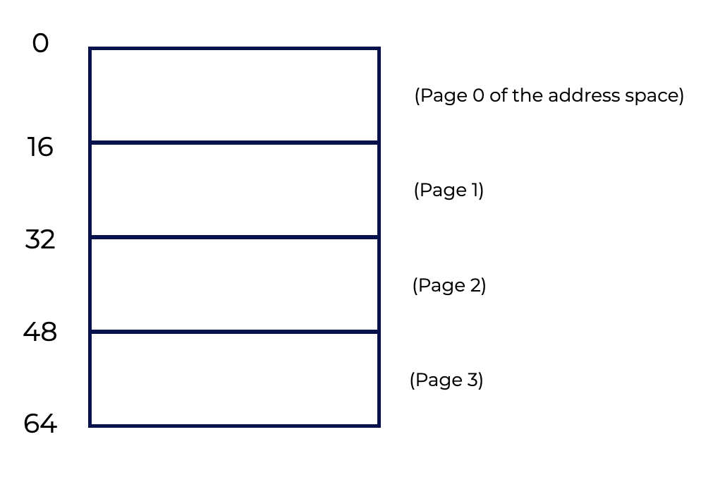
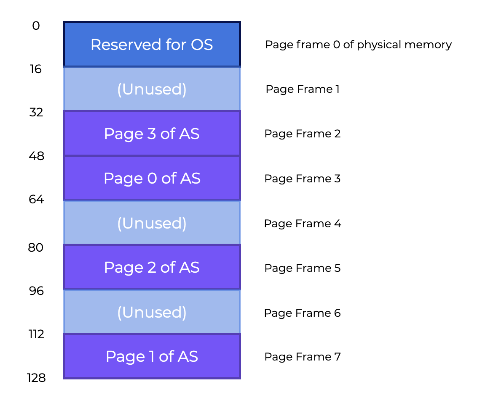
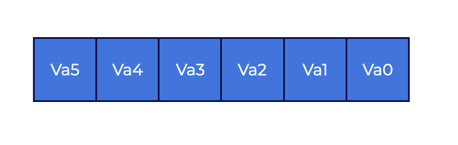
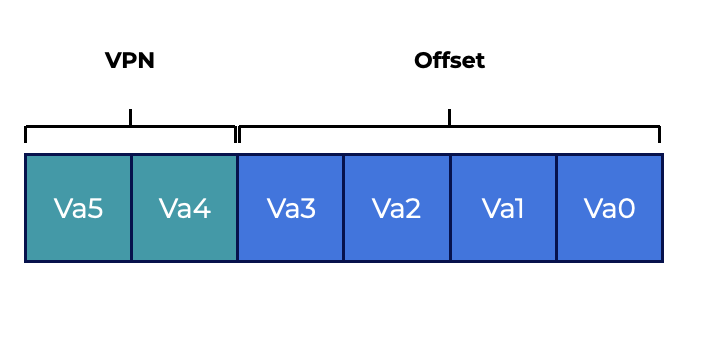
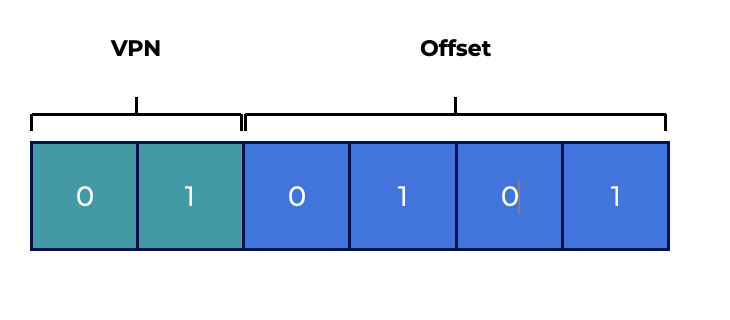
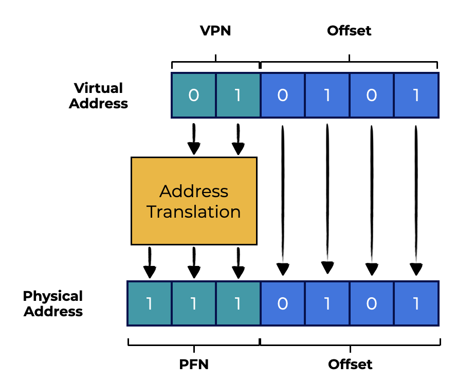
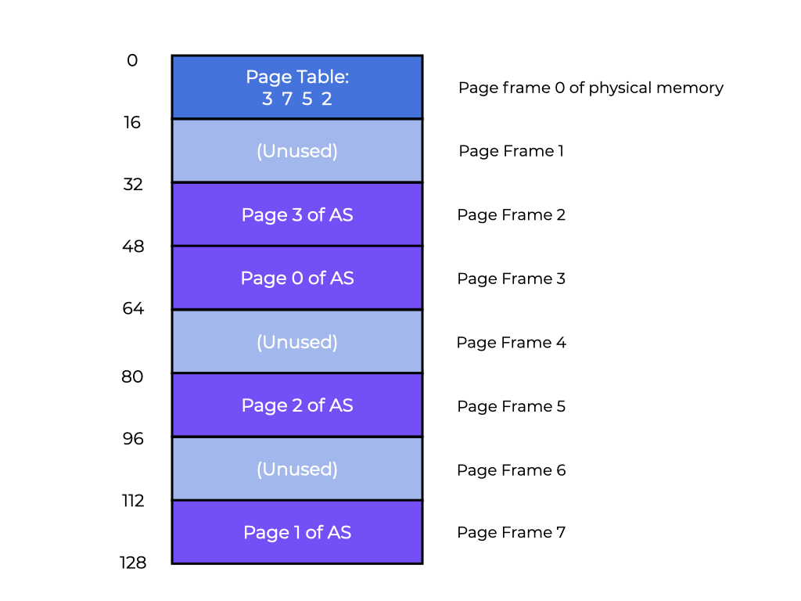
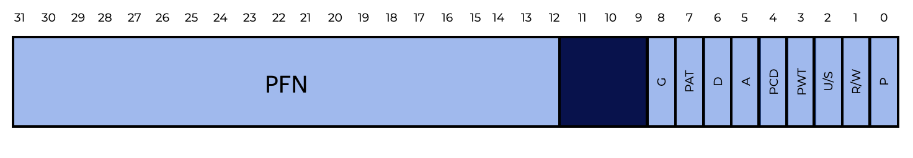

# Introducción a la Paginación

## Resumen

Comencemos explorando cómo virtualizar la memoria usando páginas.

Esta sección debería ayudarnos a responder las siguientes preguntas:
* **¿Cómo podemos virtualizar la memoria con páginas sin los problemas de la segmentación?**
* **¿Cuáles son los conceptos básicos?**
* **¿Cómo podemos hacer que esas estrategias funcionen bien ahorrando espacio y tiempo?**

## Introducción

Al enfrentar los problemas de gestión del espacio, el sistema operativo suele adoptar uno de dos enfoques.
1. El primer enfoque consiste en dividir el espacio de direcciones en secciones de tamaño variable. Esto se llama **segmentación (segmentation)**, que ya estudiamos. Sin embargo, esta solución tiene varios inconvenientes. Al dividir el espacio en partes de distintos tamaños, el propio espacio puede **fragmentarse**, lo que con el tiempo dificulta la asignación de memoria.
2. El segundo enfoque es la **paginación (paging)**, en la que el espacio de direcciones se divide en fragmentos de tamaño fijo. En lugar de dividir el espacio de un proceso en **segmentos** lógicos de tamaño variable (p. ej., código, heap, stack), se divide en unidades de tamaño fijo llamadas **páginas (pages)**. La memoria física se representa como un arreglo de ranuras de tamaño fijo llamadas **marcos de página (page frames)**, cada una de las cuales puede contener una única página de memoria virtual.

### Preguntas

1. ¿Cuál de las siguientes opciones describe, en general, cómo funciona la paginación?
   Selecciona una respuesta y haz clic en el botón de abajo para enviarla.
   - [x] El espacio de direcciones y la memoria física de cada proceso se dividen en unidades de tamaño fijo
   - [ ] El espacio de direcciones y la memoria física de cada proceso se dividen en unidades de tamaño variable
   - [ ] Utiliza varios pares de base y límite (base & bounds) para cada proceso
   - [ ] Solo permite que un proceso use la RAM a la vez.
   
   > **Solución**:
   > 
   > La paginación consiste en dividir el espacio de direcciones y la memoria física de cada proceso en **unidades de tamaño fijo**.

2. Completa los espacios en blanco del siguiente enunciado.
   En el caso de la paginación, podemos pensar en la memoria física como un arreglo de ranuras de tamaño fijo llamadas **marcos de página (page frames)**. Cada una de ellas puede contener una única **página** de memoria virtual.

## Un Ejemplo Sencillo y Panorama General

Usemos un ejemplo básico para entender mejor este método. El gráfico de abajo muestra un espacio de direcciones de 64 bytes con cuatro páginas de 16 bytes (las páginas virtuales 0, 1, 2 y 3).

<p align="center">
  
</p>

Los espacios de direcciones típicos son mucho más grandes; sin embargo, usamos ejemplos modestos para explorar estos conceptos.

La memoria física contiene una cantidad de ranuras de tamaño fijo. En el gráfico de abajo hay ocho marcos de página, que nos dan 128 bytes de memoria física. Las páginas del espacio de direcciones virtual de nuestro gráfico se han colocado en distintas ubicaciones de la memoria física. El gráfico también muestra que el SO está usando parte de la memoria física para sí mismo.

<p align="center">
  
</p>

**La paginación tiene ventajas importantes frente a los métodos anteriores.**
* La paginación es más **flexible** que los métodos anteriores.
  * El sistema podrá soportar de forma eficaz la abstracción de un espacio de direcciones, sin importar cómo lo use el proceso. No haremos suposiciones sobre la forma en que crecen el heap y el stack ni sobre cómo se usan.
* La paginación también **simplifica** la gestión del espacio libre.
  * Por ejemplo, para ubicar nuestro pequeño espacio de direcciones de 64 bytes en nuestra memoria física de ocho páginas, el SO simplemente busca cuatro páginas libres. Quizás el SO mantenga una **lista libre (free list)** de todas las páginas libres y tome las cuatro primeras de esa lista. En nuestro ejemplo, el SO coloca:
    * La **página 0** virtual del espacio de direcciones (AS) en el **marco 3** físico
    * La **página 1** en el **marco 7**,
    * La **página 2** en el **marco 5**, y
    * La **página 3** en el **marco 2**.
    * Los **marcos de página 1**, **4** y **6** están **libres**

Una **tabla de páginas (page table)** es una estructura de datos por proceso que registra dónde se ubica en la memoria física cada página virtual del espacio de direcciones. La tabla de páginas **almacena las traducciones de direcciones de cada página virtual del espacio de direcciones, indicando en qué lugar de la memoria física se encuentra cada página**. En nuestro ejemplo, la **tabla de páginas** tendría cuatro entradas:
* $VP\ 0 \rightarrow PF\ 3$
* $VP\ 1 \rightarrow PF\ 7$
* $VP\ 2 \rightarrow PF\ 5$
* $VP\ 3 \rightarrow PF\ 2$

Esta tabla de páginas es una estructura de datos **por proceso** (la mayoría de las estructuras de tablas de páginas que veremos son por proceso; la **tabla de páginas invertida (inverted page table)** es una excepción). En nuestro ejemplo, si se ejecutara otro proceso, el SO tendría que administrar una tabla de páginas distinta para él, porque sus páginas virtuales corresponderían a páginas físicas diferentes (salvo que haya memoria compartida).

### Preguntas

1. ¿Cuál de las siguientes opciones describe una tabla de páginas?
   Selecciona una respuesta y haz clic en el botón de abajo para enviarla.
   - [ ] Una estructura de datos que lleva el registro de todas las páginas libres.
   - [x] Una estructura de datos que almacena las traducciones de direcciones virtuales a direcciones físicas.
   - [ ] Una sección de memoria libre que no se puede asignar

   > **Solución**:
   > 
   > Las tablas de páginas contienen las traducciones de cada página virtual del espacio de direcciones, mostrando en qué lugar de la memoria física se encuentra cada página.

## Ejemplo de Traducción de Direcciones

Con este conocimiento, podemos hacer un ejemplo de traducción de direcciones.

<p align="center">
  
</p>

**Supongamos que tenemos un proceso con un espacio de direcciones pequeño (64 bytes) que está accediendo a memoria**:   

```asm
movl <virtual address>, %eax
```

Observa la carga explícita del dato desde la dirección `<virtual address>` al registro `eax`.

Para **traducir** la dirección virtual que genera el proceso, tenemos que dividirla en dos partes:
* El **número de página virtual (virtual page number, VPN)** y
* El **offset** dentro de la página.

Como el espacio de direcciones virtual del proceso es de **64** bytes, necesitamos **6** bits en total para nuestra dirección virtual ($2^6=64$). Así, podemos pensar en nuestra dirección virtual de la siguiente manera:

<p align="center">
  
</p>

En este diagrama, $Va5$ es el bit de mayor orden y $Va0$ el de menor orden. Sabiendo que el tamaño de página es de $16$ bytes, podemos dividir la dirección virtual así:

<p align="center">
  
</p>

El tamaño de página es de $16$ bytes en un espacio de direcciones de $64$ bytes, por lo que necesitamos poder elegir entre $4$ páginas, y de eso se encargan los $2$ bits superiores. Así obtenemos un **número de página virtual** ($VPN$) de $2$ bits. Los bits restantes, en este caso $4$, nos dicen qué byte de la página queremos consultar. Esto se llama **offset**.

Cuando un proceso genera una dirección virtual, el SO y el hardware tienen que trabajar juntos para traducirla a una dirección física con sentido. Supongamos que la carga que emitimos antes, `movl <virtual address>, %eax`, fue a la dirección virtual $21$:

```asm
movl 21, %eax
```

Si convertimos "$21$" a binario, obtenemos "$010101$". Con esto, podemos examinar esta dirección virtual y ver cómo se descompone en un **número de página virtual** y un **offset**

<p align="center">
  
</p>

Entonces, la dirección virtual "$21$" está en el $5.º$ (el "$0101$"-ésimo) byte de la página virtual "$01$" (o $1$). Usando nuestro **número de página virtual**, ahora podemos indexar la tabla de páginas y averiguar en qué marco físico vive la página virtual $1$. El **número de marco físico (physical frame number, PFN)** es $7$ en la tabla de páginas de la izquierda (binario $111$). Así, podemos traducir esta dirección virtual reemplazando el **VPN** por el **PFN** y luego emitir la carga a la memoria física, como en el gráfico de abajo.

<p align="center">
  
</p>

Como el offset solo nos indica qué byte queremos dentro de la página, permanece igual (no se traduce). Nuestra dirección física final es $1110101$ ($117$ en decimal), y es la ubicación desde la cual queremos que la carga obtenga el dato.

Con esta comprensión básica, ahora podemos plantear (y, con suerte, responder) algunas preguntas fundamentales sobre la paginación.
* Por ejemplo, ¿dónde se almacenan estas tablas de páginas?
* ¿Cuál es el contenido típico de una tabla de páginas y qué tan grandes son?
* ¿La paginación hace que el sistema se vuelva demasiado lento?

## Almacenamiento de la Tabla de Páginas

**Las tablas de páginas pueden llegar a ser mucho más grandes que las tablas de segmentos o los pares base/límite que estudiamos antes.**

<p align="center">
  
</p>

Supongamos que tenemos un espacio de direcciones estándar de $32$ bits con páginas de $4KB$. Esta dirección virtual se compone de:
* Un VPN de $20$ bits, y
* Un offset de $12$ bits
  * Recuerda que se necesitarían $10$ bits para un tamaño de página de $1KB$; basta con sumar dos más para llegar a $4KB$.

Un VPN de $20$ bits implica que el SO tiene que mantener $2^20$ traducciones por cada proceso (alrededor de un millón). Suponiendo $4$ bytes por **entrada de la tabla de páginas (page table entry, PTE)** para guardar la traducción física más cualquier otra información útil, ¡obtenemos la enorme cifra de $4MB$ de RAM requeridos por cada tabla de páginas!

## Eso es mucho espacio.

Ahora piensa en $100$ procesos en ejecución. ¡El SO necesitaría $400MB$ de memoria solo para traducciones de direcciones! Aunque los computadores tienen gigabytes de memoria, sigue siendo bastante absurdo consumir una porción tan grande solo en traducciones. Ni siquiera vamos a entrar en lo grande que sería una tabla de páginas así para un espacio de direcciones de $64$ bits. ¡Eso sí da miedo!

Como las tablas de páginas son tan grandes, no tenemos ningún hardware especial dentro del chip, en la MMU, para guardar la tabla de páginas del proceso en ejecución. En cambio, **guardamos la tabla de páginas de cada proceso en algún lugar de la memoria**.

Por ahora, **supondremos que las tablas de páginas se almacenan en memoria física administrada por el SO**. Más adelante veremos que gran parte de la memoria del propio SO puede virtualizarse, de modo que las tablas de páginas pueden almacenarse en la memoria virtual del SO (e incluso enviarse a disco mediante swap).

El gráfico de la izquierda nos muestra una tabla de páginas en la memoria del SO. ¿Ves ahí el pequeño conjunto de traducciones?

## ¿Qué hay en la Tabla de Páginas?

### Veamos la organización de la tabla de páginas.

La **tabla de páginas** es una **estructura de datos** que mapea direcciones virtuales (o números de página virtual) a direcciones físicas (números de marco físico). Por lo tanto, cualquier estructura de datos podría servir para esto.

Una **tabla de páginas lineal (linear page table)** es simplemente un arreglo.
* El **número de página virtual (VPN)** se usa para indexar el arreglo, y
* La **entrada de la tabla de páginas (PTE)** determina el **número de marco físico (PFN)**.
  
Por ahora usaremos una estructura lineal. En secciones posteriores usaremos estructuras de datos más complejas para ayudar a mitigar ciertos problemas de la paginación.

En cuanto al contenido de cada PTE, hay varios **bits** distintos que conviene entender.

* Un **bit de validez (valid bit)** indica si una traducción es válida.
  * Por ejemplo, cuando un programa inicia, el código y el heap están en un extremo del espacio de direcciones y el stack en el otro. El espacio no usado entre ellos se marcará como **inválido**. Si el proceso intenta acceder a esa memoria, se generará un trap al SO, que probablemente terminará el proceso.
  * Al marcar como ilegales todas las páginas no usadas del espacio de direcciones, eliminamos la necesidad de asignar marcos reales para esas páginas, ahorrando enormes cantidades de memoria.
* Los **bits de protección (protection bits)** también pueden indicar si una página se puede leer, escribir o ejecutar. Intentar acceder a una página de una forma que estos bits no permiten provocará un trap al SO.
* Un **bit de presencia (present bit)** indica si una página está en RAM o en disco (es decir, si ha sido **enviada a disco (swapped out)**).
  * Aprenderemos más sobre este mecanismo cuando veamos cómo hacer **swap** de partes del espacio de direcciones a disco para soportar espacios de direcciones más grandes que la memoria física.
* Un **bit de modificación (dirty bit)** indica si la página ha sido modificada desde que se trajo a memoria.
* Un **bit de referencia (reference bit)** (también conocido como **bit de acceso (accessed bit)**) se usa a veces para registrar si una página ha sido accedida y, por lo tanto, se conserva en memoria. Esta información es importante durante el **reemplazo de páginas (page replacement)**, que exploraremos en secciones posteriores.

<p align="center">
  
</p>

El gráfico anterior muestra una entrada de la tabla de páginas de la arquitectura x86. Contiene:
* Un bit de presencia - **P**
* Un bit de lectura/escritura - **R/W**
  * Determina si se permiten escrituras en esta página
* Un bit de usuario/supervisor - **U/S**
  * Determina si los procesos en modo usuario pueden acceder a la página
* **PWT**, **PCD**, **PAT** y **G** determinan cómo funcionará la caché de hardware para estas páginas
* Un bit de acceso (**A**), y
* Un bit de modificación (**D**)
  * Esto dicta cómo funciona la caché de hardware para estas páginas.
* Y el **número de marco de página** (**PFN**).

## ¡La Paginación es Lenta!

```c
// Extract the VPN from the virtual address
VPN = (VirtualAddress & VPN_MASK) >> SHIFT
// Form the address of the page-table entry (PTE)
PTEAddr = PTBR + (VPN * sizeof(PTE))
// Fetch the PTE
PTE = AccessMemory(PTEAddr)
// Check if process can access the page
if (PTE.Valid == False)
    RaiseException(SEGMENTATION_FAULT)
else if (CanAccess(PTE.ProtectBits) == False)
    RaiseException(PROTECTION_FAULT)
else
    // Access is OK: form physical address and fetch it
    offset = VirtualAddress & OFFSET_MASK
    PhysAddr = (PTE.PFN << PFN_SHIFT) | offset
    Register = AccessMemory(PhysAddr)
```

Ya sabemos que las tablas de páginas en memoria pueden ser demasiado grandes. **Además, pueden hacer que todo sea más lento**.

Considera esta instrucción como ejemplo:

```asm
movl 21, %eax
```

Fijémonos en la referencia explícita a la dirección $21$ y no tanto en la búsqueda de la instrucción (instruction fetch). Supondremos que el hardware hace la traducción por nosotros. Para obtener el dato requerido, el sistema primero tiene que traducir la dirección virtual ($21$) a la dirección física correcta ($117$). En consecuencia, antes de solicitar el dato en la dirección $117$, el sistema tiene que:
1. Obtener la entrada correcta de la tabla de páginas del proceso
2. Traducirla, y
3. Cargar el dato desde la memoria física

Para hacer esto, el hardware tiene que conocer la ubicación de la tabla de páginas del proceso.

Supongamos, por ahora, que un **único registro base de la tabla de páginas (page-table base register)** contiene la dirección física de la tabla de páginas. El hardware realizará las siguientes operaciones para ubicar la PTE necesaria:

```c
VPN     = (VirtualAddress & VPN_MASK) >> SHIFT
PTEAddr = PageTableBaseRegister + (VPN * sizeof(PTE))
```

En nuestro ejemplo:
* `VPN_MASK` vale `0x30` (hex `30`, o binario `110000`), y
* `SHIFT` vale `4` (la cantidad de bits del offset), de modo que los bits del VPN producen el número entero de página virtual correcto.
* Por ejemplo, al aplicar la máscara, la dirección virtual $21$ ($010101$) se convierte en $010000$. El desplazamiento la convierte en $01$, es decir, la página virtual $1$. Este valor se usa como índice en el arreglo de PTEs al que apunta el registro base de la tabla de páginas.

Para obtener la dirección física, el hardware tiene que:
* Traer la PTE desde memoria,
* Extraer el PFN, y
* Combinarlo con el offset de la dirección virtual.

El PFN se desplaza a la izquierda SHIFT posiciones y luego se combina con el offset mediante un OR bit a bit para generar la dirección final:

```c
offset   = VirtualAddress & OFFSET_MASK
PhysAddr = (PFN << SHIFT) | offset
```

Finalmente, el dispositivo puede leer el dato de memoria al registro eax. ¡La aplicación ya tiene un valor cargado desde memoria!

En resumen, podemos describir el mecanismo inicial de referencia a memoria. El ejemplo de código de la izquierda nos muestra este enfoque. Para usar paginación, primero tenemos que obtener la traducción desde la tabla de páginas en cada referencia a memoria (búsqueda de instrucción, carga explícita o almacenamiento). ¡Eso cuesta trabajo! Esto hará que el proceso sea dos o más veces más lento.

Ahora puedes ver que tenemos dos problemas serios por resolver. Si no se diseñan con cuidado, las tablas de páginas **hacen más lento el sistema** y **consumen demasiada memoria**. Para usar esto en la virtualización de memoria, primero tenemos que resolver estos dos problemas.

## Resumen

Introdujimos el concepto de **paginación** para resolver los problemas de la virtualización de memoria. La **paginación** tiene muchas ventajas frente a los métodos anteriores (como la segmentación).
* El primer beneficio es **que la paginación no provoca fragmentación externa**, ya que, por diseño, la memoria se divide en segmentos de tamaño fijo.
* Además, es **adaptable**, lo que permite un uso mínimo de los espacios de direcciones virtuales.
* Implementar la paginación de forma descuidada da como resultado un **computador más lento** (por los accesos adicionales a memoria necesarios para llegar a la tabla de páginas) y desperdicio de memoria (con memoria llena de tablas de páginas en lugar de datos útiles de la aplicación).
