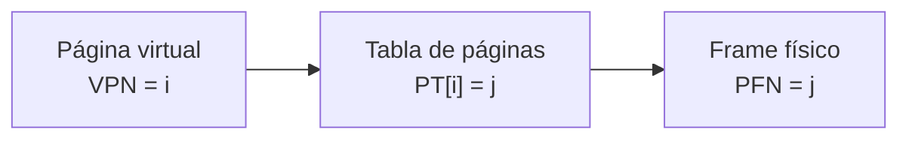
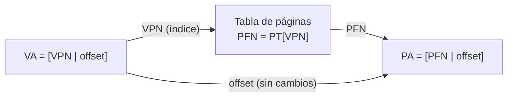
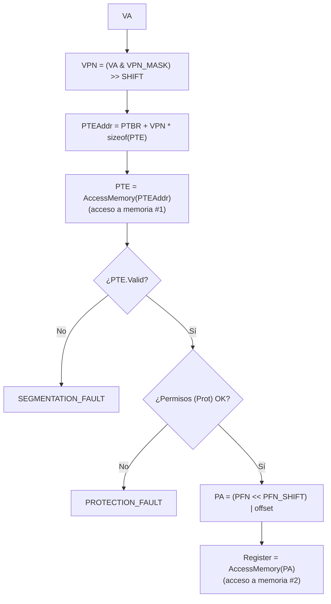

# Paginación: Introducción (OSTEP, cap. 18)

## Objetivos de Aprendizaje

* **Explicar**: cómo la paginación divide el espacio de direcciones en páginas y la memoria física en frames del mismo tamaño, y por qué así se evita la fragmentación externa de la segmentación.
* **Calcular**: el número de páginas y de frames, y los bits de VPN, PFN y offset de las direcciones virtuales y físicas a partir de los tamaños de memoria y de página.
* **Aplicar**: la traducción de una dirección virtual a física usando la tabla de páginas ($PT[VPN] = PFN$), tanto a mano como con el pseudocódigo del hardware (PTBR, máscaras y corrimientos).
* **Describir**: la estructura de una entrada de la tabla de páginas (PTE) y el papel de sus bits de validez, referencia, modificación, protección y presencia.
* **Evaluar**: el costo de la paginación simple: el tamaño de las tablas de página (4 MB por proceso en el ejemplo de 32 bits) y los accesos extra a memoria en cada traducción.

## Contexto: de la segmentación a la paginación

> [!NOTE]
> Sesión del 15/09/2026. La primera parte de esa sesión cerró el tema de segmentación (ver [apuntes_zoom de la clase 9](../../clase_09/apuntes_zoom/)); aquí se desarrolla la introducción a la paginación que se hizo al final.

La segmentación divide la memoria con una **granularidad de grano grueso**: pocas divisiones (3 segmentos: code, heap, stack), contiguas y de tamaño variable. Por eso sufre de fragmentación externa. El objetivo de la paginación es hacer **más fina la división** (grano fino): muchas divisiones, **todas del mismo tamaño**.

Las preguntas que guían el tema:

1. ¿Cómo virtualizar la memoria con páginas para evitar los problemas de la segmentación?
2. ¿Cuáles son las técnicas básicas?
3. ¿Cómo hacer que estas técnicas trabajen correctamente con un mínimo **overhead** (espacio y tiempo)?

## Conceptos clave

La paginación consiste en:

* Dividir el espacio de direcciones (*address space*, AS) en **unidades de tamaño fijo** llamadas **páginas**.
* Mapear **cada página de forma independiente** en la memoria física.
* Así se elimina la necesidad de que los segmentos del espacio de direcciones sean contiguos en memoria física.

| Concepto | Qué es | Índice | Relación |
|---|---|---|---|
| **Página** (*page*) | Bloque de memoria **virtual** de tamaño fijo | VPN (*Virtual Page Number*): $0, 1, \dots, M-1$ | $size(AS) = M \cdot size(page)$ |
| **Frame** (*page frame*, marco) | Bloque de memoria **física** (RAM) de tamaño fijo, asociado a una página | PFN (*Page Frame Number*): $0, 1, \dots, N-1$ | $size(PM) = N \cdot size(frame)$ |
| **Tabla de páginas** (*page table*, PT) | Estructura que traduce direcciones virtuales a físicas, mapeando páginas a frames | Se indexa con el VPN | $PFN = PT[VPN]$ |

> [!IMPORTANT]
> $size(page) = size(frame)$. Una página se copia completa en un frame, así que ambos deben tener el mismo tamaño.



### Ejemplo: espacio de direcciones de 64 B y memoria física de 128 B

Datos (un ejemplo "muy ideal", tomado de OSTEP):

* Memoria física: $size(PM) = 128$ B, con frames de $size(frame) = 16$ B.
* Espacio de direcciones: $size(AS) = 64$ B, con páginas de $size(page) = 16$ B.

$$num\_frames = \frac{size(PM)}{size(frame)} = \frac{128\ \text{B}}{16\ \text{B}} = 8 \qquad num\_pages = \frac{size(AS)}{size(page)} = \frac{64\ \text{B}}{16\ \text{B}} = 4$$

La memoria física queda así (el frame 0 está reservado para el sistema operativo):

| PFN | Rango físico | Contenido |
|---|---|---|
| 0 | 0–15 | Sistema operativo |
| 1 | 16–31 | (libre) |
| 2 | 32–47 | página 3 del AS |
| 3 | 48–63 | página 0 del AS |
| 4 | 64–79 | (libre) |
| 5 | 80–95 | página 2 del AS |
| 6 | 96–111 | (libre) |
| 7 | 112–127 | página 1 del AS |

Leyendo en qué frame quedó cada página se obtiene la **tabla de páginas**: $PT[\,] = \{3, 7, 5, 2\}$.

| VPN (página) | PFN (frame) |
|---|---|
| 0 | 3 |
| 1 | 7 |
| 2 | 5 |
| 3 | 2 |

Cada fila de la tabla es una **PTE** (*Page Table Entry*): hay una por cada página del AS. Las páginas no quedan contiguas ni en orden en memoria física, y no importa: por eso desaparece la fragmentación externa.

## Formato de la dirección virtual

> [!NOTE]
> Continuación: sesión del 17/09/2026.

Una dirección virtual (VA) tiene **dos partes**:

* **VPN** (bits más significativos): índice de la página.
* **offset** (bits menos significativos): desplazamiento dentro de la página seleccionada.

```
[    VPN    |   offset   ]   VA
  n(VPN)       n(offset)
```

La regla general: una memoria de tamaño $size$ necesita $n = \log_2(size)$ bits, y su rango de direcciones es $[0, 2^n - 1]$.

Con los datos del ejemplo ($size(AS) = 64$ B, $size(page) = 16$ B, 4 páginas):

1. **Bits de la VA**: $2^n = 64 = 2^6 \Rightarrow n = 6$. Rango: $[0, 2^6 - 1] = [0, 63]$.
2. **Bits del VPN** (para referirse a cada página): $2^{n(VPN)} = num\_pages = 4 = 2^2 \Rightarrow n(VPN) = 2$.
3. **Bits del offset** (para acceder a cada dirección dentro de una página): $2^{n(offset)} = size(page) = 16 = 2^4 \Rightarrow n(offset) = 4$. También: $n(offset) = n - n(VPN) = 6 - 2 = 4$.

| Tamaño de página | Bits de la VA | Bits altos (VPN) | Bits bajos (offset) |
|---|---|---|---|
| 16 bytes | 6 | 2 | 4 |

```
  5    4  |  3    2    1    0
[Va5  Va4 | Va3  Va2  Va1  Va0]   VA
   VPN    |      offset
```

Con 2 bits de VPN, las páginas ocupan estos rangos:

| VPN | Rango de direcciones | En binario |
|---|---|---|
| 0 (`00`) | 0–15 | `00 0000` – `00 1111` |
| 1 (`01`) | 16–31 | `01 0000` – `01 1111` |
| 2 (`10`) | 32–47 | `10 0000` – `10 1111` |
| 3 (`11`) | 48–63 | `11 0000` – `11 1111` |

### VPN y offset de la VA 21

$$VA = 21 = \texttt{0x15} = \texttt{010101} = [\,\texttt{01}\,|\,\texttt{0101}\,]$$

* $VPN = \texttt{01} = 1$
* $offset = \texttt{0101} = 5$

Comprobación intuitiva: la página 1 va de 16 a 31, y $16 + 5 = 21$. La VA 21 está 5 posiciones después del inicio de la página 1.

## Formato de la dirección física

Una dirección física (PA) también tiene **dos partes**:

* **PFN**: frame dentro del que se encuentra la dirección física.
* **offset**: desplazamiento dentro del frame. Es **el mismo** offset de la VA, porque página y frame tienen el mismo tamaño.

Con los datos del ejemplo ($size(PM) = 128$ B, 8 frames de 16 B):

1. **Bits de la PA**: $2^n = 128 = 2^7 \Rightarrow n = 7$.
2. **Bits del PFN**: $2^{n(PFN)} = num\_frames = 8 = 2^3 \Rightarrow n(PFN) = 3$.
3. **Bits del offset**: $n(offset) = n - n(PFN) = 7 - 3 = 4$ (igual que $\log_2(size(frame)) = \log_2 16$).

| Tamaño de página | Bits de la PA | Bits altos (PFN) | Bits bajos (offset) |
|---|---|---|---|
| 16 bytes | 7 | 3 | 4 |

```
  6    5    4  |  3    2    1    0
[Pa6  Pa5  Pa4 | Pa3  Pa2  Pa1  Pa0]   PA
      PFN      |      offset
```

## Traducción de direcciones con la tabla de páginas

La traducción reemplaza el VPN por el PFN que indica la tabla y **conserva el offset**:



### Ejemplo: VA 21 → PA

* $VA = 21 = [\,\texttt{01}\,|\,\texttt{0101}\,]$ → $VPN = 1$, $offset = 5$.
* $PFN = PT[1] = 7 = \texttt{111}$.
* $PA = [\,\texttt{111}\,|\,\texttt{0101}\,] = \texttt{1110101} = \texttt{0x75} = 117$.

Equivalentemente, $PA = PFN \cdot size(page) + offset = 7 \cdot 16 + 5 = 117$: la VA 21 cae en la página 1, que está en el frame 7 (rango físico 112–127).

### Ejercicio: espacio de direcciones de 16 B y memoria física de 32 B

Una memoria virtual (*logical memory*) y una física almacenan datos de 1 byte. La memoria virtual tiene las letras `a`–`p` en las direcciones 0–15, y la tabla de páginas es $PT[\,] = \{5, 6, 1, 2\}$.

* $size(AS) = 16$ B, con 4 páginas → $size(page) = 4$ B.
* $size(PM) = 32$ B → $num\_frames = 32 / 4 = 8$.

| Pregunta | Cálculo | Resultado |
|---|---|---|
| Número de páginas | de la figura | 4 |
| Número de frames | $32 / 4$ | 8 |
| Tamaño de la página | $16 / 4$ | 4 B |
| Bits de la VA | $2^n = 16 = 2^4$ | 4 |
| Bits de VPN | $2^{n(VPN)} = 4 = 2^2$ | 2 |
| Bits de offset | $4 - 2$ | 2 |
| Bits de la PA | $2^n = 32 = 2^5$ | 5 |
| Bits de PFN | $5 - 2$ | 3 |
| Número total de PTEs | una por página | 4 |

Formatos: $VA = [\,VPN\ (2)\,|\,offset\ (2)\,]$ y $PA = [\,PFN\ (3)\,|\,offset\ (2)\,]$.

Traducciones, con $PA = PFN \cdot size(page) + offset$:

| VA | VA en binario `[VPN\|offset]` | VPN | PFN | PA en binario `[PFN\|offset]` | PA |
|---|---|---|---|---|---|
| 2 (`c`) | `00\|10` | 0 | 5 | `101\|10` = `0x16` | 22 |
| 5 (`f`) | `01\|01` | 1 | 6 | `110\|01` = `0x19` | 25 |
| 6 (`g`) | `01\|10` | 1 | 6 | `110\|10` = `0x1A` | 26 |
| 11 (`l`) | `10\|11` | 2 | 1 | `001\|11` = `0x07` | 7 |
| 12 (`m`) | `11\|00` | 3 | 2 | `010\|00` = `0x08` | 8 |

Cada PA contiene la misma letra que su VA en la memoria virtual. Por ejemplo, el frame 5 (direcciones físicas 20–23) guarda `a b c d`, y la PA 22 es la `c`.

### Ejemplo: llevar la letra `h` a un registro de la CPU

Se ejecuta `mov VA, %eax`, donde `VA` es la dirección virtual donde está la letra `h`:

* `h` está en la $VA = 7 = [\,\texttt{01}\,|\,\texttt{11}\,]$ → $VPN = 1$, $offset = 3$.
* $PFN = PT[1] = 6 = \texttt{110}$.
* $PA = [\,\texttt{110}\,|\,\texttt{11}\,] = \texttt{11011} = 27$.

La CPU accede a la posición física 27, donde está la `h`, y la carga en el registro `%eax`. Ese es el ciclo completo: **VA → tabla de páginas → PA → registro**.

## Varios procesos: una tabla de páginas por proceso

Cuando se ejecutan varios procesos:

* Se crea una **tabla de páginas separada para cada proceso**.
* Así, ningún proceso puede acceder a la memoria física de otro: sus VPN solo se traducen a los frames que le fueron asignados.
* En un *context switch*, un registro de la **MMU** pasa a apuntar a la dirección base de la tabla de páginas del proceso que entra en ejecución (se detalla más abajo: el PTBR).

Ejemplo con 3 procesos de 4 páginas cada uno y una memoria física de 12 frames:

| VPN | PT de P1 | PT de P2 | PT de P3 |
|---|---|---|---|
| 0 | 1 | 0 | 5 |
| 1 | 3 | 2 | 8 |
| 2 | 7 | 4 | 9 |
| 3 | 10 | 6 | 11 |

Los 12 frames quedan repartidos sin solaparse: cada proceso usa la misma numeración de páginas virtuales (0 a 3), pero la tabla de cada uno las lleva a frames distintos.

### ¿Qué tan grandes pueden ser las tablas de página?

Las tablas de página **pueden ser muy grandes**. Ejemplo: un espacio de direcciones con

* direcciones de **32 bits** ($n(VA) = 32$),
* páginas de **4 KB**,
* PTEs de **4 B** cada una.

**Pregunta 1: formato de la VA.**

$$2^{n(offset)} = 4K = (2^2)(2^{10}) = 2^{12} \Rightarrow n(offset) = 12$$

$$n(VPN) = n(VA) - n(offset) = 32 - 12 = 20$$

```
 31  30  ...  13  12 | 11  ...  1   0
[      VPN (20)      |  offset (12)  ]   VA
```

**Pregunta 2: tamaño de la tabla de páginas.**

$$size(AS) = 2^{32} = (2^2)(2^{30}) = 4\ \text{GB}$$

$$num\_pages = \frac{size(AS)}{size(page)} = \frac{2^{32}}{2^{12}} = 2^{20} \approx 1M \text{ páginas} = 1M \text{ PTEs}$$

$$size(PT) = num\_pages \cdot size(PTE) = 2^{20} \cdot 2^{2}\ \text{B} = 2^{22}\ \text{B} = 4\ \text{MB}$$

**Conclusión**: en este ejemplo, la tabla de páginas de **un solo proceso** ocupa 4 MB. Con $N = 100$ procesos:

$$N \cdot size(PT) = 100 \cdot 4\ \text{MB} = 400\ \text{MB}$$

Son 400 MB de RAM (en una máquina de, por ejemplo, 8 GB) ocupados **solo** por tablas de página, en el espacio del sistema operativo. Hay un **enorme gasto de memoria**, y es uno de los problemas de la paginación simple.

## Estructura de una tabla de páginas

> [!NOTE]
> Continuación: sesión del 22/09/2026.

### ¿Dónde se guardan las tablas de página?

Las tablas de página son estructuras que se almacenan en **memoria física**, en el **espacio del kernel**. No caben en los registros de la CPU, que son el almacenamiento más costoso y escaso: una sola tabla puede ocupar 4 MB, como se vio arriba.

En el ejemplo de 64 B / 128 B, la tabla $\{3, 7, 5, 2\}$ podría guardarse en el frame 0, el que está reservado para el sistema operativo.

### La tabla de páginas lineal

La forma más simple de tabla de páginas es la **tabla lineal**: un **arreglo**. El SO indexa el arreglo con el VPN para obtener la PTE:

$$PTE = PT[VPN] = [\,bits\,|\,PFN\,]$$

Hasta ahora la PTE era solo el PFN (forma más simple). En la práctica, además del PFN contiene varios **bits de estado y control**:

```
[ V | R | P | M | Prot |       PFN       ]   PTE
```

| Bit | Nombre | Significado |
|---|---|---|
| **V** | Validez | Indica si la traducción es válida |
| **Prot** | Protección | Operaciones permitidas: *read*, *write*, *execute* |
| **P** | Presencia | Indica si la página está en la memoria física |
| **M** | Modificación (*dirty*, sucio) | Indica si la página ha sido modificada |
| **R** | Referencia | Indica si la página ha sido accedida |

### Ejemplo guía para los bits

Para ver cada bit por separado se usa este ejemplo, que tiene los mismos tamaños que el anterior pero otra tabla de páginas:

* Memoria virtual de 64 B con páginas de 16 B (4 páginas).
* Memoria física de 128 B con frames de 16 B (8 frames).

| Página | Segmento | Frame |
|---|---|---|
| VP0 | code | PFN 1 |
| VP1 | heap | PFN 4 |
| VP2 | libre | no válido |
| VP3 | stack | PFN 7 |

Con la tabla $\{1, 4, -, 7\}$, la misma $VA = 21 = [\,\texttt{01}\,|\,\texttt{0101}\,]$ ahora se traduce a $PA = [\,\texttt{100}\,|\,\texttt{0101}\,] = \texttt{1000101} = 69$.

#### Bit de validez (V)

Indica si una PTE **puede o no ser usada**. Se evalúa cada vez que se usa una dirección.

* $V = 1$: traducción válida (la página está mapeada).
* $V = 0$: traducción inválida. Cualquier acceso a esa página es inválido, sin importar lo que haya en el campo PFN.

| VPN | V | PFN |
|---|---|---|
| 0 (code) | 1 | 1 |
| 1 (heap) | 1 | 4 |
| 2 (libre) | 0 | – |
| 3 (stack) | 1 | 7 |

Así, $PTE = [\,V\,|\,PFN\,]$.

#### Bit de referencia (R)

Indica si la página **ha sido accedida**. Se lleva a 1 (operación *set*) cuando la página se lee o se escribe.

* $R = 0$: página no accedida. $R = 1$: página accedida.
* Utilidad: permite rastrear los accesos a cada página y determinar su **popularidad**.

Ejemplo: se ejecuta la instrucción de lectura `mov 60, %eax`, que está en la página de código (VPN 0).

* Para **leer la instrucción** se accede a la página de código: VPN 0.
* El dato está en la $VA = 60 = \texttt{0x3C} = [\,\texttt{11}\,|\,\texttt{1100}\,]$ → $VPN = 3$ (stack), $offset = 12$. Con $PFN = 7$: $PA = 7 \cdot 16 + 12 = 124$, donde está el valor 3000.

| VPN | V | R | PFN |
|---|---|---|---|
| 0 (code) | 1 | **1** | 1 |
| 1 (heap) | 1 | 0 | 4 |
| 2 (libre) | 0 | – | – |
| 3 (stack) | 1 | **1** | 7 |

El heap queda con $R = 0$ porque esta instrucción no lo accede.

#### Bit de modificación (M) o *dirty* (D)

Indica si la página **ha sido modificada**, es decir, si se ha hecho una escritura (*write*) sobre ella. Su relevancia es la **sincronización entre RAM y disco**: todo programa vive originalmente en disco, y si una página se modificó en RAM, la copia en disco queda desactualizada. Es parecido a un archivo que se está editando y no se ha guardado.

Ejemplo: se modifica una variable global `x` (por ejemplo, de 0 a 30). En este ejemplo la VPN 0 agrupa el código y las variables globales, así que su bit M pasa a 1:

| VPN | V | R | M | PFN |
|---|---|---|---|---|
| 0 (code + datos) | 1 | 1 | **1** | 1 |
| 1 (heap) | 1 | 0 | 0 | 4 |
| 2 (libre) | 0 | – | – | – |
| 3 (stack) | 1 | 1 | 0 | 7 |

> [!NOTE]
> En un sistema real las variables globales residen en un segmento de datos separado (con permisos R/W), y el código tiene permisos R/X con $M = 0$.

#### Bits de protección (Prot)

Controlan qué operaciones están permitidas sobre la página (R/W/X, usuario/kernel, etc.). Es el mismo mecanismo que ya existía en segmentación. Asumiendo por ahora la codificación `R/X = 00` y `R/W = 01`:

| VPN | V | R | M | Prot | PFN |
|---|---|---|---|---|---|
| 0 (code) | 1 | 1 | 1 | `00` (R/X) | 1 |
| 1 (heap) | 1 | 0 | 0 | `01` (R/W) | 4 |
| 2 (libre) | 0 | – | – | – | – |
| 3 (stack) | 1 | 1 | 0 | `01` (R/W) | 7 |

La PTE queda $[\,V\,|\,R\,|\,M\,|\,Prot\,|\,PFN\,]$.

#### Bit de presencia (P)

Indica si la página se encuentra en **memoria física** ($P = 1$) o en **disco** ($P = 0$). Al ejecutarse un programa, solo algunas de sus páginas se cargan en RAM y el resto permanece en disco (*backing store*) hasta que se necesite. Este bit cobra más sentido con la **memoria virtual** (swap), que se verá más adelante.

> [!IMPORTANT]
> No hay que confundir V con P. $V = 0$ significa que la página **no pertenece** al espacio de direcciones en uso (un acceso ahí es inválido). $P = 0$ significa que la página es válida pero **está en disco**. Algunos libros y figuras mezclan ambos: la figura del libro de Silberschatz usada en clase marca con `v`/`i` (válido/inválido) si la página está en memoria, y en la figura del hardware de traducción (tomada de CS:APP) el texto "*Valid bit = 0: page not in memory (page fault)*" corresponde en realidad al bit de presencia. En el pseudocódigo del curso (más abajo), $V = 0$ produce un `SEGMENTATION_FAULT`.

#### Ejemplo real: la PTE en x86

En x86, una PTE de 32 bits tiene el PFN en los bits 31–12 y los bits de control en los bits bajos. Entre ellos:

| Bit | Significado |
|---|---|
| **P** (bit 0) | *present* |
| **R/W** (bit 1) | lectura/escritura |
| **U/S** (bit 2) | usuario/supervisor |
| **A** (bit 5) | *accessed* (equivale al bit de referencia) |
| **D** (bit 6) | *dirty* |
| **PFN** (bits 31–12) | *page frame number* |

La definición exacta de los bits depende de la arquitectura. Entender la PTE permite implementar la gestión de memoria (traducción, permisos, fallos de página) y adaptar el SO a distintas arquitecturas.

### Ejemplo: la instrucción `ld 17, R1`

Con el ejemplo guía (la PTE es $[\,V\,|\,PFN\,]$ y la tabla es $\{1, 4, -, 7\}$), se analiza la instrucción `ld 17, R1`:

| Memoria virtual | | Memoria física | |
|---|---|---|---|
| $size(AS)$ | 64 B | $size(PM)$ | 128 B |
| $n(VA)$ | 6 | $n(PA)$ | 7 |
| $n(VPN)$ | 2 | $n(PFN)$ | 3 |
| $n(offset)$ | 4 | $n(offset)$ | 4 |

**1. Campos de la dirección virtual.**

$$VA = 17 = \texttt{0x11} = \texttt{010001} = [\,\texttt{01}\,|\,\texttt{0001}\,] \Rightarrow VPN = 1,\ offset = 1$$

**2. Campos de la dirección física.**

$$PFN = PT[1] = 4 = \texttt{100} \qquad PA = [\,\texttt{100}\,|\,\texttt{0001}\,] = \texttt{1000001} = \texttt{0x41} = 65$$

**3. Tamaño de la tabla de páginas.**

* Una PTE tiene 1 bit de validez (2 posibilidades) y 3 bits de PFN (frames 0 a $2^3 - 1 = 7$):
  $$size(PTE) = size(V) + size(PFN) = 1 + 3 = 4 \text{ bits}$$
* Hay una PTE por página:
  $$size(PT) = num\_pages \cdot size(PTE) = 4 \cdot 4 \text{ bits} = 16 \text{ bits}$$

### Registro PTBR (*Page Table Base Register*)

**Problema**: el hardware es quien hace la traducción, pero ¿dónde está la tabla asociada al proceso?

* Las tablas de página residen en **memoria física** y las gestiona el **kernel**.
* Para ubicarlas se usa el **PTBR**, un registro de la MMU que mantiene la **dirección física de la tabla de páginas del proceso** en ejecución: $PTBR = \&PT[0]$.
* La MMU usa el PTBR para localizar la tabla durante la traducción. En un *context switch* el SO cambia el PTBR para que apunte a la tabla del nuevo proceso.

Ejemplo: con el ejemplo guía y $PTBR = 4$, la tabla (4 PTEs de 4 bits = 16 bits) ocupa los bytes 4 y 5 de la memoria física:

| Byte | Primera mitad (4 bits) | Segunda mitad (4 bits) |
|---|---|---|
| 4 | `1001` = PT[0] (V=1, PFN=`001`) | `1100` = PT[1] (V=1, PFN=`100`) |
| 5 | `0???` = PT[2] (V=0) | `1111` = PT[3] (V=1, PFN=`111`) |

La dirección de la PTE de un VPN se calcula como

$$PTEAddr = PTBR + VPN \cdot size(PTE)$$

> [!NOTE]
> Las unidades de $PTBR$ y de $size(PTE)$ deben coincidir. En los sistemas reales las PTEs ocupan un número entero de bytes (por ejemplo, 4 B), así que todo se mide en bytes. En este ejemplo didáctico la PTE mide 4 **bits**. Si todo se mide en bits, la tabla empieza en el bit $4 \cdot 8 = 32$ y $PT[1]$ está en el bit $32 + 1 \cdot 4 = 36$, es decir, en la segunda mitad del byte 4.

## Traducción de direcciones usando paginación

El hardware debe conocer la **estructura exacta** de la tabla de páginas. El PTBR (en x86, el registro `CR3`) da la dirección física de la tabla del proceso actual. El VPN se usa como índice para obtener la PTE. Si la PTE es válida, su PFN se une con el offset (que pasa sin cambios) para formar la PA.

Lógica resumida:

```c
index into PT: PTBR + VPN*size(PTE)     // PTE = PT[VPN]
Fetch PTE for VPN;                      // Traer la PTE
if (VALID == 0)
    fault();
PA = (PFN << PAGESHIFT) | offset        // Realizar la traducción
Fetch PA -> R1;                         // Cargar los datos desde la memoria física
```

### Ejemplo del libro: `movl 21, %eax`

Con la tabla original ($PT[\,] = \{3, 7, 5, 2\}$), ¿cómo lleva a cabo el hardware la traducción de la VA 21 a la PA 117? En tres pasos.

**1. Encontrar la PTE.** El VPN son los 2 bits altos de la VA, así que se aíslan con una máscara y se corren 4 posiciones (el tamaño del offset):

```c
VPN = (VirtualAddress & VPN_MASK) >> SHIFT          // VPN = 01
PTEAddr = PageTableBaseRegister + (VPN * sizeof(PTE)) // PTEAddr = &PT[1]
```

con `VPN_MASK = 110000` y `SHIFT = 4`: $(\texttt{010101}\ \&\ \texttt{110000}) \gg 4 = \texttt{010000} \gg 4 = \texttt{01}$.

**2. Realizar la traducción.** El offset son los 4 bits bajos:

```c
offset = VirtualAddress & OFFSET_MASK   // offset = 010101 & 001111 = 000101
PhysAddr = (PFN << SHIFT) | offset      // PhysAddr = (111 << 4) | 000101 = 1110101
```

$\texttt{1110101} = 117$.

**3. Cargar los datos desde la memoria física.**

```c
Register = AccessMemory(PhysAddr)
```

La CPU trae el dato de la PA 117 (dentro del frame 7, donde está la página 1) y lo guarda en el registro.

### Resumen: protocolo completo

```c
// Extract the VPN from the virtual address
VPN = (VirtualAddress & VPN_MASK) >> SHIFT

// Form the address of the page-table entry (PTE)
PTEAddr = PTBR + (VPN * sizeof(PTE))

// Fetch the PTE
PTE = AccessMemory(PTEAddr)

// Check if process can access the page
if (PTE.Valid == False)
    RaiseException(SEGMENTATION_FAULT)
else if (CanAccess(PTE.ProtectBits) == False)
    RaiseException(PROTECTION_FAULT)
else
    // Access is OK: form physical address and fetch it
    offset = VirtualAddress & OFFSET_MASK
    PhysAddr = (PTE.PFN << PFN_SHIFT) | offset
    Register = AccessMemory(PhysAddr)
```

El pseudocódigo está también en [`apuntes/intro-to-paging/src/paging.c`](../apuntes/intro-to-paging/src/paging.c).



> [!TIP]
> Construir la dirección (extraer VPN y offset, armar la PA) y revisar los bits de la PTE son operaciones baratas. Lo costoso son los dos accesos a memoria marcados en el diagrama.

## Simulador `paging-linear-translate.py`

> [!NOTE]
> Continuación: sesión del 24/09/2026.

El simulador del curso ([`clase_10/simulador/paging-linear-translate.py`](../simulador/paging-linear-translate.py), homework `vm-paging` de OSTEP) permite comprobar las traducciones. Se usó para verificar el ejemplo original: memoria virtual de 64 B con páginas de 16 B ($n = 6$, $n(VPN) = 2$, $n(offset) = 4$), memoria física de 128 B con frames de 16 B ($n = 7$, $n(PFN) = 3$, $n(offset) = 4$), tabla $\{3, 7, 5, 2\}$ y la traducción $VA = 21 = \texttt{0x15} = [\,\texttt{01}\,|\,\texttt{0101}\,] \rightarrow PA = 117 = \texttt{0x75} = [\,\texttt{111}\,|\,\texttt{0101}\,]$.

| Bandera | Significado |
|---|---|
| `-A` | lista de direcciones virtuales a traducir |
| `-a` | tamaño del espacio de direcciones (`size(AS)`) |
| `-p` | tamaño de la memoria física (`size(PM)`) |
| `-P` | tamaño de página (`size(page)`) |
| `-u` | porcentaje del espacio de direcciones que está en uso (páginas válidas) |
| `-s` | semilla aleatoria |
| `-v` | modo detallado: imprime el VPN de cada entrada de la tabla |
| `-c` | calcula las respuestas |

El contenido de las PTEs se genera **aleatoriamente**, principalmente a partir de `-s` y `-u`. Con `-u 100` todas las páginas son válidas, y la semilla `-s 728` produce justo la tabla del ejemplo:

```bash
./paging-linear-translate.py -A 21 -a 64 -p 128 -P 16 -u 100 -s 728 -v -c
```

```
...
ARG addresses 21

The format of the page table is simple:
The high-order (left-most) bit is the VALID bit.
  If the bit is 1, the rest of the entry is the PFN.
  If the bit is 0, the page is not valid.
Use verbose mode (-v) if you want to print the VPN # by
each entry of the page table.

Page Table (from entry 0 down to the max size)
  [       0]  0x80000003
  [       1]  0x80000007
  [       2]  0x80000005
  [       3]  0x80000002

Virtual Address Trace
  VA 0x00000015 (decimal:       21) --> 00000075 (decimal      117) [VPN 1]
```

Cómo leer la salida:

* Cada entrada de la tabla es un número de 32 bits cuyo **bit más significativo** (el de más a la izquierda) es el bit de validez. `0x80000003` = `1000 0000 ... 0011`: $V = 1$ y $PFN = 3$. Las cuatro entradas dan la tabla $\{3, 7, 5, 2\}$.
* La VA 21 (`0x15`) se traduce a `0x75` = 117, en la página 1 ([VPN 1]). Coincide con el cálculo a mano.
* Sin `-c`, el simulador escribe `PA or invalid address?` en lugar de la respuesta, para que uno la calcule.

> [!TIP]
> Antes de resolver cualquier problema de traducción, dibuja la memoria virtual y la física con sus páginas y frames numerados, y construye la tabla de páginas. La tabla tiene tantas entradas como páginas virtuales, y sus índices son los VPN.

## Puente hacia la siguiente clase: el costo de la paginación

La traducción funciona, pero tiene dos problemas:

1. **Espacio**: las tablas de página pueden ser enormes (4 MB por proceso en el ejemplo de 32 bits).
2. **Tiempo**: cada referencia a memoria cuesta **dos accesos** a memoria física: uno para traer la PTE de la tabla de páginas y otro para traer el dato o la instrucción.

Para dimensionar el costo del segundo problema se planteó un acceso simple a memoria: inicializar en cero un arreglo de 1000 enteros.

```c
int array[1000];
...
for (i = 0; i < 1000; i++)
    array[i] = 0;
```

Con un espacio de direcciones de 64 KB, páginas de 1 KB y el arreglo (4000 bytes) en las direcciones virtuales 40 000 a 43 999, el arreglo ocupa las páginas virtuales 39 a 42, mapeadas a los frames 7 a 10. El análisis de cuántos accesos a memoria genera este ciclo, y la solución de hardware para reducirlos, la **TLB** (*Translation Lookaside Buffer*), son el tema de la [clase 11](../../clase_11/).

## Actividades sugeridas

* Repetir a mano las traducciones de la clase (VA 21, el ejercicio de 16 B / 32 B, la letra `h`, `ld 17, R1`) y verificarlas con el simulador.
* Resolver las preguntas de la tarea del simulador en [`clase_10/simulador/README.md`](../simulador/README.md).
* Para profundizar, leer los apuntes del tema en [`apuntes/intro-to-paging/`](../apuntes/intro-to-paging/).

> [!NOTE]
> **Evaluaciones**:
> * El quiz de paginación se habilita al terminar el tema en clase.
> * El primer parcial se hará en horario de clase, en una fecha que se concertará con el grupo después del 9/10. Será de una sola oportunidad, con límite de tiempo y con consulta de apuntes. Entran virtualización de memoria, paginación y swap.
> * La actividad de seguimiento del módulo 1 es opcional, da bonificación para el parcial y cierra el 26/09.
> * Para prepararse, en la plataforma están los talleres resueltos del módulo 2, un parcial anterior con su solución y los "pasteles" (resúmenes de semestres anteriores).

---

> [!IMPORTANT]
> **Nota de Transparencia:** Este documento fue generado y adaptado mediante el uso de **IA Generativa**, a partir del manuscrito anotado de la clase y los resúmenes de las sesiones de Zoom. El contenido ha sido supervisado, validado y refinado por intervención humana para garantizar su precisión técnica y coherencia pedagógica. No obstante, pueden haber errores.
