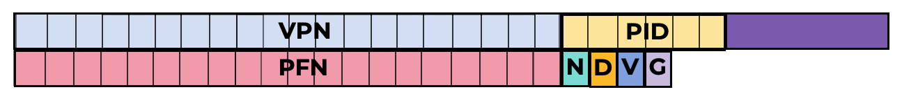
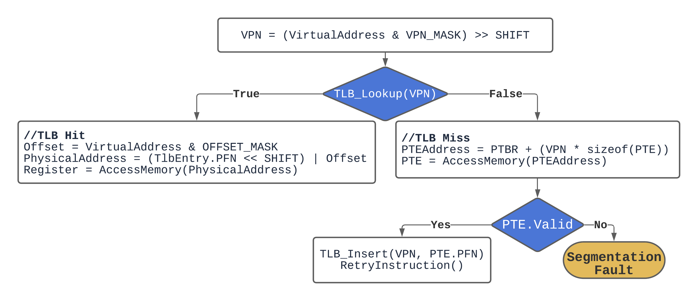
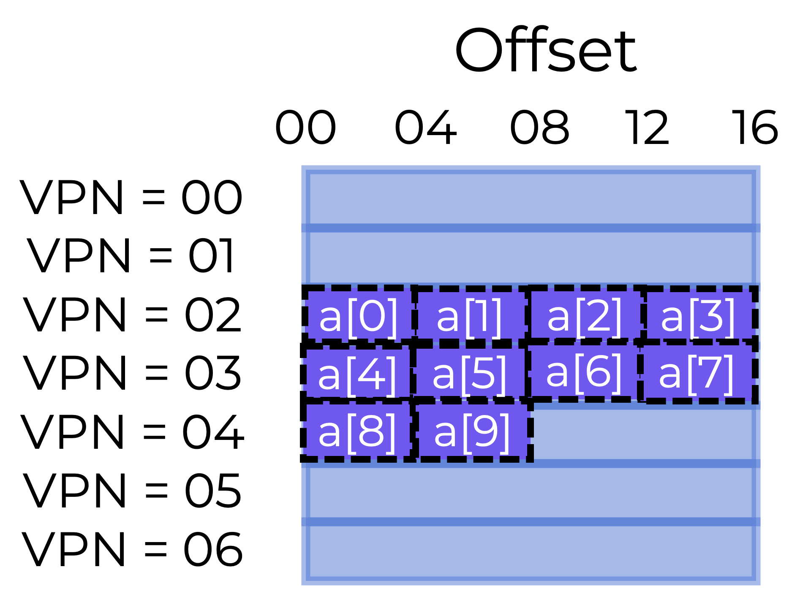
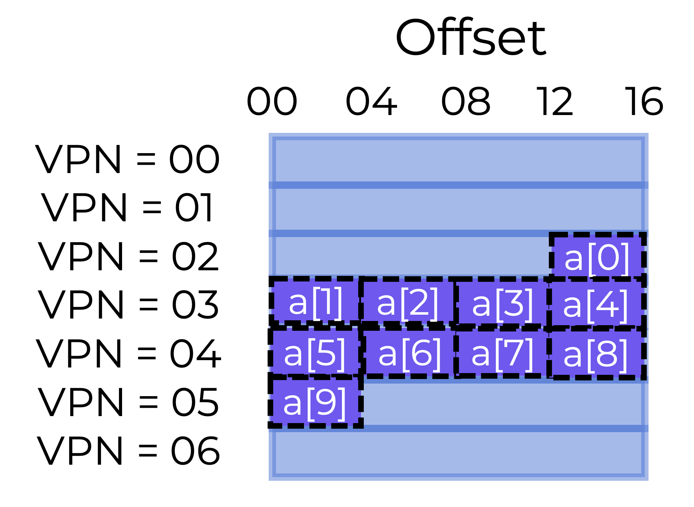

# Translation Lookaside Buffers (TLB)

## Resumen

Esta sección debería ayudarnos a responder las siguientes preguntas:
* **¿Cómo podemos acelerar la traducción de direcciones y evitar la referencia a memoria adicional e innecesaria que implica la paginación?**
* **¿Qué soporte de hardware se necesita?**
* **¿Qué tanto debe intervenir el SO?**

Al hacer un cambio de contexto entre procesos, las traducciones de la TLB del proceso anterior no le sirven al siguiente proceso.
* **¿Qué deberían hacer el hardware o el SO para resolver este problema?**

## Translation Lookaside Buffers (TLBs)

En la práctica, la paginación necesita una búsqueda adicional en memoria para traducir cada dirección virtual (como se ilustra abajo), pero obtener la información de traducción antes de cada búsqueda de instrucción (instruction fetch), carga (load) o almacenamiento (store) toma demasiado tiempo.

<p align="center">
  
</p>

Para acelerar la traducción de direcciones, usaremos un **translation lookaside buffer (TLB)**.

> **Translation Lookaside Buffer o TLB**
> Un **translation lookaside buffer (TLB)** es una caché de hardware con las traducciones de direcciones virtuales a físicas más usadas, y forma parte de la MMU del chip.

Si la traducción solicitada está almacenada en la TLB, el hardware no necesita acceder a la tabla de páginas que contiene todas las traducciones.

La memoria virtual no sería posible sin la mejora de rendimiento que brindan las TLBs.

### Dentro de la TLB

Las entradas de la TLB podrían verse más o menos así:

```          
VPN                     PFN                 other bits
```

Cada entrada contiene tanto el VPN como el PFN (en términos de hardware, la TLB se conoce como una **caché totalmente asociativa (fully-associative cache)**). Para ver si hay una coincidencia, el hardware busca en todas las entradas en paralelo.

Veamos una TLB real. La figura de abajo muestra una entrada de TLB, algo simplificada, de un sistema moderno que usa TLBs administradas por software.

<p align="center">
  
</p>

* 20 bits: Número de Página Virtual (Virtual Page Number, VPN)
* 6 bits: Identificador de Proceso (Process ID, PID); a veces llamado Identificador de Espacio de Direcciones (Address Space ID, ASID)
* 6 bits: sin usar
* 20 bits: Número de Marco de Página (Page Frame Number, PFN)
* Bit N: si está activo, el acceso a memoria se salta la caché (esto se discutirá en una sección futura)
* Bit D: Bit de modificación (dirty bit) - si está activo, la memoria se puede escribir (esto se discutirá en una sección futura)
* Bit V: Bit de validez (valid bit) - indica si la entrada tiene o no una traducción válida
* Bit G: Bit global (global bit) - si está activo, la TLB no revisa el PID para la traducción (ver más abajo)

Las TLBs suelen incluir **32** o **64** de estas entradas; la mayoría las usan los procesos de usuario, pero unas pocas son para el SO (usando el bit G). El SO puede configurar un registro *wired* para indicarle al hardware cuántas ranuras de la TLB debe reservarle. El SO usa estos mapeos reservados para el código y los datos a los que necesita acceder en momentos clave en los que un fallo de TLB sería problemático (p. ej., en el manejador de fallos de TLB (TLB miss handler)).

Cuando una TLB es administrada por software, debe haber instrucciones para actualizarla. El sistema ofrece cuatro instrucciones de este tipo:
* **`TLBP`** busca (probe) una traducción específica en la TLB
* **`TLBR`** lee el contenido de una entrada de la TLB en registros
* **`TLBWI`** reemplaza una entrada específica de la TLB, y
* **`TLBWR`** reemplaza una entrada aleatoria de la TLB

### Preguntas

**Completa el párrafo de abajo para describir el proceso de traducción de direcciones con una TLB**

El hardware (la MMU) obtiene un `número de página virtual (VPN)` de la dirección virtual que genera un proceso. Luego lo traduce a un `número de marco de página (PFN)`.

En lugar de ir a la `tabla de páginas` en memoria, el hardware puede usar un `Translation Lookaside Buffer` en la MMU.

Hay algunos bits útiles en la entrada de la TLB, que incluyen cosas como el `identificador de proceso (process ID)`.

Otros bits útiles indican si esa ubicación de memoria se puede escribir, si es global o si es válida.

## Cómo Funcionan las TLBs

El diagrama de flujo de abajo esboza cómo podría manejar el hardware la traducción de una dirección virtual.

<p align="center">
  
</p>

El proceso tiene 2 grandes puntos de decisión:
1. Después de extraer el número de página virtual (VPN) de la dirección virtual, el sistema revisa si la TLB tiene la traducción para ese VPN
   * Si la tiene, tenemos un **acierto de TLB (TLB hit)**, lo que significa que la traducción está almacenada en la TLB. Podemos concatenar el número de marco de página (PFN) de la entrada correspondiente de la TLB con el offset de la dirección virtual inicial para formar la dirección física (PA) deseada, y acceder a memoria.
   * Si la CPU no encuentra la traducción en la TLB (un **fallo de TLB (TLB miss)**), tenemos que consultar la tabla de páginas para encontrar la traducción.
2. En caso de un fallo de TLB, tenemos que revisar si la referencia a memoria virtual generada por el proceso es válida y está disponible
   * Si lo es, actualizamos la traducción en la TLB, el hardware reintenta la instrucción y (esta vez) la traducción se encuentra en la TLB, así que la referencia a memoria se procesa rápidamente
   * Si no, tenemos una falla de segmentación (segmentation fault)

La TLB, como todas las cachés, parte de la expectativa de que las traducciones se encuentren en la caché (es decir, que sean aciertos). Si es así, como la TLB está ubicada cerca del núcleo de procesamiento, cualquier sobrecosto adicional es mínimo.

Cuando hay un fallo, se paga el alto costo de la paginación. Hay que buscar en la tabla de páginas para encontrar la traducción, lo que genera una referencia a memoria adicional. Si esto ocurre con frecuencia, el programa probablemente se ejecutará bastante más lento. Los accesos a memoria son bastante costosos en comparación con otras instrucciones de la CPU, y los fallos de TLB generan más accesos a memoria.

Nuestro objetivo es evitar los fallos de TLB tanto como sea posible.

### Ejemplo de Acceso a un Arreglo

Veamos una traza de direcciones virtuales y cómo una TLB puede hacerla más rápida. Supongamos que tenemos en memoria un arreglo de 10 enteros de 4 bytes. Digamos que tenemos un espacio de direcciones virtual de 8 bits con páginas de 16 bytes. Así, una dirección virtual se divide en un VPN de 4 bits y un offset de 4 bits.


<p align="center">
  
</p>

La primera entrada del arreglo (`a[0]`) empieza en la página VPN=02, offset=00. El arreglo continúa en la siguiente página (VPN=3) con los elementos `a[4] ... a[7]`. Las dos últimas entradas (`a[8]` y `a[9]`) están en la página siguiente (VPN=04).

Considera un ciclo básico que duplica cada elemento del arreglo, como el siguiente ejemplo:

```c
for (i = 0; i < 10; i++) {
    a[i] *= 2;
}
```

Imaginemos que los únicos accesos a memoria del ciclo son al arreglo (ignorando la variable `i`, así como las instrucciones). En cuanto la CPU accede al primer elemento del arreglo (`a[0]`), verá una carga a la dirección virtual de `a[0]` (VPN=02, offset=00). Para buscar una traducción válida en la TLB, el hardware extrae de ahí el VPN (VPN=02). Esto resulta en un fallo de TLB si es la primera vez que el programa accede al arreglo.

El siguiente acceso es a `a[1]`, ¡y es un **acierto de TLB (TLB hit)**! La traducción ya está cargada en la TLB porque el segundo elemento del arreglo está ubicado justo al lado del primero. Por eso tuvimos éxito.

Como `a[2]` y `a[3]` están en la misma página que `a[0]` y `a[1]`, también se pueden acceder y por lo tanto son un **acierto**.

El programa tiene otro **fallo de TLB** cuando accede a `a[4]`. Sin embargo, las siguientes entradas (`a[5] ... a[7]`) seguirán siendo aciertos de TLB, ya que todas están almacenadas en la misma página.

El acceso a `a[8]` provoca un último **fallo** de TLB... El hardware vuelve a buscar en la tabla de páginas para encontrar la página virtual en la memoria física y actualiza la TLB. El acceso final (`a[9]`) se beneficia de la actualización de la TLB, lo que produce otro **acierto**.

Para nuestros **10** accesos al arreglo, tuvimos la siguiente actividad en la TLB:
1. fallo
2. acierto
3. acierto
4. acierto
5. fallo
6. acierto
7. acierto
8. acierto
9. fallo
10. acierto

Entonces, nuestra **tasa de aciertos (hit rate)** de la TLB (número de aciertos dividido por el total de accesos) es **70%**. No es muy alta (queremos tasas de aciertos del **100%**), pero no es cero. La TLB mejora el rendimiento aunque sea la primera vez que la aplicación accede al arreglo. Como los elementos del arreglo están agrupados de forma compacta en páginas (en el espacio), solo el primer acceso a un elemento de cada página provoca un fallo de TLB.

Este ejemplo también muestra la importancia del tamaño de página. El acceso al arreglo habría sido mejor si el tamaño de página hubiera sido el doble (**32** bytes en lugar de **16**). Como las páginas suelen ser de **4 KB**, los accesos densos basados en arreglos tienen un excelente rendimiento en la TLB, con un solo fallo por cada página de accesos.

> La **localidad temporal (temporal locality)**, es decir, volver a referenciar rápidamente elementos de memoria en el tiempo, aumentaría la tasa de aciertos de la TLB. Las TLBs, como cualquier caché, dependen de la localidad espacial y temporal propia de cada programa. Si el programa tiene esa localidad (y muchos la tienen), la tasa de aciertos de la TLB será alta.

Probablemente el programa se ejecutaría mejor si volviera a acceder al arreglo poco después de terminar el ciclo, siempre que la TLB fuera lo bastante grande para guardar en caché las traducciones necesarias:

```c
//70% hit rate
for (i = 0; i < 10; i++) {
    a[i] *= 2;
}
//100% hit rate
for (i = 0; i < 10; i++) {
    printf("%d", a[i]);
}
```

### Pregunta

Dado el arreglo almacenado como se muestra abajo, ¿cuál es la tasa de aciertos de la TLB la primera vez que se accede al arreglo?

<p align="center">
  
</p>

- [x] 60%
- [ ] 40%
- [ ] 50%
- [ ] 70%

El arreglo tendría el siguiente patrón de accesos:
1. Fallo (VPN 2 se almacena en la TLB)
2. Fallo (VPN 3 se almacena en la TLB)
3. Acierto (VPN 3)
4. Acierto (VPN 3)
5. Acierto (VPN 3)
6. Fallo (VPN 4 se almacena en la TLB)
7. Acierto (VPN 4)
8. Acierto (VPN 4)
9. Acierto (VPN 4)
10. Fallo (VPN 5 se almacena en la TLB)
    
Esto da un total de **4** fallos y **6** aciertos, es decir, una tasa de aciertos del **60%**

## Cambio de Contexto

Las TLBs complican el cambio entre procesos (y el cambio de espacio de direcciones). Las traducciones de virtual a física solo son válidas para el proceso que se está ejecutando. Por eso, al cambiar de proceso, el hardware o el SO (o ambos) deben asegurarse de que el nuevo proceso no reutilice traducciones anteriores.

Veamos un ejemplo. Mientras un proceso (**P1**) se ejecuta, se asume que la TLB guarda en caché traducciones válidas de la tabla de páginas de **P1**. Imagina que la **10.ª** página virtual de **P1** está asignada al marco **100**.

Supongamos que existe otro proceso (**P2**) y que el SO decide ejecutarlo mediante un cambio de contexto. Supongamos que la **10.ª** página virtual de **P2** está asignada al marco **170**. Si existieran entradas para ambos procesos, la TLB las contendría así:

|VPN | PFN | valid | prot |
|---|---|---|---|
|10 | 100 |	1 |rwx |
|- | - | 0 | - |
|10 | 170 |	1 |	rwx |
|- | - | 0 | - |

Tenemos un problema en la TLB: el VPN **10** es o bien el PFN **100** (**P1**) o bien el PFN **170** (**P2**), pero el hardware no puede distinguirlos. Así que la TLB necesita desarrollarse más para permitir la virtualización con múltiples procesos de forma adecuada y eficiente. De ahí el dilema:

### ¿Cómo administramos el contenido de la TLB al cambiar de proceso?

Al hacer un cambio de contexto entre procesos, las traducciones de la TLB del proceso anterior no le sirven al siguiente proceso. ¿Qué deberían hacer el hardware o el SO?

La solución más simple es el **vaciado (flushing)**. Vaciar la TLB significa dejarla vacía antes de comenzar a ejecutar el siguiente proceso. Se puede hacer con instrucciones de hardware privilegiadas o, en una TLB administrada por hardware, modificando el registro base de la tabla de páginas. **El vaciado limpia la TLB poniendo todos los bits de validez en 0**. Vaciar la TLB en cada cambio de contexto es un método viable, pero provoca muchos fallos de TLB. Un cambio de proceso costoso puede ser un problema si ocurre con demasiada frecuencia.

Para reducir este sobrecosto, algunos sistemas permiten que la TLB de hardware se comparta entre cambios de contexto. Algunas TLBs incluyen un campo de **identificador de espacio de direcciones (address space identifier, ASID)**. El ASID es un identificador de proceso (PID) con menos bits.

Agregar ASIDs a nuestra TLB anterior muestra que los procesos pueden compartir fácilmente la TLB: solo el campo ASID distingue traducciones que de otro modo serían idénticas. Este es un ejemplo de una TLB con un campo ASID:

|VPN | PFN | valid | prot | ASID |
|---|---|---|---|---|
|10 | 100 | 1 | rwx	| 1 |
|- | - | 0 | - | - |
|10 | 170 |	1 | rwx | 2 |
|- | - | 0 | - | - |

Con los identificadores de espacio de direcciones, la TLB puede contener traducciones de varios procesos. Como el hardware necesita saber qué proceso se está ejecutando, el SO tiene que asignar el ASID del proceso a un registro privilegiado.

Quizás también hayas considerado la situación en la que dos entradas de la TLB son sorprendentemente parecidas. Aquí, dos entradas de dos procesos, con dos VPN distintos, apuntan a la misma página física:

|VPN | PFN | valid | prot | ASID |
|---|---|---|---|---|
| 10 | 101 | 1 | r-x | 1 |
| - | -	 | 0 | - | - |
| 50 | 101 | 1 | r-x | 2 |
| -	 | - | 0 | - |  - |

Esto puede ocurrir cuando dos procesos comparten una página (por ejemplo, una página de código). El **Proceso 1** comparte la página física **101** con el **Proceso 2**, pero **P1** la mapea a la **10.ª** página de su espacio de direcciones, mientras que **P2** la mapea a la **50.ª** página. Compartir páginas de código reduce el sobrecosto de memoria al disminuir la cantidad de páginas físicas necesarias.

### Pregunta

**¿Cuáles de las siguientes afirmaciones sobre los distintos enfoques para el cambio de contexto son verdaderas?**

- [x] El vaciado (flushing) es el enfoque más fácil de implementar (se ponen en 0 todos los bits de validez de la TLB), pero provoca muchos fallos de TLB, lo que perjudica el rendimiento.
- [ ] Llevar el registro del identificador de proceso o de espacio de direcciones es lo más fácil de implementar (hay que almacenar y revisar el PID o ASID), pero provoca muchos fallos de TLB, lo que perjudica el rendimiento.
- [x] Llevar el registro del identificador de proceso o de espacio de direcciones es más difícil de implementar (hay que almacenar y revisar el PID o ASID), pero aumenta los aciertos de TLB, lo que favorece el rendimiento.
- [ ] El vaciado (flushing) es más difícil de implementar (se ponen en 0 todos los bits de validez de la TLB), pero aumenta los aciertos de TLB, lo que favorece el rendimiento.

> **Respuestas**
>
> * El vaciado (flushing) es el enfoque más fácil de implementar (se ponen en 0 todos los bits de validez de la TLB), pero provoca muchos fallos de TLB, lo que perjudica el rendimiento.
> * Llevar el registro del identificador de proceso o de espacio de direcciones es más difícil de implementar (hay que almacenar y revisar el PID o ASID), pero aumenta los aciertos de TLB, lo que favorece el rendimiento.

## Otros Aspectos Logísticos de la TLB

Hay dos aspectos logísticos que aún no hemos abordado:
1. ¿Quién maneja un fallo de TLB?
2. ¿Qué se elimina de la TLB cuando se llena?

### Manejadores de Trap: ¿Quién maneja un fallo de TLB?

Hay dos opciones:
1. El hardware, o
2. El software (el SO).

En diseños de sistemas más antiguos, el hardware manejaba el fallo de TLB por completo. Para hacerlo, el hardware tiene que conocer la ubicación exacta de las tablas de páginas en memoria (mediante un **registro base de la tabla de páginas (page-table base register)**), así como su formato exacto. Si ocurre un fallo, el hardware recorre la tabla de páginas, encuentra la entrada correcta, extrae la traducción, actualiza la TLB y vuelve a intentar la instrucción.

En sistemas más recientes, ante un fallo de TLB, el hardware genera una excepción: pausa el flujo de instrucciones actual, cambia a modo kernel y salta a un **manejador de trap (trap handler)**.

> **Manejador de Trap (Trap Handler)**
>
> Un manejador de trap es código dentro del SO destinado a manejar los fallos de TLB. Al ejecutarse, el manejador de trap busca la traducción en la tabla de páginas, usa instrucciones "privilegiadas" para actualizar la TLB y sale del trap (lo que resulta en un acierto de TLB).

<details>
  <summary><b>Detalles de implementación del manejador de trap</b></summary>
  
  1. La instrucción de retorno del trap (return-from-trap) tiene que ser distinta de la que se usa para atender una llamada al sistema. El retorno del trap debería continuar la ejecución en la instrucción siguiente al trap del SO, exactamente como lo hace el retorno de una llamada a procedimiento. Retornar de un trap de manejo de fallo de TLB hace que el hardware reintente la instrucción, lo que resulta en un acierto de TLB. Para continuar correctamente, el hardware tiene que guardar un PC (contador de programa) distinto al hacer el trap hacia el SO, dependiendo de cómo ocurrió el trap o la excepción.
  2. Los sistemas operativos deben evitar crear ciclos infinitos de fallos de TLB, ya sea manteniendo los manejadores de fallos de TLB en memoria física (sin mapear y sin estar sujetos a traducción de direcciones) o reservando algunas entradas de la TLB para traducciones siempre válidas y usando algunas de esas ranuras para el propio código del manejador.
</details>

El principal beneficio de una tabla de páginas administrada por software es la flexibilidad: el SO puede usar cualquier estructura de datos que quiera para implementar la tabla de páginas. El hardware no hace mucho ante un fallo; solo lanza una excepción y deja que el manejador de fallos de TLB del SO haga el resto.

### Política de Reemplazo de la TLB: ¿Qué se elimina de la TLB cuando se llena?

El reemplazo es una preocupación en cualquier caché, incluida la TLB. En concreto, al agregar una nueva entrada a la TLB, debemos reemplazar una existente.

Cuando agregamos una nueva entrada a la TLB, ¿cuál se debe reemplazar? Por supuesto, la idea es reducir los fallos (o aumentar los aciertos) y así mejorar el rendimiento.

Repasaremos algunos principios comunes cuando veamos cómo guardar páginas en disco. Una técnica común es desalojar la entrada **usada menos recientemente (least-recently-used, LRU)**. En el flujo de referencias a memoria, LRU intenta aprovechar la localidad, suponiendo que las entradas que no se han usado son candidatas a ser desalojadas.

Otra opción es una política **aleatoria (random)**, que desaloja mapeos de la TLB al azar.

Qué política funciona mejor depende mucho del contexto. Por ejemplo, cuando un programa recorre cíclicamente ***n + 1*** páginas con una TLB de tamaño ***n***, una política "razonable" como LRU se comporta de manera muy poco razonable. En este caso, LRU falla en cada acceso, mientras que la aleatoria funciona bastante mejor.

### Preguntas

**Completa el párrafo de abajo para describir cómo maneja el SO la logística de la TLB**

Muchos sistemas usan un enfoque basado en software para manejar los fallos de TLB, llamado **`manejador de trap (trap handler)`**, que da flexibilidad en la implementación de la TLB.

Cuando ocurre un fallo y se agrega una nueva entrada a la TLB, se debe reemplazar una entrada antigua. Cuál entrada se reemplaza lo determina la 
**`política de reemplazo (replacement policy)`**.

Una forma de elegirla es reemplazar la entrada **`usada menos recientemente (least recently used)`**,
que aprovecha la localidad, pero hay ciertos contextos en los que reemplazar una entrada **`aleatoria (random)`** funciona mejor.

> Aunque los sistemas buscan minimizar los fallos de TLB tanto como sea posible, el SO se encarga tanto de obtener y almacenar direcciones en la TLB como de elegir qué se reemplaza en ella.

## Resumen

**En esta sección exploramos cómo el hardware puede ayudar a acelerar la traducción de direcciones**.
* Al proporcionar una TLB dentro del chip para la traducción de direcciones, la mayoría de las referencias a memoria deberían atenderse sin acceder a la tabla de páginas en memoria principal.
* Si un programa accede a más páginas de las que la TLB puede contener en un periodo corto, provocará muchos fallos de TLB y, por lo tanto, se ejecutará mucho más lento.

