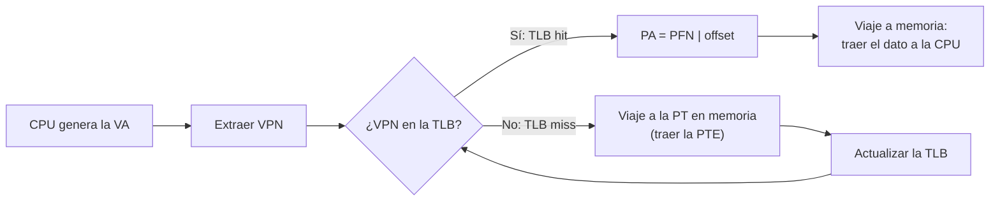
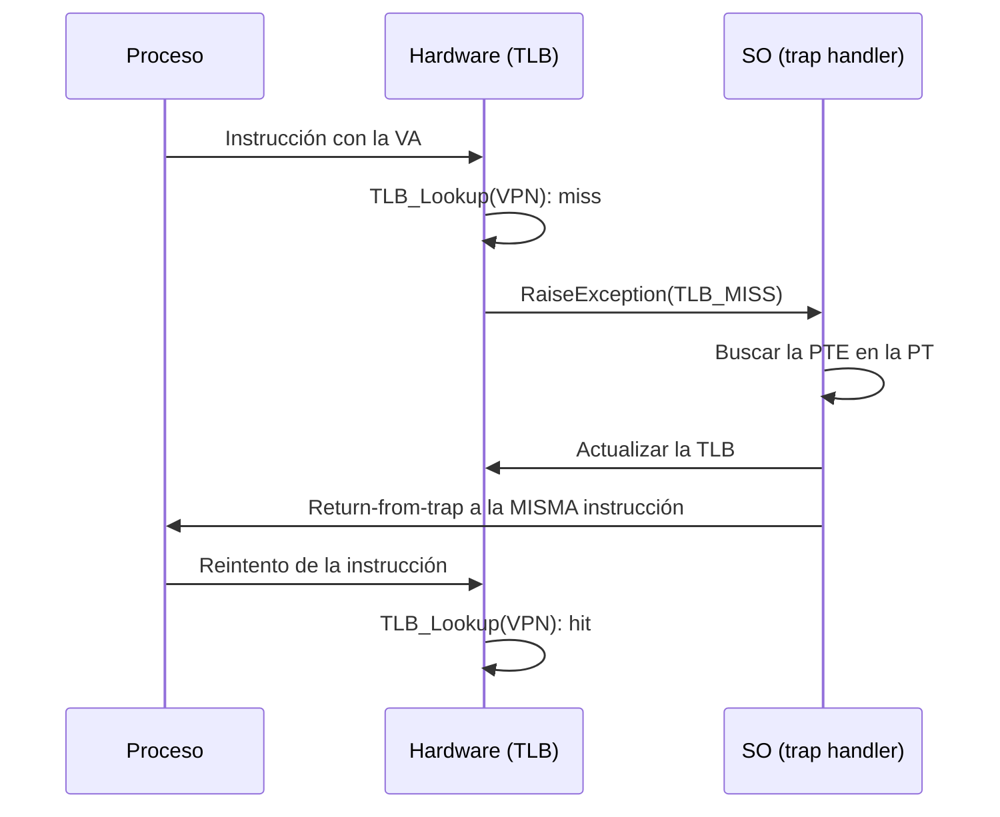

# TLB: Translation Lookaside Buffer (OSTEP, cap. 19)

## Objetivos de Aprendizaje

* **Explicar**: por qué la paginación simple es lenta: cada referencia a memoria exige un acceso adicional a la tabla de páginas, y cuantificarlo con la traza de un ciclo (10 accesos por iteración).
* **Describir**: qué es la TLB, qué contiene una de sus entradas ($VPN + PTE$) y el flujo de la traducción en los casos de *TLB hit* y *TLB miss*.
* **Calcular**: la tasa de aciertos (*hit rate*) de la TLB al recorrer un arreglo y el efecto del tamaño de página sobre ella.
* **Comparar**: el manejo de los TLB miss por hardware y por software, y las dos soluciones al problema del cambio de contexto (vaciado o *flush* y ASID).
* **Aplicar**: las políticas de reemplazo LRU y aleatoria a una traza de referencias.

## El costo de la paginación

> [!NOTE]
> Sesión del 24/09/2026. La primera parte de esa sesión terminó el tema de paginación con el simulador `paging-linear-translate.py` (ver [apuntes_zoom de la clase 10](../../clase_10/apuntes_zoom/)); aquí se desarrolla el análisis del costo de la paginación y la introducción a la TLB.

### Pasos de la traducción: baratos y costosos

Para traducir una dirección virtual (VA) a física (PA) con paginación, el hardware sigue estos pasos:

| Paso | Operación | Costo |
|---|---|---|
| 1 | Extraer el VPN de la VA | barato |
| 2 | Calcular la dirección de la PTE: $PTEAddr = PTBR + VPN \cdot size(PTE)$ | barato |
| 3 | Traer (*fetch*) la PTE de memoria | **costoso** |
| 4 | Extraer el PFN de la PTE | barato |
| 5 | Construir la PA ($PFN$ concatenado con el offset) | barato |
| 6 | Traer el dato de la PA a un registro | **costoso** |

Los pasos baratos son operaciones dentro de la CPU (máscaras, corrimientos, sumas, verificación de bits). Los costosos son **viajes a memoria física**. Por eso **cada referencia a memoria genera dos accesos**:

1. Uno a la tabla de páginas (PT) para encontrar el PFN.
2. Otro para traer (*fetch*) la instrucción o el dato como tal.

### Ejemplo: dos procesos con PTEs de 8 B

Se tienen dos procesos con páginas de 4 KB (offset de 12 bits) y PTEs de 8 B ($size(PTE) = 8$ B). Las tablas de páginas de ambos procesos están en el frame 0: la de P1 en la dirección 0 y la de P2 en 2 KB.

| PFN | Rango físico | Contenido |
|---|---|---|
| 0 | 0 KB – 4 KB | PT de P1 (desde 0 KB) y PT de P2 (desde 2 KB) |
| 1 | 4 KB – 8 KB | P1 |
| 2 | 8 KB – 12 KB | P2 |
| 3 | 12 KB – 16 KB | P2 |
| 4 | 16 KB – 20 KB | P1 |
| 5 | 20 KB – 24 KB | P1 |
| 6 | 24 KB – 28 KB | P2 |

| Proceso | PTBR | Tabla de páginas (VPN 0, 1, 2, ...) |
|---|---|---|
| P1 | `0x0000` | 1, 5, 4, ... |
| P2 | `0x0800` (2 KB) | 6, 2, 3, ... |

Cada instrucción `load` de la VA se convierte en dos accesos a memoria física:

| Proceso | Virtual | Acceso 1: PTE | Acceso 2: dato |
|---|---|---|---|
| P2 | `load 0x0000` (VPN 0) | `load 0x0800`: $PTEAddr = \texttt{0x0800} + 0 \cdot 8 = \texttt{0x0800}$ → PFN 6 | `load 0x6000` ($PA = \texttt{0x6000}$ = 24 KB) |
| P2 | `load 0x1444` (VPN 1) | `load 0x0808`: $PTEAddr = \texttt{0x0800} + 1 \cdot 8 = \texttt{0x0808}$ → PFN 2 | `load 0x2444` |
| P1 | `load 0x1444` (VPN 1) | `load 0x0008`: $PTEAddr = \texttt{0x0000} + 1 \cdot 8 = \texttt{0x0008}$ → PFN 5 | `load 0x5444` |

Con páginas de 4 KB, el VPN es el dígito hexadecimal más alto de la VA (`0x1444` → VPN 1, offset `0x444`), y la PA se forma reemplazándolo por el PFN. La misma VA (`0x1444`) lleva a frames distintos según el proceso, porque cada uno tiene su propio PTBR y su propia tabla.

### Problemas de la paginación

1. **Lentitud** en el proceso, debido a los accesos a la tabla de páginas.
2. **Gasto de memoria**, porque cada proceso tiene su propia tabla de páginas.

Esta clase ataca el primer problema.

### Trazas de memoria: el arreglo de 1000 enteros

Para dimensionar la lentitud se analizó la inicialización de un arreglo (el ejemplo con el que cerró la [clase 10](../../clase_10/apuntes_zoom/)):

```c
int array[1000];
...
for (i = 0; i < 1000; i++)
    array[i] = 0;
```

```
prompt> gcc -o array array.c -Wall -O
prompt> ./array
```

El ciclo se compila en cuatro instrucciones:

```
0x1024 movl $0x0,(%edi,%eax,4)
0x1028 incl %eax
0x102c cmpl $0x03e8,%eax
0x1030 jne 0x1024
```

* `movl` escribe 0 en `array[i]` (`%edi` tiene la dirección base del arreglo y `%eax` el índice `i`; cada entero ocupa 4 bytes).
* `incl` incrementa `i`.
* `cmpl` compara `i` con `0x03e8` = 1000.
* `jne` salta al inicio del ciclo mientras `i` ≠ 1000.

Cada instrucción se trae de memoria (*fetch*), lo que cuesta 2 accesos: PT + instrucción. Además, `movl` escribe en el arreglo, lo que cuesta otros 2: PT + dato.

| Instrucción | Fetch de la instrucción | Acceso al dato |
|---|---|---|
| `movl $0x0,(%edi,%eax,4)` | 2 | 2 |
| `incl %eax` | 2 | – |
| `cmpl $0x03e8,%eax` | 2 | – |
| `jne 0x1024` | 2 | – |

Cada iteración genera **10 accesos a memoria**, así que:

$$5 \text{ ciclos} \times \frac{10 \text{ accesos}}{1 \text{ ciclo}} = 50 \text{ accesos} \qquad 1000 \text{ ciclos} \times \frac{10 \text{ accesos}}{1 \text{ ciclo}} = 10\,000 \text{ accesos}$$

Al graficar los primeros 50 accesos (dirección vs. número de acceso) aparecen **patrones** que se repiten en cada iteración:

* Los accesos a la tabla de páginas siempre caen en las mismas dos entradas: `PT[1]` (la página del código) y `PT[39]` (la página del arreglo).
* El código se recorre siempre en el mismo orden: `mov`, `inc`, `cmp`, `jne`.
* El arreglo avanza 4 bytes por iteración.

> [!TIP]
> **Patrones → aprovecharlos.** Si los accesos se repiten, las traducciones que se piden una y otra vez se pueden guardar cerca de la CPU en lugar de ir a buscarlas a la tabla de páginas en cada acceso.

### Localidad espacial y temporal

Los patrones anteriores son de dos tipos:

| Localidad | Patrón de acceso | Ejemplo típico |
|---|---|---|
| **Espacial** | Acceso secuencial: después de acceder a una dirección, se accede a las vecinas | Recorrer un arreglo |
| **Temporal** | Acceso repetido: las mismas direcciones se vuelven a acceder al poco tiempo | Las instrucciones de un ciclo |

## Pregunta clave: ¿cómo mejorar la traducción de direcciones?

* ¿Cómo acelerar la traducción evitando la referencia adicional a memoria de la paginación? → **Aprovechando la localidad.**
* ¿Qué soporte de hardware es necesario? → **Una caché: la TLB.**
* ¿Qué tiene que hacer el sistema operativo en este caso? → Se responde más adelante (manejo de los TLB miss y del cambio de contexto).

## La TLB (*Translation Lookaside Buffer*)

La **TLB** es una memoria **caché *on chip*** (dentro de la CPU, como parte de la MMU) que guarda las traducciones más usadas:

* Es **pequeña y rápida**.
* Mantiene las **traducciones (PTEs) más populares** de la tabla de páginas: las que se transfieren más a menudo desde memoria.
* Tamaños típicos: **16 a 256 entradas**.
* Usualmente es **totalmente asociativa** (*fully associative*): todas las entradas se comparan en paralelo. Puede tener otro grado de asociatividad para reducir la latencia.

**Analogía del almacén.** La CPU es el almacén que atiende a los clientes. La TLB es la bodega pequeña del almacén, donde están los productos que más se piden. La memoria principal es la bodega principal.

* Si el producto está en la bodega del almacén, se entrega de inmediato (*hit*).
* Si no está, hay que ir a la bodega principal, traerlo, dejarlo en la bodega del almacén y luego entregarlo (*miss*).

| Analogía | Sistema |
|---|---|
| Almacén (atiende al cliente) | CPU |
| Bodega del almacén | Caché (TLB) |
| Bodega principal | Memoria |

### Contenido de una entrada de la TLB

Una entrada de la tabla de páginas es $PTE = PFN + \text{otros bits}$. Una entrada de la TLB agrega el VPN, que sirve de **etiqueta** (*tag*) para la búsqueda:

$$TLB\ Entry = VPN + PFN + \text{otros bits} = VPN + PTE$$

| Campo | Significado |
|---|---|
| VPN (*tag*) | Número de página virtual: lo que se busca en la TLB |
| PFN | Número de frame: el resultado de la traducción |
| Otros bits | V (validez), R (referencia), M (modificación), Prot (protección) |

Ejemplo de contenido:

| Valid | Tag (VPN) | Value (PTE) |
|---|---|---|
| 1 | `0x1000` | V, R, M, Prot, PFN `0x1234` |
| 1 | `0x2400` | V, R, M, Prot, PFN `0x8800` |
| 0 | – | – |

Tener el par VPN–PFN en la TLB **elimina el viaje a la tabla de páginas**.

### Traducción con TLB: *hit* y *miss*



* **Caso feliz (*TLB hit*)**: **1 viaje** a memoria, solo para traer el dato.
* **Caso no feliz (*TLB miss*)**: **2 viajes** a memoria, uno a la PT para traer la PTE y otro para el dato.

**Caso hit.** Se elimina la necesidad de acceder a memoria física para traducir:

1. El procesador envía la VA a la MMU.
2. La MMU extrae el VPN de la VA.
3. Se verifica si el VPN está en la TLB. Como sí está (**TLB hit**), se obtiene la PTE.
4. Se extrae el PFN de la PTE y se forma la PA asociada a la VA.
5. Con la PA se carga el dato en la CPU.

**Caso miss.** Hay un acceso adicional a memoria, a la PT. En programas con buena localidad, los TLB miss son poco frecuentes:

1. El procesador envía la VA a la MMU.
2. La MMU extrae el VPN de la VA.
3. Se verifica si el VPN está en la TLB. Como no está (**TLB miss**), hay que acceder a la PT.
4. Una vez obtenido el PFN asociado al VPN (al acceder a la PT), se **actualiza la TLB**.
5. Se repite la búsqueda en la TLB ya actualizada, lo que produce un TLB hit y permite formar la PA.
6. Con la PA se carga el dato en la CPU.

### Algoritmo de control (pseudocódigo)

```c
1   VPN = (VirtualAddress & VPN_MASK) >> SHIFT
2   (Success, TlbEntry) = TLB_Lookup(VPN)
3   if (Success == True) // TLB Hit
4     if (CanAccess(TlbEntry.ProtectBits) == True)
5       Offset = VirtualAddress & OFFSET_MASK
6       PhysAddr = (TlbEntry.PFN << SHIFT) | Offset
7       Register = AccessMemory(PhysAddr)
8     else
9       RaiseException(PROTECTION_FAULT)
10  else // TLB Miss
11    PTEAddr = PTBR + (VPN * sizeof(PTE))
12    PTE = AccessMemory(PTEAddr)
13    if (PTE.Valid == False)
14      RaiseException(SEGMENTATION_FAULT)
15    else if (CanAccess(PTE.ProtectBits) == False)
16      RaiseException(PROTECTION_FAULT)
17    else
18      TLB_Insert(VPN, PTE.PFN, PTE.ProtectBits)
19      RetryInstruction()
```

* Líneas 1–2 (comunes): extraer el VPN y buscarlo en la TLB.
* Líneas 3–7 (*hit*): verificar la protección y formar la PA **sin acceder a la PT**.
* Líneas 10–19 (*miss*): calcular `PTEAddr` con el PTBR, traer la PTE de memoria (el acceso extra), insertarla en la TLB y **reintentar la instrucción**. En el reintento se produce un hit y se sigue el camino de las líneas 3–7.
* Líneas 9, 14 y 16 (interrupción): excepciones por acceso no permitido o por página inválida.

> [!NOTE]
> **Preguntas en clase sobre sistemas multicore.**
> * Si varios núcleos comparten una caché, ¿quién tiene prioridad? Se necesita sincronizar el acceso y aplicar políticas adicionales, algo que va más allá del alcance del curso. Aquí se estudia el caso de un solo núcleo, desde el cual se puede proyectar el de varios.
> * ¿El cambio de contexto ocurre a la vez en todos los núcleos? No: cada núcleo maneja su propio contexto de forma independiente, como dos trabajadores con su propia tarea. La sincronización de los recursos compartidos se verá en la tercera unidad del curso.

## Ejemplo: accediendo a un arreglo

> [!NOTE]
> Continuación: sesión del 29/09/2026.

Este ejemplo muestra cómo la TLB mejora el desempeño de la traducción de direcciones.

```c
1  int sum = 0;
2  for (i = 0; i < 10; i++) {
3    sum += a[i];
4  }
```

Suposiciones:

1. Arreglo de 10 enteros: $size(int) = 4$ B, así que $size(array) = 40$ B.
2. La dirección base del arreglo es 100: `&a[0] = 100`.
3. Espacio de direcciones con $n(VA) = 8$ bits, es decir, $size(AS) = 2^8 = 256$ B.
4. Páginas de $size(page) = 16$ B, así que $num\_paginas = \frac{size(AS)}{size(page)} = \frac{256}{16} = 16$.

Formato de la dirección virtual:

* $n(offset) = \log_2(16) = \log_2(2^4) = 4$ bits.
* $n(VPN) = n(VA) - n(offset) = 8 - 4 = 4$ bits.

**¿Cuál es el VPN y el offset de la dirección 100?**

$$VA = 100 = \texttt{0x64} = [\,\texttt{0110}\,|\,\texttt{0100}\,] \quad\Rightarrow\quad VPN = \texttt{0110} = 6, \quad offset = \texttt{0100} = 4$$

Cada página cubre 16 direcciones consecutivas (la página $k$ va de $16k$ a $16k + 15$), así que el arreglo queda repartido en tres páginas:

| VPN | Rango de direcciones | Elementos (dirección) |
|---|---|---|
| 6 | 96 – 111 | `a[0]` (100), `a[1]` (104), `a[2]` (108) |
| 7 | 112 – 127 | `a[3]` (112), `a[4]` (116), `a[5]` (120), `a[6]` (124) |
| 8 | 128 – 143 | `a[7]` (128), `a[8]` (132), `a[9]` (136) |

**Asumiendo una TLB de una sola entrada, ¿cuántos TLB miss y TLB hits se presentan?**

| Acceso | `a[0]` | `a[1]` | `a[2]` | `a[3]` | `a[4]` | `a[5]` | `a[6]` | `a[7]` | `a[8]` | `a[9]` |
|---|---|---|---|---|---|---|---|---|---|---|
| VPN | 6 | 6 | 6 | 7 | 7 | 7 | 7 | 8 | 8 | 8 |
| Resultado | **M** | H | H | **M** | H | H | H | **M** | H | H |
| TLB (VPN → PFN) | 6 → PFN_x | | | 7 → PFN_y | | | | 8 → PFN_z | | |

* `a[0]`: la TLB está vacía. Hay miss, se consulta la PT y se carga $6 \rightarrow PFN_x$. `a[1]` y `a[2]` están en la misma página, así que son hits.
* `a[3]`: el VPN 7 no está. Hay miss y la única entrada se reemplaza por $7 \rightarrow PFN_y$. Le siguen 3 hits.
* `a[7]`: lo mismo con $8 \rightarrow PFN_z$, seguido de 2 hits.

| Estadística | Valor |
|---|---|
| Hits | 7 (70 %) |
| Miss | 3 (30 %) |
| Total | 10 (100 %) |
| **TLB hit rate** | **70 %** |

Sin TLB, cada uno de los 10 accesos habría requerido un viaje a la tabla de páginas; con la TLB solo se hacen 3.

> [!IMPORTANT]
> **Conclusión:** las TLB mejoran el desempeño gracias a los principios de localidad espacial y temporal.

### Principios de localidad

| Localidad temporal | Localidad espacial |
|---|---|
| Una instrucción o dato accedido recientemente probablemente volverá a ser accedido pronto. | Si un programa accede a la dirección $x$, probablemente pronto accederá a una dirección cercana a $x$. |
| Ejemplo: un **ciclo** (el primer acceso es a la página 1, y el segundo también). | Ejemplo: un **arreglo** (el primer acceso es a la página 1, y el segundo a una cercana). |

Las memorias caché, al ser pequeñas y rápidas, aprovechan estos principios.

### Importancia del tamaño de la página

A **mayor tamaño de página, menor cantidad de TLB misses**. Con páginas de 32 B, el mismo arreglo ocupa solo dos páginas: las direcciones 100 a 124 caen en la página 3 (96–127) y las direcciones 128 a 136 en la página 4 (128–159).

| Tamaño de página | TLB misses | Hit rate |
|---|---|---|
| 16 B | 3 | 70 % |
| 32 B | 2 | 80 % |

Con un tamaño de página grande (por ejemplo, 4 KB, típico en sistemas reales), la tasa de hits mejora y por lo tanto el desempeño: el *hit rate* tiende al 100 %.

## ¿Quién maneja los TLB miss?

### Opción 1: TLB manejada por hardware (x86, ARM)

* El hardware sabe dónde están las tablas de página en memoria gracias a un registro, el PTBR (en x86 es el registro CR3).
* Cuando ocurre un TLB miss (el VPN no está en la TLB), el hardware **recorre** la PT, **encuentra** la PTE correcta, **extrae** la traducción y **actualiza** la TLB. Luego la instrucción se vuelve a ejecutar.
* Para eso, el hardware especifica el **formato exacto de la PT** (está documentado en el manual del procesador) y usa sus registros (PTBR).

### Opción 2: TLB manejada por software (MIPS, ...)

* Cuando ocurre un TLB miss, el hardware **lanza una excepción** (*trap*).
* La excepción la maneja el *trap handler* del sistema operativo:
  1. Busca la PTE en la PT.
  2. Actualiza la TLB con esa traducción.
  3. Retorna.
* El **return-from-trap** es un poco **diferente** al caso tradicional (por ejemplo, el de una llamada al sistema). El hardware debe continuar la ejecución **en la instrucción que causó el trap**, y no en la siguiente, para que el reintento produzca un TLB hit.



Con la TLB manejada por el SO, el algoritmo del hardware se reduce. En caso de miss solo lanza la excepción:

```c
1   VPN = (VirtualAddress & VPN_MASK) >> SHIFT
2   (Success, TlbEntry) = TLB_Lookup(VPN)
3   if (Success == True) // TLB Hit
4     if (CanAccess(TlbEntry.ProtectBits) == True)
5       Offset = VirtualAddress & OFFSET_MASK
6       PhysAddr = (TlbEntry.PFN << SHIFT) | Offset
7       Register = AccessMemory(PhysAddr)
8     else
9       RaiseException(PROTECTION_FAULT)
10  else // TLB Miss
11    RaiseException(TLB_MISS)
```

## Contenido de una entrada TLB

Sobre las TLB:

* Es una memoria caché **completamente asociativa**.
* Cualquier traducción puede estar en cualquier lugar de la TLB.
* La búsqueda (`TLB_Lookup(VPN)`) se hace **en paralelo**: el VPN se compara a la vez con todas las entradas. Si alguna coincide hay **TLB hit**; si no, **TLB miss**.
* Una TLB típica puede tener 32, 64 o 128 entradas.

Una entrada TLB es $[\,VPN \,|\, PTE\,]$, y la PTE contiene el PFN y otros bits:

| Bit | Significado |
|---|---|
| **V** (*Valid*) | Dice si la entrada tiene una traducción válida que puede usarse. Se evalúa cada vez que se usa una dirección virtual. |
| **D** (*Dirty*) | Indica si la página ha sido modificada (ocurrió una escritura sobre ella). |
| **R** (*Reference*) | Indica si la página ha sido accedida: se pone en 1 cuando la página se lee o se escribe. Sirve para rastrear el acceso a la página y determinar su popularidad. |
| **Prot** (*Protection*) | Bits que controlan las operaciones permitidas (R, W, X, usuario/kernel, etc.). |
| **P** (*Present*) | Indica si la página está en memoria física o en el disco. |
| **ASID** (*Address Space Identifier*) | Identificador del espacio de direcciones (ver la siguiente sección). |

## TLB y cambio de contexto

* La TLB es una estructura de hardware **compartida por todos los procesos**: hay una única TLB para todos.
* Las traducciones del proceso en ejecución **no tienen sentido** para los demás procesos.
* Al cambiar de un proceso a otro, el hardware, el software o ambos deben asegurarse de que el proceso que va a ejecutarse no use por accidente las traducciones de un proceso ejecutado antes.

**Ejemplo.** Dos procesos usan el mismo VPN, pero cada uno lo mapea a un frame distinto:

| Proceso | VPN | PFN |
|---|---|---|
| P1 | 10 | 100 |
| P2 | 10 | 170 |

Paso a paso:

1. P1 (*process A*) accede al VPN 10, y se inserta la entrada $10 \rightarrow 100$ en la TLB.
2. Hay un cambio de contexto a P2 (*process B*), que accede a **su** VPN 10, y se inserta la entrada $10 \rightarrow 170$.

| VPN | PFN | valid | Prot |
|---|---|---|---|
| 10 | 100 | 1 | rwx |
| – | – | 0 | – |
| 10 | 170 | 1 | rwx |
| – | – | 0 | – |

**Problema:** ambos procesos tienen entradas en la TLB, pero no se puede distinguir cuál pertenece a cada uno. Al buscar el VPN 10, no se puede obtener la dirección física correcta.

### Solución 1: vaciar (*flush*) la TLB en cada cambio de contexto

**Flush**: poner todos los bits de validez (V) en **0**. Cuando P2 empieza a ejecutarse, la entrada $10 \rightarrow 100$ de P1 ya es inválida, así que solo es válida la que P2 cargue ($10 \rightarrow 170$).

Consecuencias del vaciado:

1. Un proceso nunca encontrará por accidente traducciones incorrectas en la TLB.
2. El *flushing* es **costoso**, porque se pierden todas las traducciones cargadas recientemente. Después de cada cambio de contexto, el proceso vuelve a empezar con TLB miss:

$$\text{context switch} \uparrow \;\Rightarrow\; \text{TLB miss} \uparrow \;\Rightarrow\; \text{costo} \uparrow$$

### Solución 2: un campo ASID (*Address Space Identifier*) en la TLB

* **ASID**: campo de **8 bits** en cada entrada de la TLB.
* Permite **diferenciar un proceso de otro** dentro de la TLB.
* Gracias a este campo, varios procesos pueden compartir la TLB, cada uno con sus traducciones, sin ninguna confusión.
* Soluciona el problema de **overhead** del vaciado (*flushing*).

$$TLB\ Entry = [\,VPN \,|\, PTE \,|\, ASID\,]$$

Con P1 (ASID = 1) y P2 (ASID = 2), las dos entradas del VPN 10 conviven en la TLB. En la búsqueda solo coincide la entrada cuyo VPN **y** ASID son los del proceso en ejecución:

| VPN | PFN | valid | Prot | ASID |
|---|---|---|---|---|
| 10 | 100 | 1 | rwx | 1 |
| – | – | 0 | – | – |
| 10 | 170 | 1 | rwx | 2 |
| – | – | 0 | – | – |

### Páginas compartidas

Es común que procesos distintos compartan segmentos de código: el mismo binario, como dos instancias de un mismo programa, o las bibliotecas compartidas (*shared libraries*). **¿Qué pasa cuando dos procesos apuntan a un mismo frame (PFN)?**

| Proceso | VPN | PFN |
|---|---|---|
| P1 | 10 | 101 |
| P2 | 50 | 101 |

| VPN | PFN | valid | Prot | ASID |
|---|---|---|---|---|
| 10 | 101 | 1 | r-x | 1 |
| – | – | 0 | – | – |
| 50 | 101 | 1 | r-x | 2 |
| – | – | 0 | – | – |

Las dos entradas se distinguen por su ASID aunque apunten al mismo frame. Como se trata de código, los bits de protección lo marcan como de lectura y ejecución (`r-x`), de modo que ningún proceso puede modificar el código del otro.

> [!TIP]
> Compartir páginas es **útil** porque reduce el número de frames en uso, es decir, ahorra memoria física.

## Políticas de reemplazo

Cuando ocurre un TLB miss y la TLB está llena, ¿cómo se inserta la nueva traducción? Una **política de reemplazo** es el procedimiento para reemplazar una entrada antigua de la TLB (caché) por una nueva.

* **Objetivo:** reducir la tasa de miss y, por consiguiente, aumentar la tasa de hits.
* Hay diferentes políticas. Dos de ellas son **LRU** (*Least Recently Used*) y **aleatoria** (*Random*).

Para comparar ambas se usa el mismo ejemplo: una TLB de **tres entradas** y la siguiente traza de accesos a memoria (principal):

```
7, 0, 1, 2, 0, 3, 0, 4, 2, 3, 0, 3, 2, 1, 2
```

### LRU (*Least Recently Used*)

Reemplaza la entrada de la TLB que **no haya sido usada recientemente**, es decir, la que lleva más tiempo sin ser accedida. Aprovecha la localidad temporal.

| # | Referencia | Entrada 0 | Entrada 1 | Entrada 2 | Resultado | Sale |
|---|---|---|---|---|---|---|
| 1 | 7 | **7** | | | M | |
| 2 | 0 | 7 | **0** | | M | |
| 3 | 1 | 7 | 0 | **1** | M | |
| 4 | 2 | **2** | 0 | 1 | M | 7 |
| 5 | 0 | 2 | 0 | 1 | H | |
| 6 | 3 | 2 | 0 | **3** | M | 1 |
| 7 | 0 | 2 | 0 | 3 | H | |
| 8 | 4 | **4** | 0 | 3 | M | 2 |
| 9 | 2 | 4 | 0 | **2** | M | 3 |
| 10 | 3 | 4 | **3** | 2 | M | 0 |
| 11 | 0 | **0** | 3 | 2 | M | 4 |
| 12 | 3 | 0 | 3 | 2 | H | |
| 13 | 2 | 0 | 3 | 2 | H | |
| 14 | 1 | **1** | 3 | 2 | M | 0 |
| 15 | 2 | 1 | 3 | 2 | H | |

Por ejemplo, en el acceso 4 (referencia 2) la TLB está llena con 7, 0 y 1. El 7 es el que lleva más tiempo sin usarse (acceso 1), así que sale. En el acceso 6 (referencia 3) sale el 1, porque su último uso (acceso 3) es más antiguo que el del 2 (acceso 4) y el del 0 (acceso 5).

**Resultado con LRU: 5 hits y 10 misses**, un *hit rate* de $5/15 \approx 33{,}3\,\%$.

### Aleatoria (*Random*)

Reemplaza una entrada de la TLB **seleccionada al azar**. En cada miss, la posición a reemplazar (0, 1 o 2) se elige al azar, como si se lanzara un dado. Con la misma traza:

| # | 1 | 2 | 3 | 4 | 5 | 6 | 7 | 8 | 9 | 10 | 11 | 12 | 13 | 14 | 15 |
|---|---|---|---|---|---|---|---|---|---|---|---|---|---|---|---|
| Referencia | 7 | 0 | 1 | 2 | 0 | 3 | 0 | 4 | 2 | 3 | 0 | 3 | 2 | 1 | 2 |
| Resultado | M | M | M | M | M | M | **H** | M | M | M | **H** | **H** | **H** | M | M |

**Resultado del ejercicio en clase: 4 hits y 11 misses**, un *hit rate* de $4/15 \approx 26{,}7\,\%$, peor que LRU con la misma traza.

> [!NOTE]
> El resultado de la política aleatoria **cambia en cada ejecución**, porque depende de los números que salgan. En una corrida puede dar más hits que LRU y en otra menos. LRU, en cambio, siempre da el mismo resultado para la misma traza: es más estable y predecible. Dejar la decisión a la suerte tiene sus consecuencias.

## Entrada TLB real: caso MIPS

El **MIPS R4000** tiene una TLB que el sistema operativo maneja **por software**. Cada entrada ocupa 64 bits:

$$TLB\ Entry = [\,VPN \,|\, PTE \,|\, ASID\,]$$

| Campo | Contenido |
|---|---|
| VPN de 19 bits | El resto del espacio se reserva para el kernel. |
| PFN de 24 bits | Permite manejar hasta 64 GB de memoria principal ($2^{24}$ frames de 4 KB). |
| *Global bit* (G) | Para páginas compartidas globalmente entre procesos. |
| ASID | Lo usa el SO para distinguir entre espacios de direcciones. |
| *Coherence bits* (C) | Determinan cómo el hardware guarda la página en caché. |
| *Dirty bit* (D) | Marca si la página ha sido escrita. |
| *Valid bit* (V) | Indica al hardware si hay una traducción válida en la entrada. |

### Para revisar de forma autónoma: tamaños en el MIPS R4000

> [!NOTE]
> Esta parte quedó en las diapositivas para revisarla de forma autónoma; no se desarrolló en clase.

El MIPS R4000 soporta un espacio de direcciones de 32 bits ($n(AS) = 32$) con páginas de 4 KB ($size(page) = 4\text{ KB} = 2^{12}$ B).

* **Tamaño de la memoria virtual:** $size(AS) = 2^{n(AS)} = 2^{32} = 2^2 \cdot 2^{30} = 4$ GB.
* **Número de páginas:** $num\_pages = \frac{size(AS)}{size(page)} = \frac{2^{32}}{4 \cdot 2^{10}} = 2^{20}$ páginas. La VA tiene entonces 20 bits de VPN y 12 de offset.
* Sin embargo, el **VPN del MIPS R4000 es de 19 bits**, porque el espacio se divide en dos mitades: 2 GB para el kernel y 2 GB para el espacio de direcciones del usuario ($2^{19}$ páginas $\times$ 4 KB $= 2^{31}$ B $= 2$ GB).
* **Dirección física:** el PFN tiene 24 bits y el offset 12, así que $n(PM) = 36$ bits:

$$size(PM) = 2^{36} = 2^6 \cdot 2^{30} = 64\text{ GB} \qquad num\_frames = \frac{size(PM)}{size(frame)} = \frac{2^{36}}{4 \cdot 2^{10}} = 2^{24} \text{ frames}$$

## Actividades sugeridas

* Repetir a mano el ejemplo del arreglo (TLB de una entrada) con páginas de 16 B y de 32 B, y las trazas de LRU y aleatoria.
* Hacer la práctica guiada de medición de la TLB en [`clase_11/simulacion/`](../simulacion/README.md), que estima el tamaño de la TLB y el costo de un miss.
* Para profundizar, leer los apuntes del tema en [`apuntes/translation-lookaside-buffers/`](../apuntes/translation-lookaside-buffers/README.md).

> [!NOTE]
> **Evaluaciones**:
> * El primer parcial (módulos 1 y 2) está programado para el **22 de octubre**. Será con consulta de apuntes, así que conviene tener resúmenes y apuntes organizados para consultarlos rápido.
> * La autoevaluación semanal del tema de TLB ya está disponible en la plataforma. Su información definitiva (número y fecha límite) se anunciará en Moodle.

---

> [!IMPORTANT]
> **Nota de Transparencia:** Este documento fue generado y adaptado mediante el uso de **IA Generativa**, a partir del manuscrito anotado de la clase y los resúmenes de las sesiones de Zoom. El contenido ha sido supervisado, validado y refinado por intervención humana para garantizar su precisión técnica y coherencia pedagógica. No obstante, pueden haber errores.
