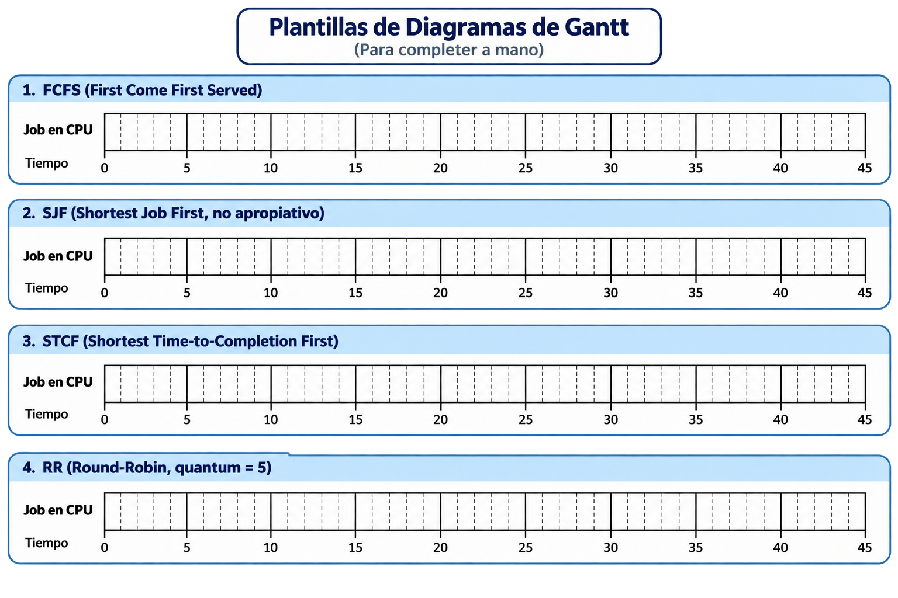
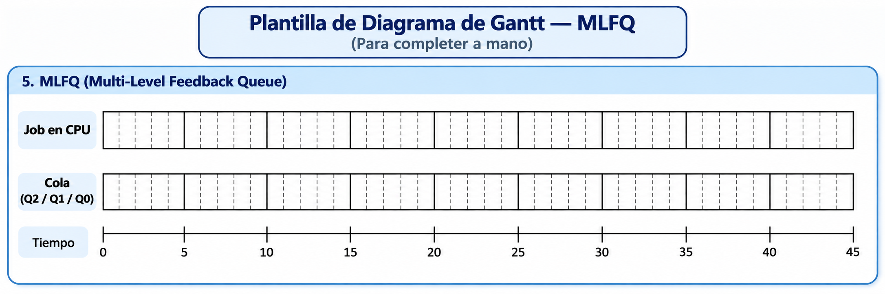

# TALLER MODULO 1 - PLANIFICACIÓN DE LA CPU (SCHEDULING)

## Conjunto de jobs

La siguiente tabla muestra el tiempo de llegada (**arrival time**) y el tiempo de ejecución (**run time**) estimado de una lista de procesos que llegan a la cola procesos listos (**ready queue**):

| Job | arrival time  | run time |
|-----|---------------|----------|
| A   | 0             | 15       |
| B   | 2             | 2        |
| C   | 3             | 14       |
| D   | 6             | 10       |
| E   | 9             | 1        |

---

## Ejercicio 1 — FIFO, SJF, STCF y RR

De acuerdo a la teoria vista en clase hay 4 algoritmos de planificacion básicos:
*   **FCFS**: (First Come First Served)
* **SJF** (Shortest Job First)
* **STCF** (Shortest Time-to-Completion First)
* **RR** (Round-Robin) con un *time slice* (scheduling quantum) de 5.

**Convención para SJF:** SJF es *no apropiativo* (non-preemptive). Cuando la CPU queda libre, se escoge entre los jobs que ya están en la ready queue aquel con menor run time, pero un job en ejecución **no** se interrumpe aunque llegue uno más corto mientras corre — eso es justamente lo que sí hace STCF.

**a. Diagrama de Gantt.** Para cada uno de los algoritmos anteriores, realice el diagrama de Gantt con el orden de ejecución. Use las siguientes plantillas para dibujar cada línea de tiempo (extienda el eje si lo necesita):

**b. Métricas.** Calcule $T_{turnaround}$ (**TT**) y $T_{response}$ (**RT**) para cada proceso y cada algoritmo (fórmulas en el apéndice). Muestre el procedimiento y resuma el resultado en la siguiente tabla:

| Job/Métrica | TT (FIFO) | RT (FIFO) | TT (SJF) | RT (SJF) | TT (STCF) | RT (STCF) | TT (RR) | RT (RR) |
|---|---|---|---|---|---|---|---|---|
| A | | | | | | | | |
| B | | | | | | | | |
| C | | | | | | | | |
| D | | | | | | | | |
| E | | | | | | | | |
| **Promedio** | | | | | | | | |

---

## Ejercicio 2 — MLFQ (Multi-Level Feedback Queue)

Usando el mismo conjunto de procesos de la tabla anterior, simule su ejecución bajo un planificador **MLFQ** (Multi-Level Feedback Queue) configurado con **tres colas** (reglas en el apéndice):

| Cola | Prioridad | Time slice (quantum) |
|------|-----------|-----------------------|
| Q2   | Más alta (topmost) | 3 |
| Q1   | Media | 6 |
| Q0   | Más baja | 12 |

**Sobre el *time allotment*:** en clase hablamos del *time slice* (quantum) de cada cola, pero no del *time allotment*, así que va la aclaración porque la necesita la Nueva Regla 4. El *time slice* es la duración de un turno de CPU; el *allotment* es el tiempo total que un job puede acumular en una cola —eventualmente en varios turnos— antes de ser degradado. Para simplificar este taller, **el allotment de cada cola equivale a un único time slice**: apenas un job agota el quantum de su nivel sin terminar, se degrada de inmediato a la cola inferior. Si un job agota su allotment estando ya en Q0 (la cola más baja), permanece en Q0 y sigue compitiendo por la CPU en RR junto con los demás jobs de esa cola.

**a. Diagrama de Gantt y trazado de colas.** Construya la línea de tiempo de ejecución bajo MLFQ, mostrando en qué cola (Q2, Q1 o Q0) se encuentra cada job en cada momento y los cambios de prioridad (demociones) que sufre. Use la siguiente plantilla:

**b. Métricas y comparación.** Calcule, para cada job, $T_{completion}$, $T_{turnaround}$ (TT) y $T_{response}$ (RT) bajo MLFQ, y compárelos con los obtenidos para SJF y RR en el Ejercicio 1:

| Job | TT (MLFQ) | RT (MLFQ) | TT (SJF) | TT (RR) |
|---|---|---|---|---|
| A | | | | |
| B | | | | |
| C | | | | |
| D | | | | |
| E | | | | |
| **Promedio** | | | | |

¿Qué jobs salen beneficiados por MLFQ y cuáles perjudicados frente a SJF y RR?

**c. Priority boost.** Con este conjunto de jobs, ¿llega a activarse un *priority boost* si $S = 20$? Justifique con base en su línea de tiempo. Suponga además que, a partir de $t = 25$, empiezan a llegar periódicamente nuevos jobs cortos (que por la Regla 3 entran directamente a Q2): explique qué problema de *starvation* podría sufrir un job **largo que ya haya sido degradado a una cola de menor prioridad (por ejemplo A o C)** si no existiera el priority boost, y cómo lo resuelve la Regla 5 con un valor de $S$ adecuado.

**d. Simulación.** Empleando el simulador `mlfq.py` (disponible en la carpeta [simulador](../../clase_06/simulador/) de la [clase 6](../../clase_06/)), configure las tres colas y quantums indicados arriba y simule el conjunto de jobs. Compare e interprete los resultados frente a los obtenidos teóricamente en los numerales a, b y c. Consulte el README del simulador para el detalle de sus parámetros de uso. Saque conclusiones al respecto.

---

## Apéndice — Fórmulas y reglas de referencia

### Metricas

Teniendo en cuenta las siguientes deficiones:

- $T_{arrival}$: instante en que el job llega al sistema.
- $T_{run}$: tiempo de ejecución (CPU burst) que el job necesita.
- $T_{completion}$: instante en que el job termina su ejecución.
- $T_{firstrun}$: primer instante en que el job es despachado a la CPU.

Las formulas asociadas a las metricas son:

**Turnaround time (TT) — métrica de rendimiento**

$$T_{turnaround} = T_{completion} - T_{arrival}$$

**Response time (RT) — métrica de capacidad de respuesta / interactividad**

$$T_{response} = T_{firstrun} - T_{arrival}$$

### Reglas formales de MLFQ (versión mejorada)

Las reglas formales son las siguientes:

- **Regla 1**: si $Priority(A) > Priority(B)$, entonces $A$ se ejecuta (y $B$ no).
- **Regla 2**: si $Priority(A) = Priority(B)$, entonces $A$ y $B$ se ejecutan en $RR$ (Round-Robin) usando el *time slice* de esa cola.
- **Regla 3**: cuando un trabajo llega al sistema, es ubicado en la cola con la prioridad más alta.
- **Nueva Regla 4**: Cuando un trabajo consume su asignación de tiempo en un nivel su prioridad es reducida (sin importar las veces que este retome el uso de la CPU).
- **Regla 5**: después de un tiempo $S$ (*priority boost*), todos los trabajos presentes en el sistema son movidos al mayor nivel de prioridad.